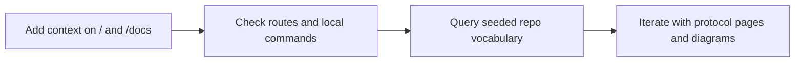

# Kijko Docs

Kijko Docs is the committed markdown surface for the brownfield WikiAgent workspace. It is both a reader-facing product and a source tree: the browser reads the same markdown files that MkDocs publishes, and the repo keeps those files under version control so the content can be reviewed like code. That makes the landing page more than a welcome screen. It is the place where a contributor should learn what exists, what is stable, and what parts of the repository are intentionally not part of the public narrative yet.

## What Lives Here

- `wiki-content/docs` is the canonical content tree for the docs reader and the MkDocs site.
- `apps/web` renders the browser surface for `/`, `/docs`, and `/chat`.
- `apps/agent` owns the wiki automation surface, repo seeding, and file-backed docs updates.
- `docs/implementation` holds architecture and deployment notes that explain the target stack.
- `conductor/` contains the superconductor artifacts that define the deterministic tracks and check discipline.

## Page Map

- [`getting-started`](/docs/getting-started) explains the local reading and verification loop.
- [`kijko-frontend`](/docs/kijko-frontend) describes the current Next.js surface and the legacy boundary.
- [`panopticon`](/docs/panopticon) documents the Panopticon repo label used in seed data and help text.
- [`panopticon-2-0`](/docs/panopticon-2-0) captures the follow-on Panopticon 2.0 label from the seeded set.
- [`hypervisa-3-0`](/docs/hypervisa-3-0) captures the HyperVisa 3.0 label from the seeded set.
- [`baton-exchange`](/docs/baton-exchange) covers the Baton Exchange context-relay label used in the sample data.

## Reading Order

If you are new to the workspace, read the pages in this order:

1. [`getting-started`](/docs/getting-started) for the routes and local checks.
2. [`kijko-frontend`](/docs/kijko-frontend) for the browser boundary and the docs catalog shape.
3. [`panopticon`](/docs/panopticon) and [`panopticon-2-0`](/docs/panopticon-2-0) to understand the seeded repo vocabulary.
4. [`hypervisa-3-0`](/docs/hypervisa-3-0) and [`baton-exchange`](/docs/baton-exchange) to see how the docs surface handles descriptive product labels.

That sequence matters because the repo mixes live surfaces, seed data, and migration artifacts. Reading from the route and file structure outward makes it easier to tell whether a claim is about current behavior, historical context, or a descriptive label that exists only to support documentation and intent coverage.

## Zero-To-Aha Flow

The docs UX uses a journey-led flow instead of a surface-led dashboard. The goal is to get a reader from orientation to a useful next page in one pass, then let them dive deeper only after the route split and verification loop are clear.



## Writing Pattern

Good pages in this corpus do four things:

1. State what the page is for in one or two paragraphs.
2. Point to the repo files that justify the claim.
3. Include a small example, command, or excerpt that makes the usage concrete.
4. End with a next-step section that links to related pages instead of expanding into a separate essay.

That pattern keeps the docs terse enough to scan while still being long-form enough to be useful. It also prevents the most common docs failure in brownfield codebases: a page that sounds polished but cannot be traced back to a real file, route, command, or seed record.

## Markdown Contract

The docs reader currently expects ordinary Markdown rather than a custom component system. In practice that means headings, paragraphs, lists, blockquotes, fenced code blocks, inline code, and links are the most reliable building blocks. When you write a page, optimize for those primitives first.

```bash
rg -n "Panopticon|HyperVisa|Baton Exchange" server apps tests wiki-content
pnpm --filter @kijko/wikiagent-web check
pnpm --filter @kijko/wikiagent-agent test
```

The command example above is intentionally boring. That is the point. A contributor should be able to verify the docs corpus with the same package scripts the repo already uses, not with a one-off script hidden in the docs itself.

## Template System

The declarative page template library now lives in `wiki-content/style-system.json`. It defines the chosen IA variant, reader personas, design-system tokens, page templates, and the platform component mappings that keep the web reader and MkDocs surfaces aligned. The library is intentionally file-backed so review stays in git instead of disappearing into a runtime-only config layer.

## Operator Note

The superconductor run artifacts in `conductor/superconductor/` record the prompt, CGC, and NLM gut-check requirements. In this slice, the docs corpus treats those checks as conductor artifacts rather than executing them directly. If you need to understand why a page reads a certain way, start with the track specs and the workspace files, then confirm the prose matches both.
