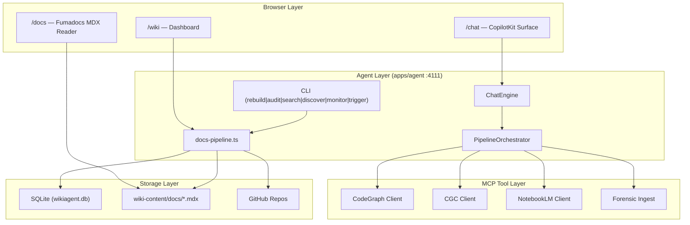

The Kijko ecosystem is a documentation-as-code platform that treats wiki content as a first-class engineering artifact. It combines a 7-agent documentation pipeline, a Next.js reading surface powered by Fumadocs, a CopilotKit chat interface, and a superconductor orchestration layer into a single workspace that keeps documentation synchronized with the codebase it describes. The platform runs on Hetzner infrastructure behind Keycloak authentication and deploys via GitHub Actions to a Docker Compose stack at `docs.kijko.nl`.

The workspace is organized as a monorepo with four active implementation surfaces: `apps/agent` owns the wiki automation backend including the pipeline orchestrator, MCP client integrations, and CLI tooling. `apps/web` renders the browser experience across three routes. `packages/shared` provides the contract types and utilities shared between agent and web. `wiki-content/docs` holds the committed MDX files that this documentation surface renders.

## At a Glance

<Cards>
  <Card title="Panopticon" href="/docs/panopticon">
    Central monitoring and observability platform with architecture deep-dives, API reference, and configuration guides.
  </Card>
  <Card title="Kijko Frontend" href="/docs/kijko-frontend">
    Next.js docs reader with Fumadocs MDX rendering, CopilotKit chat, and wiki dashboard surfaces.
  </Card>
  <Card title="HyperVisa 3.0" href="/docs/hypervisa-3-0">
    Video-mediated context engine for rich media documentation pipelines.
  </Card>
  <Card title="Baton Exchange" href="/docs/baton-exchange">
    Context relay protocol for structured handoffs between agents, services, and documentation surfaces.
  </Card>
  <Card title="Panopticon 2.0" href="/docs/panopticon-2-0">
    Durable agent orchestration layer with pipeline state persistence and resumable execution.
  </Card>
  <Card title="Getting Started" href="/docs/getting-started">
    Local development setup, verification commands, and the contributor editing loop.
  </Card>
</Cards>

## Architecture Overview

The Kijko workspace follows a three-layer architecture where each layer communicates through well-defined contracts in `packages/shared`.

## The 7-Agent Pipeline

The documentation pipeline in `apps/agent/src/lib/pipeline/orchestrator.ts` coordinates seven specialized agents that execute sequentially. Each agent receives an `AgentContext` containing the repository state, MCP tool availability flags, and artifacts from previous phases. The pipeline supports five trigger types that control which phases run.

1. **Audit Agent** (`audit-agent.ts`) scans the repository for documentation gaps by comparing exported code symbols against existing wiki pages. Falls back to file-tree scanning with regex extraction when CodeGraph MCP is unavailable.

2. **IA Agent** (`ia-agent.ts`) generates the information architecture -- page taxonomy, navigation structure, and content outlines based on the audit results and codebase structure.

3. **Writer Agent** (`writer-agent.ts`) produces MDX content for each planned page using the Mastra wiki-agent for LLM calls, grounding output in code references from the audit phase.

4. **Verifier Agent** (`verifier-agent.ts`) validates that generated content matches the codebase reality by checking file paths, function names, and API signatures referenced in the documentation.

5. **QA Agent** (`qa-agent.ts`) runs quality checks including readability scoring, broken link detection, heading hierarchy validation, snippet verification in Docker sandboxes, and duplicate content detection.

6. **Monitor Agent** (`monitor-agent.ts`) assesses page freshness, tracks structural and behavioral changes, and identifies pages that need re-verification based on code diffs.

7. **Publish Agent** (`publish-agent.ts`) writes validated content to the filesystem and updates navigation configuration.

<Callout type="info">
The pipeline supports graceful degradation. When MCP tools like CodeGraph or NotebookLM are unavailable, agents fall back to file-tree scanning and direct file reads. The `toolAvailability` flags in the pipeline context control which code paths execute.
</Callout>

## Trigger Types

The `PipelineOrchestrator` classifies each run into one of five trigger types, each skipping different phases for efficiency.

| Trigger Type | Phases Skipped | Use Case |
|---|---|---|
| `full` | None | Complete documentation regeneration |
| `incremental` | None (uses existing IA) | Content updates after code changes |
| `single_page` | audit, monitor | Regenerate one specific page |
| `preview` | monitor, publish | Preview content without writing to disk |
| `drift_check` | ia, writer, verifier, qa, publish | Quick staleness check |

## Key File Paths

| Path | Purpose |
|---|---|
| `apps/agent/src/lib/pipeline/orchestrator.ts` | Pipeline orchestrator with state persistence and resume |
| `apps/agent/src/lib/docs-pipeline.ts` | Docs corpus loading, quality checks, automation runs |
| `apps/agent/src/lib/chat-engine.ts` | CopilotKit chat backend with wiki agent |
| `apps/agent/src/cli.ts` | CLI entry point for rebuild, audit, search, discover, monitor, trigger |
| `apps/web/app/docs/[[...slug]]/page.tsx` | Fumadocs catch-all route for MDX rendering |
| `apps/web/components/mdx/index.tsx` | MDX component registry (Callout, Card, Tabs, Steps, etc.) |
| `apps/web/lib/docs.ts` | Docs page resolution, frontmatter parsing, catalog building |
| `packages/shared/` | Shared types (Audience, PageType, SuperconductorRunSummary) |
| `wiki-content/docs/` | Committed MDX documentation files |
| `config/wikiagent.yaml` | Agent configuration with docs_root and automation sources |

## Infrastructure

The production deployment runs on a Hetzner server with the following service topology:

- **WikiApp container** (`kijko_docs-wikiapp-1`) serves the Next.js frontend at `docs.kijko.nl`
- **Agent container** runs the Hono-based API server on port 4111
- **Keycloak** handles authentication with realm `kijko-docs`
- **Nginx** reverse proxy on port 8080 routes traffic to WikiApp and Keycloak
- **GitHub Actions** CI pipeline runs typecheck, tests, conductor parity gate, and build on every push to main
- **Living Docs workflow** triggers on code changes to rebuild documentation artifacts automatically

The deploy pipeline uses `scripts/deploy/deploy-production.sh` with a smoke check at `scripts/deploy/smoke-check.sh` to verify the deployment.

## Next Steps

<Cards>
  <Card title="Getting Started" href="/docs/getting-started">
    Set up your local development environment and run verification checks.
  </Card>
  <Card title="Panopticon Architecture" href="/docs/panopticon/architecture">
    Deep dive into the monitoring platform's service topology and data flows.
  </Card>
</Cards>
