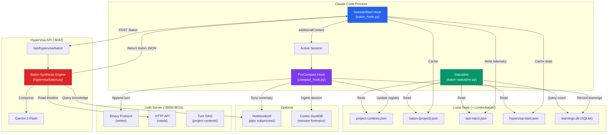
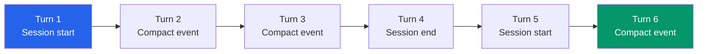
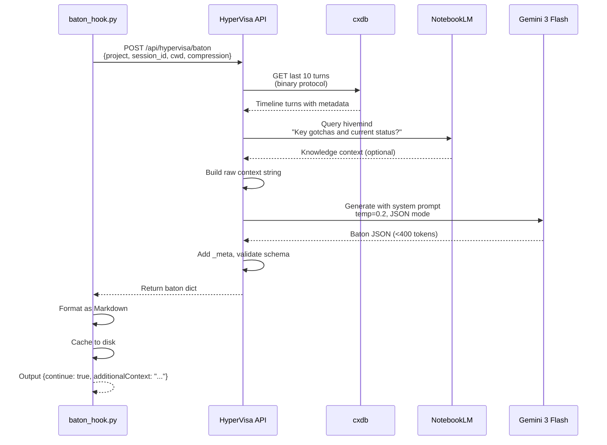
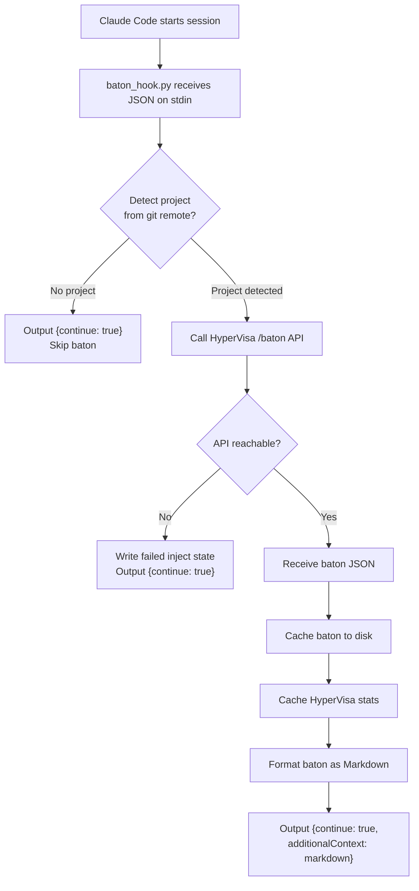
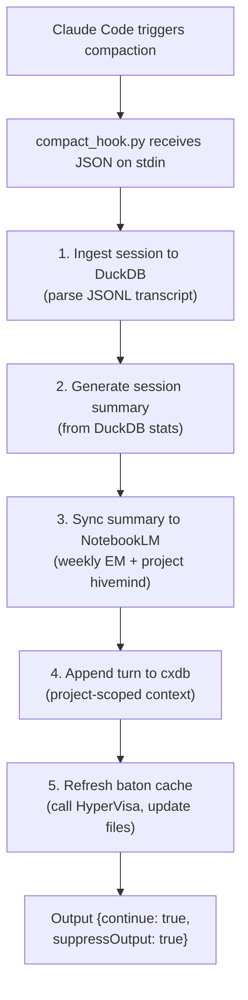
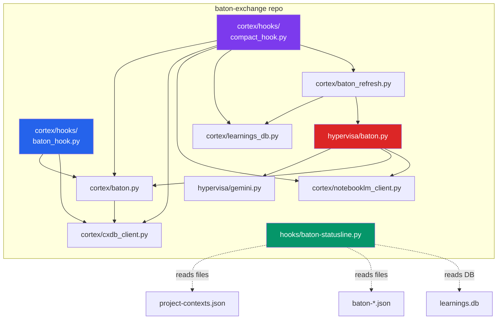

import { Card, Cards } from 'fumadocs-ui/components/card'
import { Callout } from 'fumadocs-ui/components/callout'
import { Tab, Tabs } from 'fumadocs-ui/components/tabs'
import { Accordion, Accordions } from 'fumadocs-ui/components/accordion'

Baton Exchange is composed of three layers -- hooks that integrate with Claude Code, a persistence layer backed by cxdb, and a synthesis engine powered by Gemini. This page maps the full component topology, data flow, and the role of each service.

## System Overview



## Component Layers

### Layer 1: Claude Code Hooks

The hook layer is the bridge between Claude Code's lifecycle events and the Baton Exchange system.

| Hook | Trigger | File | Purpose |
|------|---------|------|---------|
| **SessionStart** | New session begins | `cortex/hooks/baton_hook.py` | READ side: synthesize baton, inject as `additionalContext` |
| **PreCompact** | Before auto/manual compaction | `cortex/hooks/compact_hook.py` | WRITE side: ingest session, record turn, sync to NLM |
| **Statusline** | Continuous (terminal footer) | `hooks/baton-statusline.py` | Display: read cached state, render dual context bars |

Hooks are configured in `~/.claude/settings.json` by the installer:

```json title="~/.claude/settings.json (hooks section)"
{
  "hooks": {
    "SessionStart": [{
      "hooks": [{
        "type": "command",
        "command": "PYTHONPATH=/path/to/cortex:$PYTHONPATH python3 /path/to/cortex/hooks/baton_hook.py",
        "timeout": 20
      }]
    }],
    "PreCompact": [{
      "matcher": ".*",
      "hooks": [{
        "type": "command",
        "command": "PYTHONPATH=/path/to/cortex:$PYTHONPATH python3 /path/to/cortex/hooks/compact_hook.py",
        "timeout": 30
      }]
    }]
  },
  "statusLine": {
    "type": "command",
    "command": "python3 ~/.claude/hooks/baton-statusline.py"
  }
}
```

<Callout type="info" title="Hook I/O protocol">
  Both hooks read JSON from stdin (Claude Code provides `session_id`, `cwd`, `transcript_path`, etc.) and write JSON to stdout. The `continue: true` field tells Claude Code to proceed. The SessionStart hook adds `additionalContext` to inject the baton. All diagnostic logging goes to stderr.
</Callout>

### Layer 2: Persistence (cxdb + Local State)

The persistence layer stores the project timeline and baton cache.

#### cxdb: Turn DAG

cxdb is a conversation branching server that stores turns in a directed acyclic graph. Each project gets one context (a linear chain of turns), where each turn represents a session summary.



cxdb exposes two protocols:

| Protocol | Port | Used For |
|----------|------|----------|
| **Binary** | 9009 | Writes: `create_context`, `append_turn`, `fork`, `get_last` |
| **HTTP** | 9010 | Reads: `list_contexts`, `get_turns_typed`, `health`, `publish_type_bundle` |

The binary protocol uses a custom frame format: `len(u32) + msg_type(u16) + flags(u16) + req_id(u64) + payload`. Turn payloads are msgpack-encoded with BLAKE3 content hashes for integrity verification.

#### Local State Files

All local state lives under `~/.cortex/baton/`:

```
~/.cortex/baton/
  project-contexts.json     # Project -> cxdb context ID registry
  baton-my-project.json     # Per-project baton cache
  last-baton.json           # Global last-baton (backwards compat)
  last-inject.json          # Injection telemetry
  hypervisa-stats.json      # HyperVisa session/token stats
  learnings.db              # SQLite: accumulated learnings
```

### Layer 3: Synthesis (HyperVisa + Gemini)

The synthesis layer compresses raw session history into a compressed baton.



The synthesis prompt (`BATON_SYSTEM_PROMPT` in `hypervisa/baton.py`) enforces:
- Output is ONLY valid JSON, no markdown or commentary
- Total output under 400 tokens
- Terse, directive language -- no prose
- Only files actively being modified in `dependency_edges`
- Only real gotchas that actually went wrong

## Data Flow: Session Lifecycle

Here is the complete data flow for a single session, from start to compaction:

### 1. Session Start (READ Side)



### 2. Pre-Compact (WRITE Side)



## Component Dependency Map



## Upstream Repositories

Baton Exchange vendors code from two upstream repositories and depends on a third:

| Component | Repository | Vendored In | Purpose |
|-----------|-----------|-------------|---------|
| **Oracle-Cortex** | [Anansitrading/Oracle-Cortex](https://github.com/Anansitrading/Oracle-Cortex) | `cortex/` | Cognitive architecture: baton relay, cxdb client, NLM client, learnings DB, hooks |
| **HyperVisa** | [Anansitrading/hypervisa-cli](https://github.com/Anansitrading/hypervisa-cli) | `hypervisa/` | Gemini-powered synthesis engine, video compression, streaming |
| **cxdb** | [Anansitrading/cxdb](https://github.com/Anansitrading/cxdb) | External service | O(1) conversation branching server, turn DAG storage |

The `cortex/` and `hypervisa/` directories are symlinked from the repo into `~/.cortex/baton/` by the installer. The path resolution in `hypervisa/baton.py` searches multiple candidate locations:

```python
_CORTEX_CANDIDATES = [
    _HERE.parent / "cortex",                                    # baton-exchange repo layout
    Path("/home/devuser/Oracle-Cortex/scripts/cortex"),         # direct Oracle-Cortex install
    Path.home() / ".cortex" / "baton" / "lib" / "cortex",      # global install
]
```

## Failure Isolation

Every component is designed to fail gracefully without blocking the Claude Code session:

| Failure | Impact | Mitigation |
|---------|--------|------------|
| cxdb down | No timeline reads/writes | Hooks skip baton, session continues normally |
| HyperVisa API down | No baton synthesis | SessionStart hook outputs `{continue: true}` with no baton |
| Gemini unreachable | No LLM compression | Fallback baton extracted from raw cxdb timeline |
| NotebookLM unavailable | No knowledge enrichment | Baton synthesized from cxdb timeline only |
| DuckDB error | No session forensics | Compact hook continues to cxdb write and NLM sync |
| Invalid JSON from Gemini | Malformed baton | Code fences stripped; if still invalid, fallback baton used |
| Hook timeout (20s/30s) | Hook killed | Claude Code continues; `{continue: true}` is the default |

<Callout type="info" title="Non-blocking by design">
  Both hooks print `{"continue": true}` even on complete failure, and exit with code 0. A broken hook never blocks a Claude Code session. All error logging goes to stderr, not stdout, to avoid corrupting the JSON response.
</Callout>

<Accordions>
  <Accordion title="Why two protocols for cxdb?">
    The binary protocol (port 9009) is optimized for low-latency writes with minimal overhead -- no HTTP parsing, no JSON encoding for payloads. The HTTP API (port 9010) is used for reads and management operations where convenience matters more than latency. The CxdbClient class abstracts both behind a single interface.
  </Accordion>
  <Accordion title="Why vendor cortex and hypervisa instead of pip install?">
    Baton Exchange is a self-contained deployment artifact. Vendoring ensures version pinning, avoids dependency conflicts with the user's Python environment, and allows the installer to symlink directly into `~/.cortex/baton/` without requiring a virtual environment. The upstream repos evolve independently; baton-exchange pins to known-good snapshots.
  </Accordion>
  <Accordion title="How does the statusline avoid blocking?">
    The statusline reads only from local files and SQLite -- no network calls. File reads are wrapped in try/except with empty-dict fallbacks. The entire statusline script completes in single-digit milliseconds even with a cold SQLite connection.
  </Accordion>
</Accordions>

## Next Steps

<Cards>
  <Card title="Protocol Specification" href="/docs/baton-exchange/protocol-spec">
    The formal baton schema, cxdb wire protocol, and synthesis prompt.
  </Card>
  <Card title="API Reference" href="/docs/baton-exchange/api-reference">
    Complete reference for CxdbClient, baton relay, and synthesis functions.
  </Card>
  <Card title="Configuration" href="/docs/baton-exchange/configuration">
    Tune environment variables, service ports, and statusline segments.
  </Card>
  <Card title="Core Concepts" href="/docs/baton-exchange/concepts">
    Understand the three-pillar model and the relay loop.
  </Card>
</Cards>
