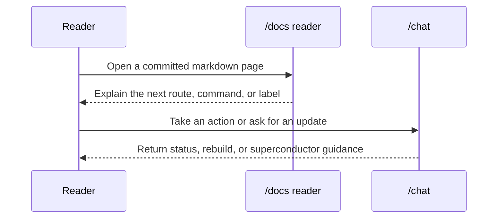

# Baton Exchange

Baton Exchange is another repo label that appears in the repository seed data. The legacy app data describes it as a context relay protocol, which makes it a natural fit for the docs surface. The important thing to keep in mind is that this page documents a shared label, not a standalone runtime service that has already been shipped under that name. It is a vocabulary page first and a product reference second.

## Overview

- `server/routes.ts` seeds `baton-exchange` as a monitored repository.
- The same file seeds a `docs/baton-exchange` page.
- The legacy sample content names Baton Exchange a context relay protocol for agent communication.
- `conductor/product.md` references the product vocabulary that surrounds the label.

Those references give the page enough weight to stand on its own. Baton Exchange is not just a random phrase in the sample data. It is the sort of name that helps the workspace describe how context moves from one actor to another. In a documentation system, that makes it a useful example for explaining handoff, traceability, and shared state without forcing the repo to define an actual protocol implementation in code.

## What The Label Means Here

In this repo, Baton Exchange is best understood as a relay concept. A baton is what one actor hands to another. The exchange is the moment when ownership of the next step changes hands. That idea maps well to documentation because docs also rely on handoffs: one page sets the context, another page adds the route details, and a third page shows where to verify the result.

If you are editing this page, the key question is not "what feature does Baton Exchange unlock?" The key question is "what kind of context handoff does the repository want readers to understand?" That distinction keeps the page honest. It also gives future contributors a clear cue that they should update the page only when the label or its usage changes, not every time an adjacent file gets a small cleanup.

## Recommended Page Shape

When a protocol-style page like this needs more detail, use a structure like the one below:

```md
## Role
## Participants
## What Moves Across the Handoff
## Failure Modes
## Example
## Related Pages
```

That shape is useful because it makes the page read like a compact contract. It also keeps the content traceable. A reader can quickly identify what the label means, who uses it, and where the repository already mentions it. The docs corpus benefits from that because the system is brownfield: a lot of meaning is already embedded in files, tests, and helper text, so the page needs to surface the meaning rather than invent it.

## Example Handoff Note

```md
The baton moves from the agent to the docs page when the page needs
context that was already discovered in seed data or help text.
The baton moves back to the reader when the page points to the next
route, command, or related label that should be checked next.
```

That example is intentionally descriptive. It does not claim a specific API shape or message format. Instead, it shows how a prose page can explain a handoff pattern without pretending that a protocol implementation already exists in a code module.

## Cross-Links That Make Sense

- [`panopticon`](/docs/panopticon) for the other seeded repo label that appears in intent coverage.
- [`panopticon-2-0`](/docs/panopticon-2-0) for the versioned follow-on label.
- [`getting-started`](/docs/getting-started) for the commands that confirm the workspace is still healthy after docs edits.

The cross-links matter because Baton Exchange sits in the same family as the other seeded examples. A reader who finds one of these pages should be able to walk to the others without searching the repo from scratch.

## Sequence Sketch



## Example Search Loop

```bash
rg -n "baton-exchange|Baton Exchange" server conductor wiki-content
```

Use the search to verify the actual wording before you change the prose. That is especially helpful when the page is acting as a semantic bridge between a legacy sample label and the current docs vocabulary.

## Next Steps

- Keep the page descriptive and evidence-driven.
- Add new sections only when the repo starts mentioning Baton Exchange in more places.
- Revisit the page if a future change turns the label from a concept into a concrete API, message, or adapter.

## Sources

- `server/routes.ts`
- `conductor/product.md`
