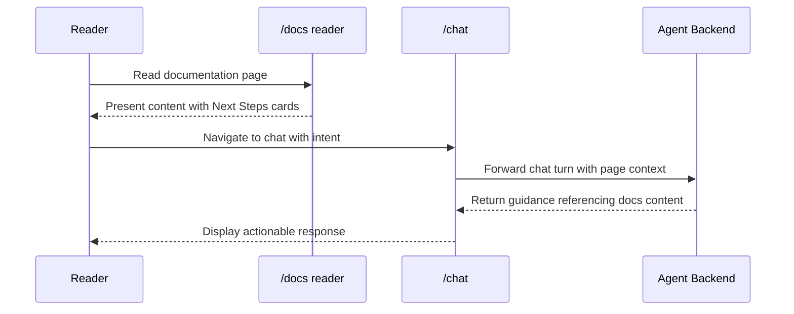

Baton Exchange is the context relay protocol that governs how state, intent, and artifacts move between actors in the Kijko ecosystem. When one agent completes a phase and hands off to the next, when the docs surface links a reader to the chat surface, or when the superconductor orchestrates worker fan-out, the handoff follows the Baton Exchange pattern: a structured transfer of context with explicit ownership, traceability, and verification at each relay point.

## Protocol Concept

The core idea is simple: a baton is a bundle of context that one actor hands to another. The exchange is the moment when ownership of the next step changes hands. What makes this a protocol rather than just a convention is the structure around each handoff:

1. **Context bundle** -- the data, state, and references being transferred
2. **Ownership transfer** -- explicit declaration of who holds the baton after the exchange
3. **Verification checkpoint** -- confirmation that the receiver has the context needed to proceed
4. **Traceability record** -- an audit trail showing what was handed off, when, and between whom

This pattern appears throughout the Kijko workspace, from the pipeline orchestrator's phase-to-phase state passing to the superconductor's worker manifests.

## Workspace Evidence

The Baton Exchange label is grounded in multiple repository surfaces:

| File | Reference |
|---|---|
| `server/routes.ts` | Seeded as a monitored repository (`baton-exchange`) |
| `server/routes.ts` | Seeded docs page entry at `docs/baton-exchange` |
| `conductor/product.md` | Referenced in the product vocabulary |
| `wiki-content/docs/baton-exchange.mdx` | Committed documentation page |

## Implementation in the Pipeline

The 7-agent documentation pipeline at `apps/agent/src/lib/pipeline/orchestrator.ts` is the clearest implementation of Baton Exchange in the codebase. Each phase receives an `AgentContext` (the baton) and returns an `AgentResult` that can modify the context for the next phase.

```typescript
// apps/agent/src/lib/pipeline/types.ts -- the baton structure
interface AgentContext {
  pipelineId: string;
  repoSlug: string;
  repoPath: string;
  existingPages: string[];
  codeGraphData?: CodeGraphFullGraph;
  cgcData?: CgcFullAnalysis;
  notebookContext?: NotebookSearchResult;
  forensicIngest?: ForensicIngestArtifacts;
  pipelineState: PipelineState;
  toolAvailability: ToolAvailability;
}

interface AgentResult {
  success: boolean;
  artifacts: Record<string, unknown>;
  errors: string[];
  metrics: { durationMs: number; llmCalls: number; toolCalls: number };
  nextContext?: Partial<AgentContext>;  // The modified baton
}
```

The `nextContext` field in `AgentResult` is the explicit baton modification. When an agent enriches the context -- for example, the Audit Agent populating `codeGraphData` or the forensic-ingest phase providing `ForensicIngestArtifacts` -- it returns the enriched data through `nextContext`, and the orchestrator merges it into the context before the next phase runs:

```typescript
// apps/agent/src/lib/pipeline/orchestrator.ts -- baton relay
if (result.nextContext) {
  if (result.nextContext.codeGraphData) codeGraphData = result.nextContext.codeGraphData;
  if (result.nextContext.cgcData) cgcData = result.nextContext.cgcData;
  if (result.nextContext.notebookContext) notebookContext = result.nextContext.notebookContext;
  if (result.nextContext.forensicIngest) forensicIngest = result.nextContext.forensicIngest;
}
```

## Superconductor Handoffs

The superconductor system at `apps/agent/src/lib/superconductor.ts` implements Baton Exchange at a higher level of abstraction. Each superconductor run generates structured artifacts that serve as batons for spawned workers:

- **`intent-alignment-report.md`** -- captures the active user intent claims, harness docs used, and brownfield reality summary
- **`docs-gap-report.md`** -- identifies intent-doc drift, doc-code drift, and missing documentation
- **`question-pack.json`** -- unresolved questions that workers need to address
- **`dependency-closure.json`** -- the set of files and symbols affected by the run
- **`sufficiency-report.json`** -- whether the current context is sufficient for implementation
- **`worker-context-manifest.json`** -- exact skills, tools, and constraints for each spawned worker

The spawn protocol enforces three gut checks before each baton handoff:

<Steps>
  <Step>
    **Prompt gut check**: Restate the active user intent as explicit claims. This verifies that the baton carrier understands what outcome is expected.
  </Step>
  <Step>
    **CGC gut check**: Confirm the affected files and boundaries still match the active claim set. This verifies the baton's scope is current.
  </Step>
  <Step>
    **NLM gut check**: Confirm aliases and harness sources point at the latest uploaded docs. This verifies the baton's knowledge base is fresh.
  </Step>
</Steps>

## Browser Surface Handoffs

The docs and chat surfaces implement Baton Exchange at the user interaction level. When a reader navigates from `/docs` to `/chat`, context should transfer:



The API client at `apps/web/lib/wiki-api-client.ts` mediates some of these handoffs by providing search and page data that both surfaces can reference. The `chatTurnRequestSchema` in `@kijko/shared` defines the structured format for chat messages, which includes context fields that carry the baton from the reading surface to the action surface.

## State Persistence as Baton Storage

The pipeline state store provides baton durability. The `PipelineStateStore` interface in the orchestrator supports save, load, and list operations:

```typescript
// apps/agent/src/lib/pipeline/orchestrator.ts
interface PipelineStateStore {
  save(state: PipelineState): void;
  load(id: string): PipelineState | null;
  list(): PipelineState[];
}
```

The default `InMemoryStateStore` uses a Map with `structuredClone` for isolation. For production, the `AppDatabase` at `apps/agent/src/storage/database.ts` provides SQLite-backed persistence, ensuring batons survive process restarts. The pipeline's `resume()` method demonstrates durable baton exchange: it loads a failed pipeline's state, resets the failed phase, and re-executes from that point with the accumulated context from all previous phases intact.

## Baton Exchange in Living Docs

The Living Docs workflow at `.github/workflows/living-docs.yml` implements automated Baton Exchange between CI and the documentation surface:

1. **Code change** triggers the workflow (baton: changed file paths)
2. **Docs rebuild** generates new automation artifacts (baton: corpus + quality report)
3. **Discovery report** identifies coverage gaps (baton: gap analysis)
4. **Monitoring report** tracks freshness and drift (baton: health assessment)
5. **Artifacts upload** stores the baton for downstream consumers

Each step consumes the baton from the previous step and produces an enriched baton for the next. The final artifact upload stores the complete chain at `conductor/artifacts/docs-automation/latest` and `wiki-content/.generated`.

## Failure Modes

<Accordions>
  <Accordion title="Lost context">
    If an agent phase fails before writing its nextContext, the baton is lost for that phase. The orchestrator's resume mechanism re-executes only the failed phase, but any context enrichment from that phase must be regenerated.
  </Accordion>
  <Accordion title="Stale context">
    If the codebase changes between pipeline phases, the baton may contain outdated information. The Monitor Agent addresses this by comparing content hashes against current file state and flagging pages for re-verification.
  </Accordion>
  <Accordion title="Incomplete handoff">
    If a superconductor worker receives a manifest without all required fields, the gut check protocol catches this before implementation begins. The sufficiency report explicitly states whether the current context is sufficient.
  </Accordion>
</Accordions>

## Next Steps

<Cards>
  <Card title="Panopticon" href="/docs/panopticon">
    See how the monitoring platform uses structured data flows that follow the Baton Exchange pattern.
  </Card>
  <Card title="Panopticon 2.0" href="/docs/panopticon-2-0">
    The durable orchestration layer with pipeline state persistence and resumable execution.
  </Card>
  <Card title="Getting Started" href="/docs/getting-started">
    Run the workspace locally and verify the pipeline handoff chain.
  </Card>
</Cards>
