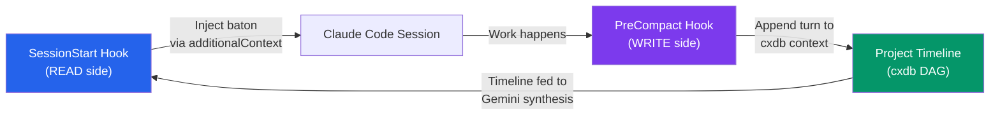

import { Card, Cards } from 'fumadocs-ui/components/card'
import { Callout } from 'fumadocs-ui/components/callout'
import { Tab, Tabs } from 'fumadocs-ui/components/tabs'
import { Accordion, Accordions } from 'fumadocs-ui/components/accordion'

Baton Exchange is built on a small number of core concepts. Understanding them makes the entire system predictable -- every component exists to serve one of these ideas.

## The Baton

A baton is a compressed JSON payload (~200-300 tokens) that carries everything a Claude Code session needs to resume seamlessly from where the last session left off. Every baton has exactly three pillars:

### Purpose -- The North Star

A single sentence declaring what the agent is working toward. This is the anchor that prevents context drift across sessions. No matter how many compactions occur, the purpose persists.

```json
{
  "purpose": "Build authentication system with JWT refresh token rotation"
}
```

The purpose is never lost. Even if the cxdb timeline is empty (a brand new project), the baton carries the purpose forward.

### Persistence -- Where You Left Off

The persistence pillar captures the session's work state: what is done, what is in progress, what comes next, and which files are active.

```json
{
  "persistence": {
    "last_session": "a1b2c3d4-e5f6-7890-abcd-ef1234567890",
    "completed": [
      "User model and migration",
      "Login endpoint with bcrypt",
      "JWT access token generation"
    ],
    "in_progress": "Implementing refresh token rotation",
    "next": [
      "Add token revocation on logout",
      "Rate limit login attempts",
      "Write integration tests"
    ],
    "files_touched": [
      "src/auth/tokens.py",
      "src/auth/routes.py",
      "src/models/user.py",
      "tests/test_auth.py"
    ]
  }
}
```

| Field | Purpose |
|-------|---------|
| `last_session` | UUID of the most recent session, for traceability |
| `completed` | Tasks finished in prior sessions |
| `in_progress` | What the agent was actively working on when context compacted |
| `next` | Prioritized queue of upcoming tasks |
| `files_touched` | Active file paths (with optional line numbers) to restore working set |

### Steering -- Lessons Learned

The steering pillar carries hard-won knowledge: bugs encountered, constraints imposed, and architectural decisions made. This is what prevents the agent from repeating mistakes.

```json
{
  "steering": {
    "mode": "implement",
    "gotchas": [
      "Redis session store requires decode_responses=True or bytes comparison fails silently",
      "PyJWT 2.x changed encode() to return str not bytes -- don't call .decode()",
      "Refresh tokens must be single-use: rotate on every refresh, revoke the old one"
    ],
    "constraints": [
      "Use httponly cookies for refresh tokens, not localStorage",
      "Max 300 lines per file"
    ],
    "decisions_made": [
      "Chose PyJWT over python-jose for fewer dependencies",
      "Redis for token blacklist instead of DB table (faster lookups)",
      "Asymmetric RS256 keys so services can verify without signing key"
    ]
  }
}
```

| Field | Purpose |
|-------|---------|
| `mode` | Current work mode: `implement`, `debug`, `refactor`, or `review` |
| `gotchas` | Non-obvious pitfalls that caused real problems -- prevents repeat failures |
| `constraints` | Hard rules the agent must follow |
| `decisions_made` | Architectural choices with rationale -- prevents relitigating settled questions |

<Callout type="warn" title="Gotchas are earned, not guessed">
  The synthesis engine only includes gotchas that actually surfaced during prior sessions. Speculative warnings are filtered out to keep the baton signal-dense.
</Callout>

## The Relay Loop

The relay loop is the lifecycle that keeps batons fresh. It has two sides:



**READ side** (`baton_hook.py`): Fires on SessionStart. Calls HyperVisa to synthesize a baton from the project's cxdb timeline and NotebookLM knowledge. Injects the result as `additionalContext`.

**WRITE side** (`compact_hook.py`): Fires on PreCompact. Ingests the session to DuckDB, syncs a summary to NotebookLM, and appends a structured turn to the project's cxdb context.

The loop is self-reinforcing: each session enriches the timeline, making the next baton more informed.

## Project Context Registry

Every project gets a dedicated cxdb context -- a persistent conversation thread where each turn represents a session summary. The registry maps project names to cxdb context IDs:

```json
{
  "projects": {
    "my-auth-service": {
      "context_id": 42,
      "head_turn_id": 87,
      "cwd": "/home/user/Projects/my-auth-service",
      "created": "2026-02-24T10:00:00",
      "last_session": "a1b2c3d4-e5f6-7890-abcd-ef1234567890",
      "updated": "2026-02-24T14:30:00"
    }
  }
}
```

The registry is stored at `~/.cortex/baton/project-contexts.json`. Project detection works by:

1. Checking `git remote get-url origin` and extracting the repo name
2. Falling back to the directory basename
3. Skipping system directories (`home`, `root`, `tmp`, `devuser`)

When a project is seen for the first time, a new cxdb context is created automatically. Subsequent sessions append turns to the same context, building a continuous project timeline.

## Baton Synthesis

Synthesis is the process of compressing a project's timeline into a baton. It happens on every SessionStart via the HyperVisa `/baton` API.

### Input Sources

The synthesis engine draws from two sources:

| Source | What It Provides | Limit |
|--------|-----------------|-------|
| **cxdb Timeline** | Structured session turns with metadata (gotchas, decisions, progress) | Last 5-10 turns |
| **NotebookLM Hivemind** | Project-specific knowledge from the human transparency layer | Query-based, ~1000 chars |

### Compression via Gemini

The raw context (timeline + NLM knowledge) is fed to Gemini 3 Flash with a system prompt that enforces the three-pillar schema. The model is configured with:

- `temperature: 0.2` (low creativity -- we want accurate compression, not invention)
- `response_mime_type: "application/json"` (structured output guaranteed)
- `max_output_tokens: 2048` (generous ceiling, but the prompt targets <400 tokens)

### Compression Modes

| Mode | Timeline Limit | When Used |
|------|---------------|-----------|
| `normal` | Last 10 turns | Default for most sessions |
| `ultra` | Last 5 turns | Near context-limit sessions where every token counts |
| `fallback` | Raw extraction | Gemini unavailable -- extracts what it can from raw timeline |

### Fallback Behavior

If Gemini is unreachable or returns invalid JSON, the synthesis engine generates a fallback baton by extracting structured data directly from the cxdb timeline metadata. This ensures batons always inject, even when the LLM is down.

## Dependency Edges

The baton tracks which files depend on which, with line-level precision:

```json
{
  "dependency_edges": {
    "src/auth/tokens.py": {
      "requires": "src/config.py",
      "line": 15
    },
    "src/auth/routes.py": {
      "requires": "src/auth/tokens.py",
      "line": 8
    }
  }
}
```

This gives the agent an instant map of the active working set and its import graph. Only files actively being modified are included -- this is not a full dependency tree.

## Baton Caching

Synthesized batons are cached to disk in two locations for the statusline and other consumers:

| Path | Purpose |
|------|---------|
| `~/.cortex/baton/baton-{project}.json` | Per-project baton cache |
| `~/.cortex/baton/last-baton.json` | Global last-baton for backwards compatibility |
| `~/.cortex/baton/last-inject.json` | Injection telemetry (timestamp, char count, est. tokens) |
| `~/.cortex/baton/hypervisa-stats.json` | HyperVisa session stats for context bar |

## Learnings Database

Beyond the baton itself, structured learnings are accumulated in a SQLite database at `~/.cortex/baton/learnings.db`. Every baton synthesis extracts gotchas, decisions, constraints, and progress markers into deduplicated rows:

```sql
CREATE TABLE learnings (
    id INTEGER PRIMARY KEY AUTOINCREMENT,
    project TEXT NOT NULL,
    session_id TEXT,
    category TEXT NOT NULL,    -- gotcha | decision | constraint | progress
    content TEXT NOT NULL,
    source TEXT,               -- baton_synthesis
    created_at TEXT NOT NULL,
    UNIQUE(project, category, content)
);
```

The `UNIQUE` constraint ensures the same learning is never duplicated. The statusline reads from this database to show the total learnings count.

<Accordions>
  <Accordion title="Why not just use the baton JSON for learnings?">
    The baton is ephemeral -- it shows the current compressed state. The learnings database is cumulative -- it preserves every gotcha and decision ever recorded, even if the baton synthesis drops older items to stay under the token budget. Think of the baton as working memory and the learnings DB as long-term memory.
  </Accordion>
  <Accordion title="What happens when a project has no cxdb history?">
    The synthesis engine returns a minimal baton with just the project name and a generic "Continue work on {project}" purpose. As sessions accumulate, the baton becomes progressively richer.
  </Accordion>
  <Accordion title="Can batons work without NotebookLM?">
    Yes. NotebookLM is optional. If unavailable, the baton is synthesized solely from cxdb timeline data. The `_meta.nlm_available` field in the baton indicates whether NLM context was used.
  </Accordion>
</Accordions>

## Next Steps

<Cards>
  <Card title="Quickstart" href="/docs/baton-exchange/quickstart">
    Install Baton Exchange and see your first baton injection.
  </Card>
  <Card title="Architecture" href="/docs/baton-exchange/architecture">
    See how all these concepts are wired together at the component level.
  </Card>
  <Card title="Protocol Specification" href="/docs/baton-exchange/protocol-spec">
    The formal baton schema, cxdb wire protocol, and synthesis prompt.
  </Card>
  <Card title="API Reference" href="/docs/baton-exchange/api-reference">
    Complete reference for CxdbClient, baton relay, and the synthesis engine.
  </Card>
</Cards>
