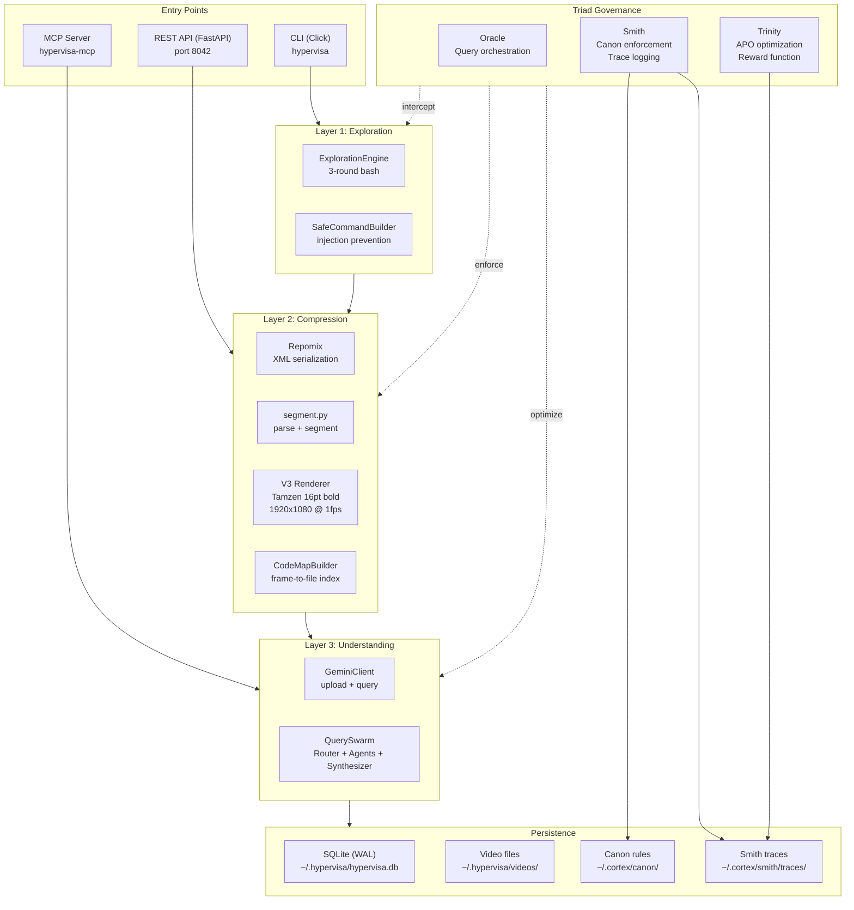
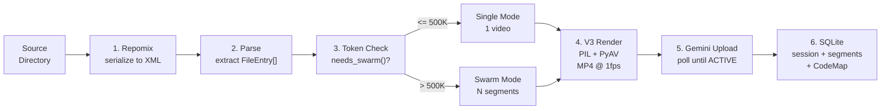
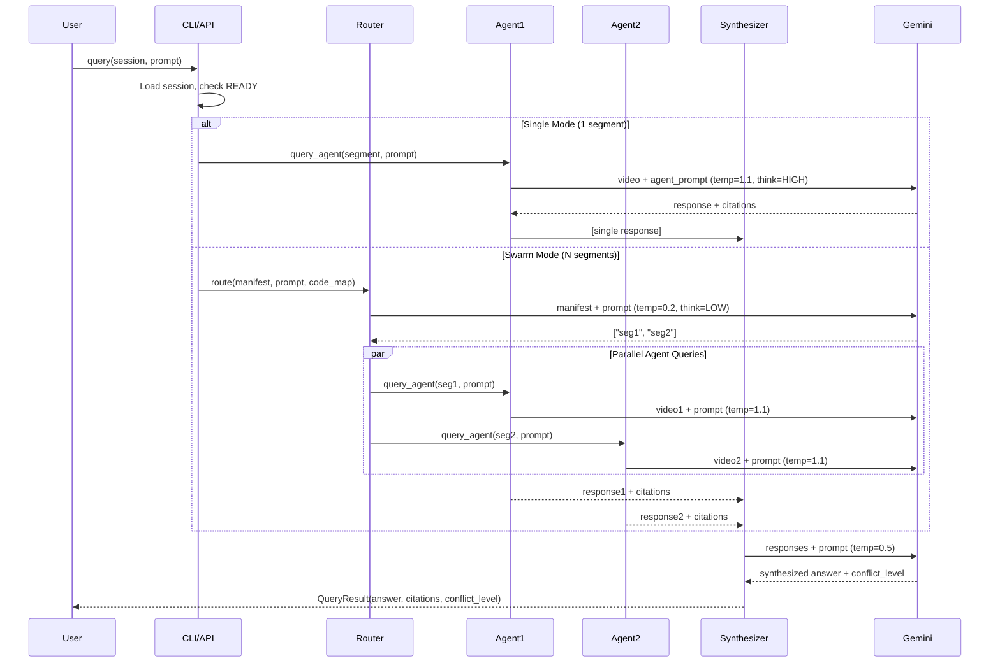

import { Card, Cards } from 'fumadocs-ui/components/card'
import { Callout } from 'fumadocs-ui/components/callout'
import { Tab, Tabs } from 'fumadocs-ui/components/tabs'
import { Accordion, Accordions } from 'fumadocs-ui/components/accordion'

HyperVisa 3.0 is organized as a three-layer stack with governance oversight. Each layer has a single responsibility: **Layer 1** explores and narrows the codebase, **Layer 2** compresses the relevant code into video, and **Layer 3** processes the video through Gemini agents. The Triad (Oracle, Smith, Trinity) governs the entire pipeline.

## System Overview



## Ingestion Pipeline

The ingestion pipeline transforms a source directory into queryable video segments in six steps. The pipeline runs asynchronously when triggered via the API, and synchronously via the CLI.



### Step 1: Repomix Serialization

HyperVisa delegates codebase serialization to [Repomix](https://github.com/yamadashy/repomix), which outputs an XML document with each file wrapped in `<file path="...">` tags. The parser (`segment.py:parse_repomix`) auto-detects XML or Markdown format.

### Step 2: Parse into FileEntry Objects

Each file becomes a `FileEntry` with `path`, `content`, and an estimated `tokens` count (calculated as `len(content) // 4` using the `CHARS_PER_TOKEN` constant).

### Step 3: Token Check and Segmentation

If total tokens exceed `SWARM_THRESHOLD` (500,000), files are grouped into segments:

1. **Group by top-level directory** -- each directory becomes a candidate segment
2. **Split large directories** -- if a directory exceeds `MAX_SEGMENT_TOKENS` (450,000), split by subdirectory
3. **Merge tiny groups** -- directories under 5% of max tokens merge into a `_misc` segment

```python title="src/hypervisa/segment.py"
def segment_files(files: list[FileEntry], max_tokens: int = 450_000) -> dict[str, list[FileEntry]]:
    """Group files into segments for swarm mode processing."""
    groups: dict[str, list[FileEntry]] = defaultdict(list)
    for f in files:
        groups[_top_dir(f.path)].append(f)
    # Split large groups, merge tiny groups into _misc
    ...
```

### Step 4: V3 Rendering

The `HypervisaRendererV3` renders source code as video frames optimized for VLM comprehension:

| Parameter | Value | Rationale |
|-----------|-------|-----------|
| Resolution | 1920x1080 | Landscape orientation preserves code line length |
| Font | Tamzen 16pt bold | Bitmap font eliminates aliasing; bold improves VLM readability |
| Layout | Single column | Preserves code line structure without wrapping |
| Density | 0.7 with 1.2 line spacing | Balanced between readability and information density |
| Background | White (#FFFFFF) | High contrast with dark text (#212121) |
| Codec | H.264 via PyAV (libx264) | `yuv420p` pixel format for maximum compatibility |
| FPS | 1 | Static frames minimize token cost; Gemini samples 8-32 frames |

<Callout type="info" title="Dead Code Note">
  The V2 base class contains a full Chromacode syntax highlighting system with tree-sitter parsing and 40+ color mappings. This is **dead code** -- the actual `_render_frame()` method renders all text in a single flat `text_color`. The V3 renderer inherits from V2 but only uses the bitmap font rendering path.
</Callout>

### Step 5: Gemini Upload

Each rendered MP4 is uploaded via `google.genai.files.upload()`. The client polls until the file reaches `ACTIVE` state (timeout: 300 seconds, poll interval: 2 seconds). Files remain active for 7 days via Gemini's context caching.

### Step 6: Persistence

The `SessionStore` persists everything in SQLite with WAL mode at `~/.hypervisa/hypervisa.db`:
- **sessions** table: id, name, mode, model, manifest, total_tokens, status
- **segments** table: session_id, video_path, gemini_file_name, cache_name, youtube_url, token_count
- **code_maps** table: session_id, entries (JSON), library_card (JSON)

## Query Flow



### Router

The Router selects up to 3 segments from the manifest using a low-temperature Gemini call (0.2). When a `CodeMap` is available, the Router includes architecture zone information, entry points, and hot paths in its decision context.

### Parallel Agents

Each agent receives the video file reference and the user's prompt wrapped in `_AGENT_PROMPT`. Agents operate at high temperature (1.1) with `thinking=HIGH` and Google Search grounding enabled. Every claim must include a citation with `frame`, `column`, `row`, `file_path`, and `confidence` fields.

### Hierarchical Synthesizer

The Synthesizer merges agent responses with explicit conflict detection:
- **Agreement**: unified answer passes through
- **Minor conflict**: both perspectives noted with uncertainty markers
- **Major conflict**: flagged for re-query with focused prompt

## Code Map System

The `CodeMapBuilder` creates a frame-to-file-to-architecture index for each session. This index powers the Router's architecture-aware segment selection.

```python title="src/hypervisa/models/core.py"
class CodeMapEntry(BaseModel):
    frame_range: tuple[int, int] | list[int]   # Which frames contain this code
    files: list[str]                            # Source file paths
    architecture_zone: str                      # Inferred zone (e.g., "api", "core")
    dependencies: list[str]                     # Import-based dependencies
    token_count: int
    summary: str

class LibraryCard(BaseModel):
    architecture_zones: list[str]      # All zones discovered
    entry_points: list[str]            # main.py, index.ts, cli.py, etc.
    hot_paths: list[str]               # Most-imported dependency chains
```

The `LibraryCard` provides Oracle with a high-level architecture overview without reading any video content -- it is the "table of contents" for a session.

## Module Map

| Module | File | Purpose |
|--------|------|---------|
| **CLI** | `cli.py` | Click-based user interface; orchestrates pipelines |
| **API** | `api.py` | FastAPI REST endpoints on port 8042 |
| **MCP Server** | `mcp_server.py` | MCP tools for LLM integration via stdio |
| **Segmentation** | `segment.py` | Parse repomix, split into segments, build manifest |
| **Swarm** | `swarm.py` | Router, Agent, Synthesizer query coordination |
| **Gemini** | `gemini.py` | Google GenAI SDK wrapper with retry and caching |
| **Render** | `render.py` | V3 renderer coordination |
| **V3 Renderer** | `core/hypervisa_renderer_v3.py` | PIL + PyAV bitmap rendering engine |
| **Store** | `store.py` | SQLite persistence with WAL mode |
| **Code Map** | `codemap.py` | Frame-to-file index and library card builder |
| **Exploration** | `exploration.py` | 3-round safe bash exploration |
| **Canon** | `canon.py` | Three-tier rule enforcement (reflexes, habits, skills) |
| **Smith** | `smith.py` | Sidecar sentinel with hook interception and trace logging |
| **Trinity** | `trinity.py` | Kaizen optimizer with APO experiments and governance |
| **Reward** | `reward.py` | 6-dimensional reward function with anti-gaming |
| **Baton** | `baton.py` | Session context compression via cxdb + NotebookLM |
| **Mental Model** | `mental_model.py` | Non-Gemini model support (frame extraction for Claude/GPT) |

## State Directories

HyperVisa 3.0 uses three state directories:

| Directory | Purpose |
|-----------|---------|
| `~/.hypervisa/` | SQLite database, video files |
| `~/.cortex/canon/` | Canon YAML rules (reflexes, habits, skills) + compiled-rules.json |
| `~/.cortex/smith/traces/` | Smith JSONL trace files per session |
| `~/.cortex/lightning/rollouts/` | Trinity APO rollout data |
| `~/.cortex/logs/` | Trinity APO cycle logs |

<Cards>
  <Card title="Core Concepts" href="/docs/hypervisa-3.0/concepts">
    Understand the theoretical foundations: video compression thesis, exploration-guided generation, and the Triad governance model.
  </Card>
  <Card title="Configuration" href="/docs/hypervisa-3.0/configuration">
    All environment variables, renderer settings, and Canon rule configuration options.
  </Card>
</Cards>
