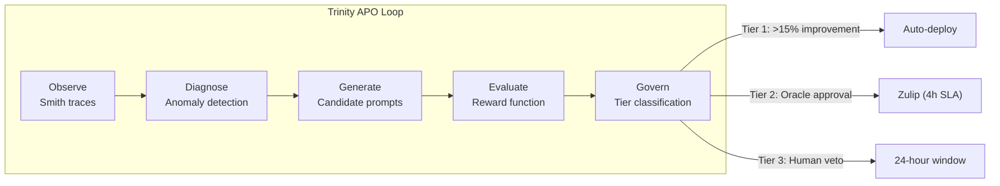

import { Card, Cards } from 'fumadocs-ui/components/card'
import { Callout } from 'fumadocs-ui/components/callout'
import { Tab, Tabs } from 'fumadocs-ui/components/tabs'
import { Accordion, Accordions } from 'fumadocs-ui/components/accordion'

Understanding HyperVisa's core concepts is essential because the system makes unconventional architectural choices that only make sense in the context of its central thesis: **video-mediated compression delivers better codebase understanding than text-based RAG at repository scale**.

## The Compression Thesis

Traditional approaches to feeding large codebases to LLMs fall into three categories, all with fundamental limitations:

<Cards>
  <Card title="Context Stuffing">
    Dump the entire codebase into a 1M+ token window. Performance degrades as a function of both length AND complexity -- attention dilution buries critical information among irrelevant code.
  </Card>
  <Card title="Summarization">
    Auto-compact context when the window fills. Deciding what to keep is itself a hard task, and progressive summarization compounds fidelity loss across cycles.
  </Card>
  <Card title="RAG">
    Retrieve top-k chunks by embedding similarity. Semantic similarity does not equal relevance, chunking strategy is task-dependent, and isolated chunks lose their dependency edges.
  </Card>
</Cards>

HyperVisa takes a different approach: render the code as video frames and feed them to Gemini's vision model. A single 1920x1080 frame at 16pt Tamzen bold contains approximately 80 lines x 120 characters of visible code. As text tokens, those 80 lines would cost 1,200-2,000 tokens. As a video frame, they cost **258 tokens** (default resolution) or **66 tokens** (low resolution).

At repository scale, this compounds. The OpenClaw benchmark measured **22x compression without information loss** -- an entire codebase that would exhaust Gemini's 1M context window as text fits comfortably as a short MP4.

<Callout type="info" title="Key Insight">
  Gemini samples 8-32 frames per video for comprehension. This means frame ordering matters enormously -- the sampled frames ARE the context. Ensuring the most important code appears in likely-sampled positions is the key optimization opportunity.
</Callout>

## The Three-Layer Architecture

### Layer 1: Bash Exploration

Before rendering any video, the `ExplorationEngine` runs three rounds of safe bash commands to narrow the codebase to the relevant 5%:

| Round | Strategy | Commands | Purpose |
|-------|----------|----------|---------|
| 1 | Map architecture surface | `grep -rl`, `find` | Discover files matching the query |
| 2 | Extract critical-path previews | `head -n 20` | Read the first 20 lines of candidate files |
| 3 | Compute stats and filter | `wc -l`, `file` | Line counts and file type classification |

The `SafeCommandBuilder` validates every argument against injection-risk patterns (backticks, `$()`, semicolons, pipes, redirects) and only allows a whitelisted set of read-only commands: `find`, `grep`, `wc`, `head`, `tail`, `tree`, `awk`, `sed`, `cat`, `ls`, `file`, `sort`, `uniq`, `cut`.

This approach maps directly to the Recursive Language Model (RLM) paradigm validated in academic research: the model uses code execution to search data programmatically rather than stuffing it all into context.

### Layer 2: Visual Compression

The V3 renderer converts source code into MP4 video optimized for VLM comprehension. Key design decisions:

- **Bitmap fonts over TrueType**: Tamzen bitmap fonts produce pixel-perfect output with zero aliasing, which matters when a vision model must OCR text from video frames
- **White background, dark text**: Reference frame validation showed this combination produces the best VLM accuracy
- **1fps static frames**: Each frame is independent (no inter-frame motion), minimizing tokens per frame while preserving text sharpness
- **H.264 intra-frame only**: Via PyAV's libx264 with `yuv420p` pixel format for maximum decoder compatibility

### Layer 3: Gemini Understanding

Video segments are uploaded to Google Gemini's file API and queried with structured prompts. The system supports two query modes:

**Single Mode** (codebases under 500K tokens): One video, one Gemini query with the full prompt. Direct and simple.

**Swarm Mode** (codebases over 500K tokens): The QuerySwarm coordinates a three-stage pipeline:
1. **Router** selects 1-3 relevant segments using low-temperature (0.2) Gemini with the manifest and CodeMap
2. **Agents** query each segment in parallel using high-temperature (1.1) Gemini with thinking enabled
3. **Synthesizer** merges responses with conflict detection (agreement / minor / major)

## The Triad: Oracle, Smith, Trinity

HyperVisa 3.0 introduces a governance model where three agents with distinct roles ensure quality and safety.

### Oracle (The Strategist)

Oracle orchestrates queries and makes strategic decisions about how to approach a codebase. It uses the LibraryCard from the CodeMap system to understand architecture zones, entry points, and hot paths before routing queries to specific segments.

### Smith (The Sentinel)

Smith is the sidecar sentinel that intercepts every tool call and enforces behavioral rules through the **Canon system**. Smith operates through three mechanisms:

1. **Hook Interception**: Smith intercepts `PreToolUse`, `PostToolUse`, and `PreMessageSend` events, matching them against Canon rules
2. **Trace Logging**: Every interception verdict is logged as a JSONL trace at `~/.cortex/smith/traces/{session_id}.jsonl`
3. **Context Budget Tracking**: Smith monitors context window usage with thresholds at 70%, 85%, and 95%

Smith also detects three hallucination failure modes from the business logic specification:
- **Doesn't Understand**: Agent misinterprets the codebase structure
- **Doesn't Verify**: Agent makes claims without checking citations
- **Thrashes**: Agent loops between approaches without converging

### Trinity (The Optimizer)

Trinity runs Automated Prompt Optimization (APO) experiments using Smith's trace data as input:

1. **Observe**: Analyze recent traces for anomalies (high violation rates, low answer quality)
2. **Diagnose**: Identify root cause (prompt weakness, routing error, synthesis failure)
3. **Generate**: Create candidate prompt variants with hypotheses
4. **Evaluate**: Score candidates against a baseline using the 6-dimensional reward function
5. **Govern**: Route deployment through the governance tier system



## The Canon Rule System

Canon is a three-tier behavioral rule enforcement system stored as YAML files at `~/.cortex/canon/`:

| Tier | File | Action | Purpose |
|------|------|--------|---------|
| **Reflex** | `reflexes.yaml` | `BLOCK` | Immediate prevention of dangerous operations |
| **Habit** | `habits.yaml` | `WARN` | Gentle reminders about best practices |
| **Skill** | `skills.yaml` | `INJECT` | Context injection for approaching thresholds |

Example reflex rules from the default seed configuration:

```yaml title="~/.cortex/canon/reflexes.yaml"
- rule_id: R001
  tier: reflex
  hook_target: PreToolUse
  condition: "tool_name == 'Bash' and 'rm -rf' in input"
  action: block
  message: "R001: Destructive command blocked -- rm -rf requires explicit permission."

- rule_id: R002
  tier: reflex
  hook_target: PreToolUse
  condition: "tool_name == 'Bash' and 'git push --force' in input"
  action: block
  message: "R002: Force-push blocked -- requires explicit user approval."
```

Canon rules are compiled into `compiled-rules.json` for O(1) lookup by hook target, with timestamped history backups on every modification.

## The Reward Function

Trinity evaluates prompt candidates using a 6-dimensional reward vector:

```python title="src/hypervisa/models/reward.py"
R = 0.25 * test_pass_rate        # Do tests still pass?
  + 0.20 * token_efficiency      # 1 - (tokens_used / tokens_available)
  + 0.20 * commit_fidelity       # tests_added / files_modified
  + 0.15 * code_quality          # Linting + style compliance
  + 0.10 * tool_efficiency       # 1 - (tool_calls / max_expected)
  + 0.10 * (1 - violation_rate)  # Lower Canon violations = better
```

Cross-agent grading prevents gaming: Oracle is graded by Smith, Smith by Trinity, Trinity by Oracle. No agent grades itself.

## Baton Relay Protocol

The Baton compresses session history and NotebookLM knowledge into a <500-token JSON payload with three pillars:

- **Purpose**: The north-star objective (never lost across sessions)
- **Persistence**: Where the last session left off, what is in progress, what is next
- **Steering**: Gotchas, constraints, lessons learned, decisions made

The Baton is synthesized by querying cxdb for project timeline data and NotebookLM for curated knowledge, then compressing both through a dedicated Gemini call at low temperature (0.2) with `response_mime_type="application/json"`.

## YouTube Watch Mode

HyperVisa supports ingesting YouTube URLs directly -- no video rendering needed because Gemini has native video understanding. A YouTube session stores only the URL as a segment and queries it through the same pipeline.

```bash
hypervisa watch --url "https://youtube.com/watch?v=..." --name my-video
hypervisa query --session my-video "What does the speaker explain about authentication?"
```

<Callout type="info" title="Key Takeaways">
  - Video compression is 22x more efficient than text at repository scale
  - The three-layer architecture (explore, compress, understand) mirrors the RLM paradigm
  - Smith's Canon system provides three tiers of behavioral enforcement
  - Trinity's APO loop continuously improves prompt quality with empirical evidence
  - The Baton protocol preserves agent context across session boundaries
</Callout>

<Cards>
  <Card title="Architecture" href="/docs/hypervisa-3.0/architecture">
    Detailed diagrams of the ingestion pipeline, query flow, and module responsibilities.
  </Card>
  <Card title="Configuration" href="/docs/hypervisa-3.0/configuration">
    All environment variables, renderer settings, Canon rules, and deployment options.
  </Card>
</Cards>
