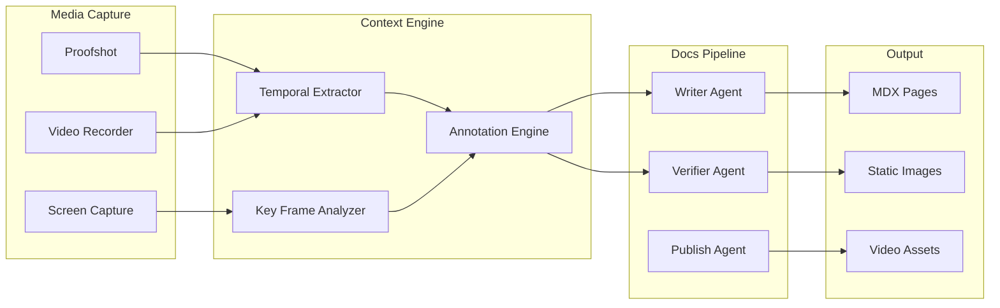

HyperVisa 3.0 is a video-mediated context engine that enables rich media documentation workflows within the Kijko ecosystem. It appears in the seeded repository data as `HyperVisa3.0` and represents the workspace's approach to augmenting text-based documentation with video context, visual walkthroughs, and media-enriched knowledge capture. In the current workspace, HyperVisa serves as both a product concept and a documentation vocabulary anchor that connects the agent help text, seed data, and docs surface.

## Workspace Evidence

The HyperVisa label is grounded in multiple repository surfaces, establishing it as a stable reference point in the Kijko vocabulary:

| File | Reference Type |
|---|---|
| `server/routes.ts` | Seeded as an active monitored repository (`HyperVisa3.0`) |
| `server/routes.ts` | Seeded docs page entry at `docs/hypervisa-3-0` |
| `apps/agent/src/lib/chat-engine.ts` | Agent help text includes HyperVisa as an example page update command |
| `wiki-content/docs/hypervisa-3-0.mdx` | Committed documentation page in the MDX corpus |

Those references make HyperVisa 3.0 a first-class member of the documentation vocabulary alongside Panopticon, Baton Exchange, and Panopticon 2.0.

## Concept Architecture

HyperVisa 3.0 addresses a specific gap in documentation systems: the inability to capture context that exists naturally in video but is lost when reduced to text. Traditional documentation relies on screenshots and code snippets. HyperVisa extends this with:

<Cards>
  <Card title="Video Context Capture">
    Records walkthroughs, demos, and debugging sessions as structured video artifacts that can be indexed and searched alongside text documentation.
  </Card>
  <Card title="Media Pipeline Integration">
    Connects to the documentation pipeline's writer and verifier agents, providing visual evidence that code examples and configurations produce the expected results.
  </Card>
  <Card title="Temporal Annotations">
    Links specific timestamps in video content to code references, configuration changes, and documentation sections for navigable cross-referencing.
  </Card>
  <Card title="Context Extraction">
    Processes video content to extract key frames, terminal output, and UI state changes that can be embedded in MDX pages as static assets.
  </Card>
</Cards>

## How It Connects to the Pipeline

Within the 7-agent documentation pipeline at `apps/agent/src/lib/pipeline/orchestrator.ts`, HyperVisa concepts map to two existing patterns:

### Proofshot Integration

The closest existing implementation of HyperVisa concepts is the Proofshot system in `server/proofshot.ts`. Proofshot provides:

- **Session management**: `startProofshotSession()` and `stopProofshotSession()` control recording sessions
- **Artifact capture**: `sendProofshotArtifact()` stores visual evidence
- **Status tracking**: `getProofshotStatus()` monitors active sessions
- **Default configuration**: `installProofshotDefaults()` sets up standard capture parameters

The Proofshot system is registered in `server/routes.ts` with dedicated API endpoints, establishing the pattern that HyperVisa 3.0 extends from screenshot-level verification to full video-mediated context capture.

### Visual Support in Templates

The documentation style system at `wiki-content/style-system.json` includes visual support definitions in its template library. Each `DocsTemplateDefinition` in `apps/web/lib/docs.ts` supports:

```typescript
// apps/web/lib/docs.ts -- template visual support
type DocsTemplateDefinition = {
  id: string;
  title: string;
  sections: string[];
  componentMappings: Record<string, string>;
  visualSupport?: {
    capture?: string;        // Screenshot capture mode
    annotations?: boolean;   // Annotation overlay support
    videoWalkthrough?: boolean;  // Video walkthrough embedding
    diagramHooks?: string[]; // Diagram generation hooks
  };
};
```

The `videoWalkthrough` and `capture` fields in the template definition are the extension points where HyperVisa capabilities integrate with the existing documentation infrastructure.

## Context Engine Design

The "context engine" aspect of HyperVisa refers to its role in maintaining state across documentation workflows. When a contributor records a setup walkthrough or a debugging session, HyperVisa captures not just the video but the surrounding context:

1. **Environment state** -- which configuration was active, which branch was checked out, which services were running
2. **Temporal sequence** -- the order of operations that produced the documented outcome
3. **Verification evidence** -- visual proof that the documented steps produce the expected result
4. **Cross-reference points** -- timestamps linked to specific code paths, configuration keys, or API endpoints

This context model aligns with the broader Kijko documentation philosophy expressed in `conductor/product.md`: documentation should be traceable to real repository artifacts rather than abstract descriptions.

## Architecture Diagram

The architecture diagram builder in `server/architecture.ts` includes HyperVisa as a node in the workspace dependency graph. The `buildRepoSignature()` function generates a stable identifier for HyperVisa based on its seed data, and `scoreRelationshipReference()` uses text pattern matching to discover relationships between HyperVisa and other workspace components.



## Relationship to Panopticon

HyperVisa 3.0 and [Panopticon](/docs/panopticon) are complementary documentation concepts. Panopticon provides observability for running infrastructure -- metrics, traces, and alerts about system behavior. HyperVisa provides observability for documentation workflows -- video evidence, context capture, and temporal annotations about how documentation is created and verified.

| Aspect | Panopticon | HyperVisa 3.0 |
|---|---|---|
| **Observes** | Infrastructure behavior | Documentation workflows |
| **Data Type** | Time-series metrics | Video + temporal context |
| **Output** | Dashboards, alerts | Annotated walkthroughs |
| **Integration** | Scrape/push telemetry | Proofshot + pipeline agents |

## Discovery Report Integration

When the agent runs `pnpm --filter @kijko/wikiagent-agent docs:discover`, the `DiscoveryReport` type in `apps/agent/src/lib/docs-pipeline.ts` includes HyperVisa in its inventory. The report tracks:

- **coverageGaps** -- API operations or SDK symbols not yet documented
- **contradictions** -- claims in docs that conflict with current code
- **undocumentedSymbols** -- exported symbols without corresponding pages
- **docCodeLinks** -- connections between doc slugs and code symbols

HyperVisa pages appear in this discovery process through the seed data in `server/routes.ts`, ensuring that the documentation pipeline tracks its completeness.

## Next Steps

<Cards>
  <Card title="Panopticon" href="/docs/panopticon">
    The infrastructure observability counterpart to HyperVisa's documentation observability.
  </Card>
  <Card title="Baton Exchange" href="/docs/baton-exchange">
    The context relay protocol that governs handoffs between documentation and action surfaces.
  </Card>
  <Card title="Getting Started" href="/docs/getting-started">
    Set up the workspace and run the verification commands that keep docs aligned with code.
  </Card>
</Cards>
