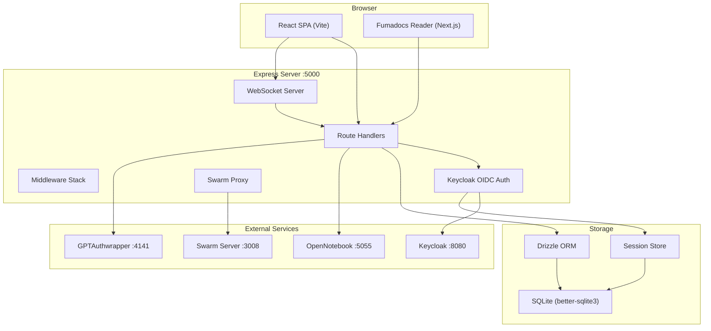
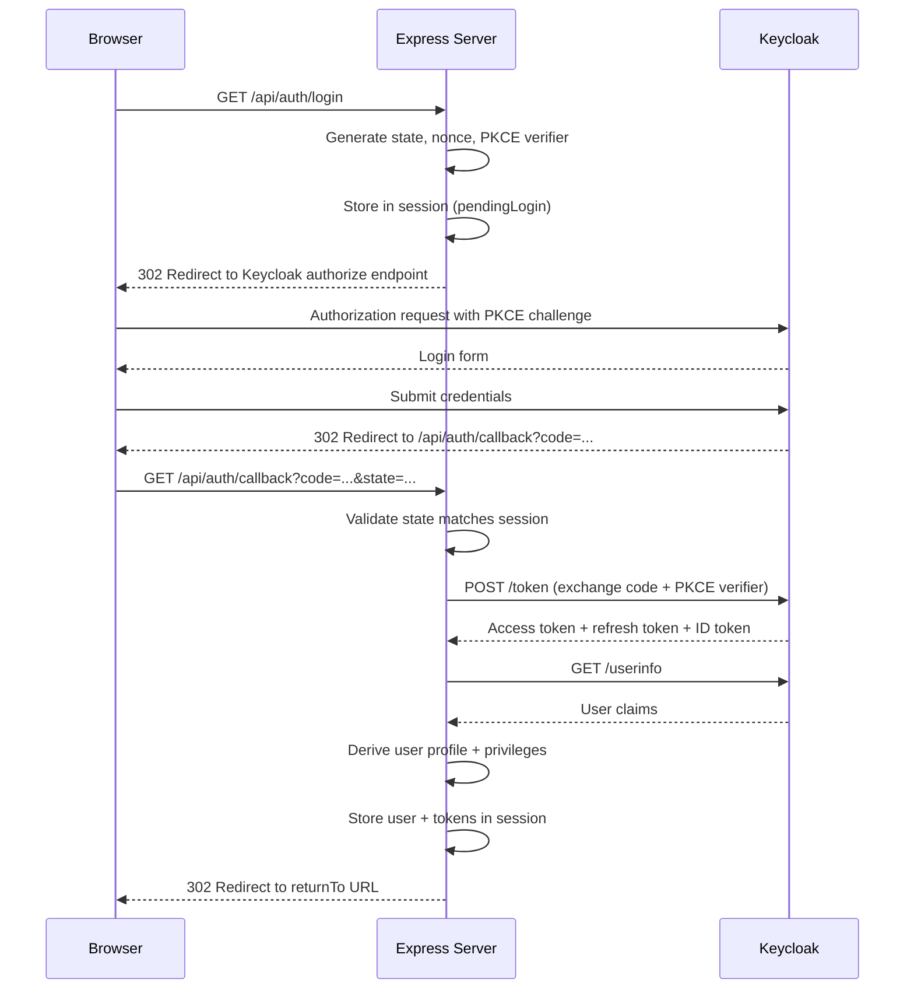
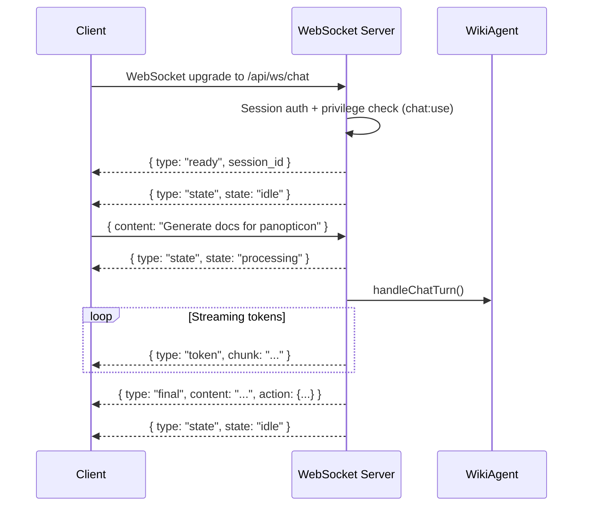

import { Card, Cards } from 'fumadocs-ui/components/card'
import { Callout } from 'fumadocs-ui/components/callout'
import { Tab, Tabs } from 'fumadocs-ui/components/tabs'
import { Step, Steps } from 'fumadocs-ui/components/steps'
import { Accordion, Accordions } from 'fumadocs-ui/components/accordion'
import { TypeTable } from 'fumadocs-ui/components/type-table'

The Kijko Docs platform uses a monolithic Express server that bundles a React SPA frontend, REST and WebSocket APIs, SQLite persistence, Keycloak OIDC authentication, and reverse proxying to upstream services (Swarm, OpenNotebook) into a single deployable unit. A separate Next.js Fumadocs app handles static docs rendering.

## System Layers



## Server Bootstrap

The Express server initializes in `server/index.ts` with a strict middleware order that matters for correctness:

```typescript
// server/index.ts -- initialization sequence
const app = express();
const httpServer = createServer(app);
app.set("trust proxy", 1);

// 1. Body parsing with raw body capture (needed for webhook signature verification)
app.use(express.json({
  verify: (req, _res, buf) => { req.rawBody = buf; },
}));
app.use(express.urlencoded({ extended: false }));

// 2. Session middleware (must come before route registration)
app.use(sessionMiddleware);

// 3. Request logging (captures JSON responses for API routes)
app.use(loggingMiddleware);

// 4. Route registration (auth routes, API routes, WebSocket upgrade)
await registerRoutes(httpServer, app);

// 5. Error handler
app.use(globalErrorHandler);

// 6. Static serving (production) or Vite middleware (development)
if (process.env.NODE_ENV === "production") {
  serveStatic(app);
} else {
  const { setupVite } = await import("./vite");
  await setupVite(httpServer, app);
}
```

<Callout type="warn">
The Vite middleware import is dynamic and happens last, after all API routes are registered. This prevents the Vite catch-all SPA handler from intercepting API requests. In production, `server/static.ts` serves the pre-built client bundle from `dist/public/`.
</Callout>

The server binds to `HOST` (default `127.0.0.1`) and `PORT` (default `5000`). In the Docker container, `HOST=0.0.0.0` and `PORT=3001` are set by the Dockerfile.

## Authentication System

Authentication uses Keycloak as the OIDC identity provider with PKCE authorization code flow, implemented entirely in `server/auth.ts` without third-party OIDC client libraries.

### Login Flow



### Persona-Based RBAC

The system maps Keycloak realm roles to three persona profiles, each with a set of privilege keys:

| Persona | Keycloak Role | Capabilities |
|---|---|---|
| `admin` | `persona_admin` | All privileges. Full CRUD on users, repos, pages, builds, swarm, proofshot |
| `member` | (default) | View and interact with dashboard, chat, pages, repos, builds. No admin access |
| `guest` | `persona_guest` | Read-only access to dashboard and pages. No write operations |

Privilege keys are granular capabilities like `pages:view`, `pages:write`, `repos:view`, `repos:write`, `chat:use`, `builds:trigger`, `admin:users`, `swarm:view`, `proofshot:run`, `architecture:view`, and `architecture:refresh`. Every API route uses `requirePrivilege("key")` middleware.

```typescript
// server/auth.ts -- privilege derivation
function deriveUser(userInfo: UserInfo, claims: AccessTokenClaims): SessionUser {
  const { realmRoles, clientRoles } = tokenRoles(claims, config.clientId);
  const profile = deriveProfile(realmRoles);
  const isAdmin = realmRoles.includes("persona_admin")
    || clientRoles.includes("admin_all");
  const privileges = isAdmin ? allPrivilegeKeys : uniquePrivilegeKeys(clientRoles);
  // ...
}
```

### Token Refresh

Session tokens are automatically refreshed when the access token's `expiresAt` passes. The `refreshSessionIfNeeded` function checks on each request via the `attachAuthUser` middleware and transparently exchanges the refresh token for a new access token without user interaction.

## Storage Layer

All persistence uses SQLite via Drizzle ORM with better-sqlite3 for synchronous query execution. The database schema is defined in `shared/schema.ts` using Drizzle's `sqliteTable` builder.

### Database Tables

<TypeTable
  type={{
    wiki_pages: {
      description: "Wiki page content with slug, title, audience, author, word count, metadata JSON, timestamps",
      type: "Table",
    },
    repos: {
      description: "Monitored GitHub repositories with URL, branch, polling interval, visibility, commit SHA tracking",
      type: "Table",
    },
    chat_messages: {
      description: "Chat conversation history with session ID, role (user/assistant/system/agent), content, action JSON",
      type: "Table",
    },
    build_events: {
      description: "Documentation build events with build ID, audience, status (queued/building/completed/failed), reason",
      type: "Table",
    },
    notebook_sources: {
      description: "NotebookLM source tracking with notebook ID, source ID, title, type, summary, sync timestamp",
      type: "Table",
    },
  }}
/>

### Storage Interface

The `IStorage` interface in `server/storage.ts` defines the data access contract. `DatabaseStorage` implements it with Drizzle queries:

```typescript
export interface IStorage {
  // Wiki pages
  getPages(audience?: string, search?: string, limit?: number, offset?: number):
    { pages: WikiPage[]; total: number };
  getPage(slug: string): WikiPage | undefined;
  createPage(data: InsertWikiPage): WikiPage;
  updatePage(slug: string, data: Partial<InsertWikiPage>): WikiPage | undefined;
  deletePage(slug: string): boolean;

  // Repositories
  getRepos(): Repo[];
  getRepo(id: number): Repo | undefined;
  getRepoByUrl(url: string): Repo | undefined;
  createRepo(data: InsertRepo): Repo;
  updateRepo(id: number, data: Partial<InsertRepo>): Repo | undefined;
  deleteRepo(id: number): boolean;

  // Chat, builds, notebook sources, system status...
}
```

The `getPages` method implements server-side filtering by audience and full-text search across title, content, and slug fields, with pagination via offset/limit.

## WebSocket Chat

The chat system uses a WebSocket server mounted on the same HTTP server as the Express app. Authentication is handled by the `authorizeWebSocketUpgrade` middleware that validates session tokens before the WebSocket handshake completes.

### Message Protocol



Message types sent by the server:

| Type | Fields | When |
|---|---|---|
| `ready` | `session_id`, `timestamp` | On connection |
| `state` | `state` (idle/processing/building/deploying/error), `session_id` | On state change |
| `token` | `chunk`, `session_id` | During streaming |
| `final` | `content`, `action`, `confirmation`, `session_id`, `timestamp` | Response complete |
| `confirmation_required` | `confirmation` (id, summary, target, actionType), `session_id` | Needs user approval |
| `ping` | (empty) | Every 30s heartbeat |
| `error` | `code`, `message` | On error |

## Swarm Proxy

The Express server acts as an authenticated reverse proxy to the Swarm backend, mapping public paths to internal Swarm URLs:

| Public Path | Internal Target |
|---|---|
| `/swarm/app/*` | `http://swarm/*` (UI static assets) |
| `/swarm/api/*` | `http://swarm-server:3008/*` (API) |
| `/swarm/api/ws/*` | `ws://swarm-server:3008/ws/*` (WebSocket) |

The proxy handles full HTTP proxying (headers, cookies, redirects, streaming bodies), WebSocket upgrade with bi-directional message piping, and upstream authentication via `x-api-key` header injection using `SWARM_API_KEY`.

```typescript
// server/routes.ts -- swarm proxy setup
app.use("/swarm/app", requirePrivilege("swarm:view"), (req, res, next) => {
  proxySwarmRequest(req, res).catch(next);
});

app.use("/swarm/api", requirePrivilege("swarm:view"), (req, res, next) => {
  proxySwarmRequest(req, res, SWARM_PUBLIC_API_BASE_PATH).catch(next);
});
```

## React SPA Architecture

The client is a Vite-bundled React SPA using wouter for routing, TanStack Query for data fetching, and shadcn/ui components on Tailwind CSS.

### Page Structure

| Route | Component | Purpose |
|---|---|---|
| `/` | `dashboard.tsx` | System status, agent state, component health |
| `/chat` | `chat.tsx` | WebSocket chat with WikiAgent |
| `/architecture` | `architecture.tsx` | Interactive architecture diagram |
| `/pages` | `pages.tsx` | Wiki pages table with audience filtering |
| `/repos` | `repos.tsx` | GitHub repository management |
| `/builds` | `builds.tsx` | Build event history |
| `/notebook` | `notebook.tsx` | NotebookLM source management |
| `/proofshot` | `proofshot.tsx` | Visual verification sessions |
| `/swarm` | `swarm.tsx` | Embedded Swarm UI |
| `/wiki/*` | `wiki-reader.tsx` | MDX docs reader (hash-routed) |
| `/admin/users` | `admin-users.tsx` | User management (admin only) |

### Auth Shell

The `AuthShell` component at `client/src/components/auth-shell.tsx` wraps all routes, polling `/api/auth/me` to determine the current user's auth state. If no session exists, it renders a login prompt. The sidebar navigation is filtered by the user's privilege set, hiding pages the user cannot access.

## Fumadocs Next.js App

The `apps/web/` directory contains a standalone Next.js application that renders wiki content from `wiki-content/docs/` using the Fumadocs framework.

### Route Architecture

| Route | File | Purpose |
|---|---|---|
| `/` | `app/page.tsx` | Docs landing with ecosystem overview |
| `/docs/[[...slug]]` | `app/docs/[[...slug]]/page.tsx` | Catch-all MDX reader with sidebar and TOC |
| `/chat` | `app/chat/page.tsx` | CopilotKit agent interaction surface |
| `/wiki` | `app/wiki/page.tsx` | Wiki dashboard with page listings |
| `/api/copilotkit` | `app/api/copilotkit/route.ts` | CopilotKit API endpoint |

### MDX Component Injection

Every MDX page automatically has access to Fumadocs components without imports, via the component registry at `apps/web/components/mdx/index.tsx`:

```typescript
export const mdxComponents: Record<string, ComponentType<any>> = {
  Callout,                    // fumadocs-ui/components/callout
  Card, Cards,                // fumadocs-ui/components/card
  Step, Steps,                // fumadocs-ui/components/steps
  Tab, Tabs,                  // fumadocs-ui/components/tabs
  Accordion, Accordions,      // fumadocs-ui/components/accordion
  TypeTable,                  // fumadocs-ui/components/type-table
  ImageZoom,                  // fumadocs-ui/components/image-zoom
  FeedbackWidget,             // Custom "Was this helpful?" widget
  EditPageLink,               // Custom "Edit on GitHub" link
};
```

### Slug Resolution

The docs library at `apps/web/lib/docs.ts` resolves URL slugs to MDX files in `wiki-content/docs/` using this priority:

1. `{slug}/index.mdx` (nested section index)
2. `{slug}/index.md` (nested section index, markdown)
3. `{slug}.mdx` (flat page)
4. `{slug}.md` (flat page, markdown)

This allows both flat pages like `getting-started.mdx` and nested sub-pages like `panopticon/architecture.mdx` to coexist naturally.
