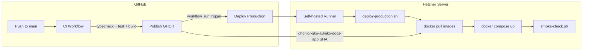

import { Callout } from 'fumadocs-ui/components/callout'
import { Tab, Tabs } from 'fumadocs-ui/components/tabs'
import { Step, Steps } from 'fumadocs-ui/components/steps'
import { Accordion, Accordions } from 'fumadocs-ui/components/accordion'

The Kijko Docs platform deploys to **docs.kijko.nl** on a Hetzner server using Docker Compose, GHCR container images, GitHub Actions CI/CD, and a self-hosted runner that executes the deployment script directly on the production host.

## Deployment Architecture



## CI/CD Pipeline

The deployment pipeline consists of four GitHub Actions workflows that execute in sequence.

### 1. CI Workflow (`.github/workflows/ci.yml`)

Triggers on push to `main` and pull requests. Runs on every change to application code, configuration, or infrastructure files.

**Steps:**
1. Checkout + Node.js 20 setup with npm cache
2. `npm ci` -- install dependencies
3. `npm run check` -- TypeScript type checking
4. `npm test` -- Vitest test suite
5. `bash scripts/ci/run-conductor-parity.sh` -- Sprint 1 parity gate
6. `npm run build` -- Full application build
7. `docker compose config` -- Validate compose file
8. `docker build -t kijko-docs-app:test .` -- Build Docker image

### 2. Publish Workflow (`.github/workflows/publish-ghcr.yml`)

Triggers on push to `main` when application source files change. Builds and pushes the Docker image to GHCR.

**Steps:**
1. All CI steps (typecheck, test, parity, build)
2. Docker Buildx setup for cross-platform builds
3. GHCR login with `GHCR_TOKEN` secret
4. Image name computation: `ghcr.io/kijko-ai/kijko-docs-app:{SHA}` and `:main`
5. Build and push with both SHA and `main` tags

```bash
# Image tags produced per publish
ghcr.io/kijko-ai/kijko-docs-app:abc123def456789...  # immutable SHA tag
ghcr.io/kijko-ai/kijko-docs-app:main                 # rolling latest
```

<Callout type="info">
The publish workflow uses `concurrency: publish-kijko-docs-app` with `cancel-in-progress: false` to prevent parallel publishes from conflicting. Each publish completes fully before the next one starts.
</Callout>

### 3. Deploy Workflow (`.github/workflows/deploy-production.yml`)

Triggers on:
- **workflow_run**: After the Publish workflow completes successfully on `main`
- **push to main**: When `docker-compose.yml`, `deploy/`, or `scripts/` change
- **repository_dispatch**: When Swarm or Matrix publish new images
- **workflow_dispatch**: Manual trigger with optional image tag overrides

**Execution:**
1. **Gate decision** -- Determines whether deployment should run. Skips if the publish workflow failed, or if the push includes app-image inputs (waiting for publish).
2. **Image resolution** -- Selects the correct image tags based on the trigger type.
3. **Deploy scope check** -- `scripts/ci/check-deploy-scope.sh` validates the deployment boundary.
4. **Registry auth** -- Logs into GHCR with the `GHCR_TOKEN` secret.
5. **Production reconciliation** -- Runs `scripts/deploy/deploy-production.sh` with `sudo -E`.
6. **Smoke check** -- Runs `scripts/deploy/smoke-check.sh` to verify the deployment.

The workflow runs on the self-hosted runner labeled `[self-hosted, Linux, X64, docs-kijko-prod]`.

### 4. Living Docs Workflow (`.github/workflows/living-docs.yml`)

Triggers on push to `main` when `wiki-content/` changes. Publishes updated documentation content.

## Production Deploy Script

The deployment script at `scripts/deploy/deploy-production.sh` is the core deployment mechanism. It runs on the production host and manages the full lifecycle.

### Script Behavior

<Steps>

### Environment Bootstrap

The script reads from two env files:
- `/etc/kijko-docs/stack.env` -- service configuration (ports, URLs, secrets)
- `/etc/kijko-docs/release.env` -- release-specific overrides (image tags, compose project name)

If `stack.env` does not exist, it bootstraps from legacy env files (`kijko-docs.env`, `keycloak.env`).

### Legacy Normalization

Automatically fixes legacy configuration values:

```bash
# Rewrite localhost paths to container paths
DATABASE_PATH=/home/david/Projects/Kijko_Docs/data/data.db -> /app/data/data.db

# Rewrite localhost URLs to Docker service names
SWARM_INTERNAL_URL=http://127.0.0.1:3456 -> http://swarm:3456

# Rewrite internal Keycloak URL
KEYCLOAK_INTERNAL_URL=http://127.0.0.1:8180/keycloak -> https://docs.kijko.nl/keycloak
```

### Secret Generation

Auto-generates missing secrets:

```bash
ensure_nonempty_secret "${STACK_ENV_FILE}" "SWARM_API_KEY"
```

Uses Python's `secrets.token_hex(32)` for cryptographically secure random values.

### Directory Setup

Creates required host directories:

```bash
/srv/docs-kijko/repo          # Compose files
/srv/docs-kijko/data           # SQLite database
/srv/docs-kijko/proofshot-artifacts
/srv/docs-kijko/agent-browser
/srv/docs-kijko/codex-home
/srv/docs-kijko/claude-home
```

### File Sync

Copies `docker-compose.yml` and the `deploy/` directory from the repository to `/srv/docs-kijko/repo/`. Installs the Caddyfile to `/etc/caddy/Caddyfile`.

### Image Pull and Stack Update

Writes image tags to `release.env`, then pulls and restarts the Docker Compose stack:

```bash
docker compose --env-file "${STACK_ENV_FILE}" --env-file "${RELEASE_ENV_FILE}" \
  pull --quiet
docker compose --env-file "${STACK_ENV_FILE}" --env-file "${RELEASE_ENV_FILE}" \
  up -d --remove-orphans
```

</Steps>

## Docker Image

The WikiApp Dockerfile at the repository root uses a multi-stage build:

### Build Stage

```dockerfile
FROM node:20-bookworm-slim AS build

# Install native build tools for better-sqlite3
RUN apt-get update && apt-get install -y --no-install-recommends python3 make g++

COPY package*.json ./
RUN npm ci

# Copy source and build
COPY client server shared script components.json drizzle.config.ts \
     postcss.config.js tailwind.config.ts tsconfig.json vite.config.ts ./
RUN npm run build
RUN npm prune --omit=dev
```

### Runtime Stage

```dockerfile
FROM node:20-bookworm-slim AS runtime

LABEL org.opencontainers.image.source="https://github.com/kijko-ai/Kijko_Docs"
ENV NODE_ENV=production HOST=0.0.0.0 PORT=3001

# Install Chromium dependencies for proofshot/agent-browser
RUN apt-get install -y --no-install-recommends \
  ca-certificates fonts-liberation libasound2 libatk-bridge2.0-0 \
  libatk1.0-0 libcups2 libdbus-1-3 libdrm2 libgbm1 libgtk-3-0 \
  libnspr4 libnss3 libx11-6 libx11-xcb1 libxcb1 libxcomposite1 \
  libxdamage1 libxext6 libxfixes3 libxkbcommon0 libxrandr2 xdg-utils

COPY --from=build /app/node_modules ./node_modules
COPY --from=build /app/dist ./dist

RUN mkdir -p /app/proofshot-artifacts /root/.agent-browser \
  && agent-browser install

EXPOSE 3001
CMD ["npm", "run", "start"]
```

<Callout type="info">
The runtime stage includes Chromium dependencies because the proofshot feature runs a headless browser for visual verification. The `agent-browser install` command downloads the browser binary into the container.
</Callout>

## Docker Compose Stack

The production stack consists of 7 services plus optional auth and edge profiles:

| Service | Image | Port | Purpose |
|---|---|---|---|
| `wikiapp` | `ghcr.io/kijko-ai/kijko-docs-app:main` | 3001 | Express server + React SPA |
| `server` | `ghcr.io/kijko-ai/swarm-server:main` | 3008 | Swarm backend server |
| `swarm` | `ghcr.io/kijko-ai/swarm-ui:main` | 80 | Swarm UI (depends on `server`) |
| `surrealdb` | `surrealdb/surrealdb:v2` | 8000 | SurrealDB for OpenNotebook |
| `open_notebook` | `lfnovo/open_notebook:v1-latest` | 5055/8502 | OpenNotebook (depends on `surrealdb`) |
| `keycloak` | `quay.io/keycloak/keycloak:26.5.5` | 8080 | OIDC identity provider (auth profile) |
| `keycloak-db` | `postgres:16-alpine` | 5432 | Keycloak database (auth profile) |
| `caddy` | `caddy:2.8-alpine` | 8080 | Reverse proxy (edge profile) |

### Volume Strategy

Persistent data uses named Docker volumes for database services and bind-mounted host directories for the wikiapp:

```yaml
volumes:
  # Named volumes (managed by Docker)
  surreal-data:        # SurrealDB storage
  notebook-data:       # OpenNotebook data
  keycloak-db-data:    # PostgreSQL data
  swarm-data:          # Swarm server data

  # Bind mounts (host directories)
  # /srv/docs-kijko/data           -> /app/data (SQLite + migrations)
  # /srv/docs-kijko/proofshot-artifacts -> /app/proofshot-artifacts
  # /srv/docs-kijko/agent-browser  -> /root/.agent-browser
  # /srv/docs-kijko/codex-home     -> /root/.codex
  # /srv/docs-kijko/claude-home    -> /root/.claude
```

### Health Checks

All services include Docker healthchecks:

```yaml
healthcheck:
  test: ["CMD", "node", "-e",
    "fetch('http://127.0.0.1:3001/health').then(r=>process.exit(r.ok?0:1)).catch(()=>process.exit(1))"]
  interval: 30s
  timeout: 5s
  retries: 3
  start_period: 20s
```

## Reverse Proxy (Caddy)

The Caddyfile at `deploy/Caddyfile` routes traffic to backend services:

| Path | Target | Purpose |
|---|---|---|
| `/` (default) | `wikiapp:3001` | Main application |
| `/keycloak/*` | `keycloak:8080` | Keycloak admin and OIDC endpoints |
| `/swarm/*` | Proxied through wikiapp | Authenticated Swarm access |

## Smoke Check

The post-deploy verification script at `scripts/deploy/smoke-check.sh` validates:

1. WikiApp health endpoint returns `200 OK`
2. Container health status is `healthy`
3. Application responds to API requests

## Rollback Procedure

To rollback to a previous deployment:

```bash
# 1. Find the previous image SHA
docker images ghcr.io/kijko-ai/kijko-docs-app --format '{{.Tag}}'

# 2. Update release.env with the previous SHA
echo "WIKIAPP_IMAGE=ghcr.io/kijko-ai/kijko-docs-app:previous_sha" \
  > /etc/kijko-docs/release.env

# 3. Re-run the deploy script
sudo -E bash /srv/docs-kijko/repo/scripts/deploy/deploy-production.sh
```

Alternatively, trigger the Deploy Production workflow with manual dispatch and specify the desired image tags.

<Callout type="warn">
The SQLite database at `/srv/docs-kijko/data/data.db` persists across deployments via bind-mount. Database migrations must be backward-compatible to support rollbacks.
</Callout>
