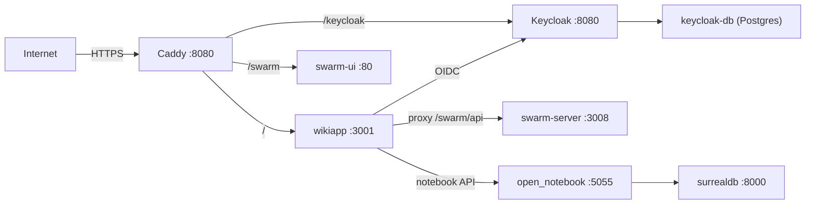

import { Card, Cards } from 'fumadocs-ui/components/card'
import { Callout } from 'fumadocs-ui/components/callout'
import { Tab, Tabs } from 'fumadocs-ui/components/tabs'
import { Step, Steps } from 'fumadocs-ui/components/steps'

The Kijko Docs platform is a full-stack documentation system that combines an Express.js API server, a React SPA dashboard, a Next.js Fumadocs reader, and a 7-phase autonomous agent pipeline into a single deployable unit. It runs in production at **docs.kijko.nl** as a Docker Compose stack serving wiki pages, repository monitoring, architecture diagrams, chat-driven doc authoring, and CI/CD-triggered deployments from a self-hosted GitHub Actions runner.

<Cards>
  <Card title="Architecture" href="/docs/kijko-frontend/architecture">
    Express + Vite + React monolith with Keycloak OIDC, SQLite via Drizzle, and WebSocket chat
  </Card>
  <Card title="Quickstart" href="/docs/kijko-frontend/quickstart">
    Clone, install, configure environment variables, and run locally in under 5 minutes
  </Card>
  <Card title="API Reference" href="/docs/kijko-frontend/api-reference">
    40+ REST endpoints across wiki pages, repos, builds, chat, architecture, proofshot, swarm, and admin
  </Card>
  <Card title="Configuration" href="/docs/kijko-frontend/configuration">
    All environment variables for the wikiapp, agent, Keycloak, Swarm, and notebook services
  </Card>
  <Card title="Deployment" href="/docs/kijko-frontend/deployment">
    Docker Compose production deployment to docs.kijko.nl with GHCR image publishing and smoke checks
  </Card>
  <Card title="Wiki Pipeline" href="/docs/kijko-frontend/wiki-pipeline">
    7-agent autonomous pipeline: Audit, IA, Writer, Verifier, QA, Monitor, Publish
  </Card>
</Cards>

## What This Platform Does

The platform solves a specific problem: keeping documentation synchronized with rapidly changing codebases across multiple repositories. It does this through three integrated subsystems.

### 1. Documentation Reader

The legacy React client (`client/`) serves a Vite-bundled SPA at port 5000 with pages for the dashboard, chat, architecture diagrams, wiki reading, repository management, builds, notebooks, proofshot sessions, and swarm control. The Next.js app at `apps/web/` provides a Fumadocs MDX reader at `/docs/[[...slug]]` that renders committed content from `wiki-content/docs/`.

### 2. Backend API

The Express server (`server/`) exposes REST and WebSocket APIs for wiki CRUD, GitHub repository monitoring, architecture diagram generation, Keycloak-backed authentication with RBAC privilege checking, and a chat interface that proxies to the WikiAgent. It uses SQLite via Drizzle ORM for persistence and better-sqlite3 for synchronous queries.

### 3. Agent Pipeline

The autonomous docs agent (`apps/agent/`) runs a 7-phase pipeline (Audit, IA, Writer, Verifier, QA, Monitor, Publish) that scans repositories for documentation gaps, generates an information architecture, writes MDX pages, verifies content accuracy, checks quality, monitors drift, and publishes changes. It integrates with CodeGraph, CGC, NotebookLM, and forensic-ingest MCP tools when available, degrading gracefully when they are not.

## Repository Structure

```
Kijko_Docs/
├── apps/
│   ├── agent/          # Autonomous docs pipeline (port 4111)
│   │   └── src/lib/pipeline/  # 7-agent orchestrator
│   └── web/            # Next.js Fumadocs reader (port 3001)
├── client/             # Legacy Vite React SPA
│   └── src/pages/      # Dashboard, chat, wiki, repos, builds
├── server/             # Express.js backend (port 5000)
│   ├── routes.ts       # 40+ API endpoints
│   ├── auth.ts         # Keycloak OIDC + RBAC
│   ├── storage.ts      # SQLite via Drizzle
│   └── wikiagent.ts    # Chat turn handler
├── shared/             # Shared types and schemas
│   ├── schema.ts       # Drizzle tables + Zod validators
│   └── auth.ts         # Privilege system types
├── wiki-content/docs/  # Committed MDX pages
├── conductor/          # Superconductor track orchestration
├── deploy/             # Caddyfile, nginx, host configs
├── scripts/            # CI gates, deploy scripts, forensic-ingest
├── docker-compose.yml  # 7-service production stack
└── Dockerfile          # Multi-stage wikiapp image
```

## Technology Stack

| Layer | Technology | Purpose |
|---|---|---|
| Frontend SPA | React 19 + Vite + Tailwind + shadcn/ui | Dashboard, chat, architecture diagrams |
| Docs Reader | Next.js 15 + Fumadocs + MDX | Static docs rendering with sidebar and TOC |
| Backend API | Express.js + Node 20 | REST + WebSocket API server |
| Database | SQLite + Drizzle ORM + better-sqlite3 | Wiki pages, repos, builds, chat, sessions |
| Auth | Keycloak 26.5 + OIDC + PKCE | SSO with persona-based RBAC |
| Agent | Mastra + GPT-5.4 via proxy | Autonomous docs generation pipeline |
| LLM Proxy | GPTAuthwrapper (:4141) + LiteLLM (:4000) | Unified model routing |
| Deployment | Docker Compose + Caddy + GHCR | Production at docs.kijko.nl |
| CI/CD | GitHub Actions (self-hosted runner) | Typecheck, test, build, publish, deploy |

<Callout type="info">
The Express server acts as the single network entry point, serving both the API and the client SPA from the same port. In development, Vite middleware handles HMR; in production, pre-built static files are served via `server/static.ts`. This eliminates CORS issues and simplifies reverse proxy configuration.
</Callout>

## Production Topology

The production stack at docs.kijko.nl runs 7 Docker services behind Caddy:



Each service communicates over Docker internal networking. The wikiapp container connects to the host machine's GPTAuthwrapper proxy at `host.docker.internal:4141` for LLM calls, routing through LiteLLM to the configured model backends.
