import { Card, Cards } from 'fumadocs-ui/components/card'
import { Callout } from 'fumadocs-ui/components/callout'
import { Tab, Tabs } from 'fumadocs-ui/components/tabs'
import { Step, Steps } from 'fumadocs-ui/components/steps'
import { TypeTable } from 'fumadocs-ui/components/type-table'

The autonomous docs pipeline at `apps/agent/src/lib/pipeline/` generates, verifies, and publishes wiki documentation by orchestrating 7 specialized agents in sequence. Each agent receives context from previous phases and produces structured artifacts that feed downstream agents. The pipeline supports full runs, incremental updates, drift checks, previews, and single-page generation.

## Pipeline Overview

```mermaid
graph LR
    F0["Phase 0: Forensic Ingest"] --> A["Phase 1: Audit"]
    A --> IA["Phase 2: IA"]
    IA --> W["Phase 3: Writer"]
    W --> V["Phase 4: Verifier"]
    V --> QA["Phase 5: QA"]
    QA --> M["Phase 6: Monitor"]
    M --> P["Phase 7: Publish"]

    style F0 fill:#f0f0f0,stroke:#999
    style A fill:#e3f2fd,stroke:#1565c0
    style IA fill:#e8f5e9,stroke:#2e7d32
    style W fill:#fff3e0,stroke:#ef6c00
    style V fill:#fce4ec,stroke:#c62828
    style QA fill:#f3e5f5,stroke:#7b1fa2
    style M fill:#e0f7fa,stroke:#00838f
    style P fill:#e8eaf6,stroke:#283593
```



## Orchestrator

The `PipelineOrchestrator` class at `apps/agent/src/lib/pipeline/orchestrator.ts` coordinates execution. It manages agent lifecycle, state persistence, MCP tool probing, and error recovery.

### Initialization

```typescript
const orchestrator = new PipelineOrchestrator({
  mastraAgent: wikiAgent,       // Mastra agent for LLM calls
  listExistingPages: () => [...], // Callback returning current page slugs
  stateStore: new InMemoryStateStore(), // Optional persistence override
});
```

### Execution

```typescript
const state = await orchestrator.execute({
  repoSlug: "kijko-docs",
  repoPath: "/home/david/Projects/Kijko_Docs",
  triggerType: "full",            // full | incremental | preview | drift_check | single_page
  skipPhases: [],                 // Optional phases to skip
});
```

### Trigger Types

The pipeline adapts its behavior based on the trigger type, skipping phases that are unnecessary for the given operation:

| Trigger | Description | Skipped Phases |
|---|---|---|
| `full` | Complete documentation regeneration | None |
| `incremental` | Update existing pages with new changes | None (uses existing IA) |
| `drift_check` | Check for documentation drift without writing | IA, Writer, Verifier, QA, Publish |
| `preview` | Generate content without persisting to disk | Monitor, Publish |
| `single_page` | Generate or update a single page | Audit, Monitor |

### State Persistence

Pipeline state is persisted after every phase completion, enabling resume on failure:

```typescript
interface PipelineState {
  id: string;
  repoSlug: string;
  currentPhase: PhaseName | null;
  phases: PhaseState[];       // Status, artifacts, errors per phase
  startedAt: string;
  completedAt?: string;
  status: "running" | "completed" | "failed" | "paused";
}
```

To resume a failed pipeline:

```typescript
const resumed = await orchestrator.resume(pipelineId, config);
```

This resets the failed phase to `pending` and re-executes from that point, skipping already-completed phases.

---

## Phase 0: Forensic Ingest

**Agent:** Built into the orchestrator (not a separate agent)
**Purpose:** Generate code dependency graphs and segmented source files for downstream agents

Before the main agent phases, the orchestrator optionally runs `scripts/forensic-ingest/ingest.py` as a subprocess. This Python script runs Repomix to pack the repository, generates a dependency graph, and segments the codebase into topic-based markdown source files.

**Outputs:**
- `sources/` -- Segmented markdown files, one per code topic
- `dependency_graph.json` -- Module-level dependency graph
- `CODE-MAP-INDEX.md` -- Code map index (if generated)

**Graceful degradation:** If the forensic-ingest script is unavailable (no Python, no Repomix), the pipeline continues without it. Downstream agents fall back to their own code analysis methods.

---

## Phase 1: Audit Agent

**Source:** `apps/agent/src/lib/pipeline/agents/audit-agent.ts`
**Purpose:** Identify documentation gaps by comparing code symbols against existing wiki pages

### Process

1. **Build symbol inventory** -- If CodeGraph MCP is available, uses semantic symbol data. Otherwise, falls back to recursive file-tree scanning with regex export pattern matching across `.ts`, `.tsx`, `.js`, `.jsx`, `.py`, `.go`, `.java`, `.rs` files.

2. **Build existing page set** -- Normalizes all existing page slugs for fast lookup.

3. **Identify gaps** -- Filters exported symbols that have no corresponding wiki page. Matches are fuzzy: a symbol `UserService` would match a page slug containing `user-service`.

4. **Detect contradictions** -- Flags pages whose referenced symbols no longer exist in the codebase.

5. **Identify stale pages** -- Finds pages whose slug parts reference symbols not found in the current codebase.

6. **Compute coverage** -- `coverageScore = documentedCount / exportedCount`.

### Artifacts

<TypeTable
  type={{
    gaps: { description: "Symbols without wiki pages, classified by importance (high/medium/low)", type: "Array<{symbol, kind, importance}>" },
    contradictions: { description: "Pages referencing symbols that no longer exist", type: "Array<{page, symbol, issue}>" },
    coverageScore: { description: "Documentation coverage as a 0-1 decimal", type: "number" },
    stalePages: { description: "Pages with potentially outdated slug references", type: "Array<{slug, reason}>" },
    existingPageCount: { description: "Number of existing wiki pages", type: "number" },
    codeSymbolCount: { description: "Total exported symbols found in codebase", type: "number" },
  }}
/>

### Importance Classification

| Symbol Kind | Importance | Rationale |
|---|---|---|
| `class`, `interface` | High | Public API surface, most likely to need documentation |
| `function` | Medium | Utility and helper functions |
| `type`, `variable` | Low | Type definitions and constants |

---

## Phase 2: Information Architecture (IA) Agent

**Source:** `apps/agent/src/lib/pipeline/agents/ia-agent.ts`
**Purpose:** Generate the wiki's page structure, navigation hierarchy, and generation order

### Process

1. **Classify complexity** -- Categorizes the repo by symbol count: small (<50), medium (50-200), large (200+). This determines page count targets.

2. **Generate page plan** -- Creates pages from audit gaps:
   - Always creates `index` (landing) and `getting-started` (quickstart)
   - High-importance gaps become concept pages
   - Medium-importance gaps become guide or reference pages
   - Class/interface gaps generate API reference pages

3. **Determine generation order** -- Sorts pages by canonical order: landing > quickstart > concept > feature guide > integration > connector > cookbook > API reference > reference spec > migration.

4. **Build sidebar structure** -- Generates Fumadocs `meta.json` format for navigation.

### Section Taxonomy

```typescript
const SECTION_TAXONOMY = [
  "index", "getting-started", "concepts", "guides",
  "integrations", "cookbook", "reference", "api-reference", "migration",
];
```

### Word Count Targets

| Page Type | Target Words |
|---|---|
| Landing Overview | 600 |
| Quickstart Tutorial | 800 |
| Concept Explainer | 1,200 |
| Feature Guide | 1,000 |
| Integration Guide | 1,000 |
| API Reference | 1,500 |
| Cookbook Recipe | 800 |
| Reference Spec | 1,200 |
| Migration Guide | 800 |

### Artifacts

<TypeTable
  type={{
    pages: { description: "Full page plan with slug, title, type, section, dependencies, word count", type: "IAPage[]" },
    sidebarStructure: { description: "Fumadocs meta.json navigation structure", type: "Record<string, unknown>" },
    sectionTaxonomy: { description: "Unique section names used in the plan", type: "string[]" },
    generationOrder: { description: "Slugs in the order they should be generated", type: "string[]" },
    totalEstimatedPages: { description: "Total number of pages in the plan", type: "number" },
  }}
/>

---

## Phase 3: Writer Agent

**Source:** `apps/agent/src/lib/pipeline/agents/writer-agent.ts`
**Purpose:** Generate MDX page content using the Mastra LLM agent

The Writer agent iterates over pages in the generation order determined by the IA agent. For each page, it builds a prompt incorporating:
- The page's type template (from the 10 page type definitions)
- Context from previous phases (audit gaps, IA structure)
- Code examples extracted from the repository
- MCP tool data (CodeGraph, NotebookLM, forensic-ingest) when available

Output is valid Fumadocs MDX with frontmatter, component imports, and cross-references.

---

## Phase 4: Verifier Agent

**Source:** `apps/agent/src/lib/pipeline/agents/verifier-agent.ts`
**Purpose:** Verify generated content against the actual codebase

Checks that code examples compile, API references match actual endpoints, class/function signatures are accurate, and cross-references resolve to existing pages.

---

## Phase 5: QA Agent

**Source:** `apps/agent/src/lib/pipeline/agents/qa-agent.ts`
**Purpose:** Quality assurance checks on the generated documentation

Validates:
- Heading hierarchy (no skipped levels)
- Internal link validity
- Image alt text presence
- Description/SEO metadata completeness
- Code snippet syntax highlighting
- Style guide compliance
- Duplicate content detection
- Readability scoring

---

## Phase 6: Monitor Agent

**Source:** `apps/agent/src/lib/pipeline/agents/monitor-agent.ts`
**Purpose:** Monitor for documentation drift between code changes and wiki content

Compares the current code state against the last documented state to detect drift. Produces a monitoring report with drift severity scores and recommended actions.

---

## Phase 7: Publish Agent

**Source:** `apps/agent/src/lib/pipeline/agents/publish-agent.ts`
**Purpose:** Publish verified, QA-passed content to the wiki-content directory

Writes MDX files to `wiki-content/docs/`, generates/updates `meta.json` navigation files, and creates a commit message summarizing the changes.

---

## MCP Tool Integration

The pipeline integrates with three MCP (Model Context Protocol) tool servers, all with circuit-breaker wrappers for graceful degradation:

| Tool | Client | Purpose | Fallback |
|---|---|---|---|
| CodeGraph | `CodeGraphClient` | Semantic code search, symbol resolution, callers/callees | Regex-based file scanning |
| CGC | `CgcClient` | Dead code detection, complexity analysis, dependency graphs | Skip analysis |
| NotebookLM | `NotebookLmClient` | Documentation research, knowledge synthesis | Skip research context |

### Tool Probing

At pipeline start, the orchestrator probes all MCP tools:

```typescript
private async probeTools(repoPath?: string): Promise<ToolAvailability> {
  const [notebookHealth, forensicAvailable] = await Promise.allSettled([
    this.notebookClient.health(),
    repoPath ? this.probeForensicIngest(repoPath) : Promise.resolve(false),
  ]);

  return {
    codegraph: this.codegraphClient.isAvailable,
    cgc: this.cgcClient.isAvailable,
    notebooklm: notebookHealth.status === "fulfilled" ? notebookHealth.value : false,
    repomix: false,
    forensicIngest: forensicAvailable.status === "fulfilled" ? forensicAvailable.value : false,
  };
}
```

The availability flags are passed to every agent via `AgentContext.toolAvailability`, allowing each agent to choose its strategy.

---

## Content Model

Generated content follows the platform-agnostic model defined in `apps/agent/src/lib/docs-pipeline.ts`. Each page is represented as a `DocsCorpusPage`:

```typescript
interface DocsCorpusPage {
  slug: string;
  title: string;
  description: string;
  filePath: string;
  body: string;
  raw: string;
  wordCount: number;
  headings: DocsHeading[];
  codeBlocks: DocsCodeBlock[];
  links: string[];
  images: DocsImage[];
  tags: string[];
}
```

The content model supports rendering to multiple documentation platforms through adapter targets (Fumadocs, Docusaurus, MkDocs, GitBook, Mintlify, Nextra), with platform-specific output generated by the `.generated/` adapters in `wiki-content/`.

---

## Conductor Integration

The pipeline operates within the Conductor orchestration framework at `conductor/`. Conductor tracks define the planning, implementation, and verification workflow:

| Track | Purpose |
|---|---|
| `agent_pipeline_20260328` | Core agent pipeline implementation |
| `wiki_content_api_20260328` | Wiki content API endpoints |
| `wiki_dashboard_ui_20260328` | Wiki dashboard UI components |
| `fumadocs_integration_20260328` | Fumadocs integration |
| `verification_qa_20260323` | Verification and QA processes |

Each track contains a `spec.md` (requirements), `plan.md` (implementation plan), and `metadata.json` (status tracking).
