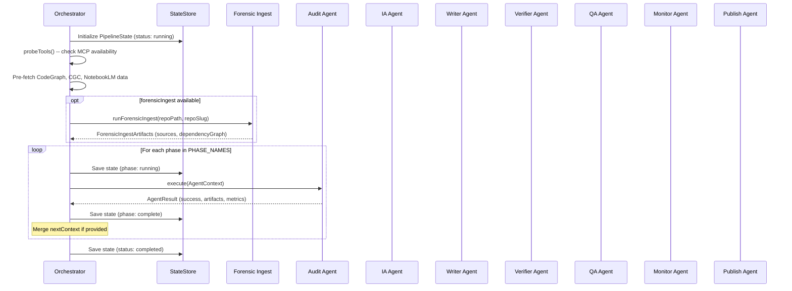

import { Card, Cards } from 'fumadocs-ui/components/card'
import { Callout } from 'fumadocs-ui/components/callout'
import { Tab, Tabs } from 'fumadocs-ui/components/tabs'

The Panopticon 2.0 pipeline is a sequential agent chain orchestrated by the `PipelineOrchestrator` class at `apps/agent/src/lib/pipeline/orchestrator.ts`. Seven agents execute in a fixed order, each receiving the accumulated context from all previous phases. A Phase 0 forensic preprocessing step optionally runs before the main chain.

## Execution Model

The orchestrator follows a strict linear execution model. There is no parallelism between phases -- each agent must complete before the next begins. This is deliberate: later phases depend on earlier phase outputs (the Writer needs the IA blueprint, the QA agent needs the Writer's pages, the Publish agent needs QA corrections).



## Phase 0: Forensic Ingest

Before the main agent chain, the orchestrator checks whether the `forensic-ingest` Python scripts are available. If they are, it shells out to `scripts/forensic-ingest/ingest.py` to run steps 1-3 (repomix, graph, segment):

```typescript
// apps/agent/src/lib/pipeline/orchestrator.ts
async runForensicIngest(
  repoPath: string,
  repoSlug: string,
  pipelineId: string
): Promise<ForensicIngestArtifacts | null> {
  const scriptPath = join(repoPath, "scripts", "forensic-ingest", "ingest.py");

  const { stdout, stderr } = await execFileAsync(
    "python3",
    [scriptPath, repoPath, "--name", repoSlug, "--step", "local"],
    {
      timeout: 300_000, // 5 min
      maxBuffer: 10 * 1024 * 1024, // 10 MB
      cwd: repoPath,
    }
  );
  // ... reads sources/*.md, dependency_graph.json, CODE-MAP-INDEX.md
}
```

The forensic ingest produces three artifacts stored at `/tmp/forensic-ingest/`:

| Artifact | Description |
|---|---|
| `sources/*.md` | Markdown files containing code segments organized by subsystem |
| `dependency_graph.json` | Full dependency graph with clusters, edges, PageRank scores, and cycle detection |
| `CODE-MAP-INDEX.md` | High-level code map index (if generated) |

These artifacts flow into the `AgentContext` as `ForensicIngestArtifacts`, providing every downstream agent with pre-analyzed code structure without requiring each agent to scan the full repository.

<Callout type="info">
Forensic ingest is optional. If the Python scripts or `repomix` binary are unavailable, the pipeline continues without it. This is the first example of the graceful degradation pattern that runs through the entire system.
</Callout>

## MCP Data Pre-Fetch

After forensic ingest (or skipping it), the orchestrator probes MCP tool availability and pre-fetches data that multiple agents need:

```typescript
// apps/agent/src/lib/pipeline/orchestrator.ts
// Probe MCP tool availability
const toolAvailability = await this.probeTools(config.repoPath);

// Pre-fetch MCP data that multiple agents need
let codeGraphData = undefined;
let cgcData = undefined;
let notebookContext = undefined;

if (toolAvailability.codegraph) {
  codeGraphData = await this.codegraphClient.getFullGraph(config.repoSlug);
}

if (toolAvailability.cgc) {
  cgcData = await this.cgcClient.getFullAnalysis(config.repoSlug);
}

if (toolAvailability.notebooklm) {
  notebookContext = await this.notebookClient.search(config.repoSlug);
}
```

Pre-fetching is a deliberate optimization. Rather than having each agent independently call MCP servers (with redundant requests and circuit breaker thrashing), the orchestrator fetches once and shares the data through the `AgentContext`. If a fetch fails, the corresponding context field remains `undefined` and agents use their fallback paths.

## The AgentContext Relay

Every agent receives the same `AgentContext` structure, which grows richer as the pipeline progresses:

```mermaid
flowchart TD
    subgraph "AgentContext"
        direction TB
        P["pipelineId, repoSlug, repoPath"]
        E["existingPages (slug list)"]
        CG["codeGraphData (symbols, callGraph)"]
        CGC["cgcData (deadCode, complexity, deps)"]
        NB["notebookContext (summaries, sourceIds)"]
        FI["forensicIngest (sources, depGraph)"]
        PS["pipelineState (all phase results)"]
        TA["toolAvailability (boolean flags)"]
    end

    AU["Audit Agent"] -->|reads: CG, existingPages| AU_R["AuditArtifacts\ngaps, coverage, stalePages"]
    IA["IA Agent"] -->|reads: pipelineState.audit| IA_R["IAArtifacts\npages, sidebarStructure, generationOrder"]
    WR["Writer Agent"] -->|reads: pipelineState.ia, NB| WR_R["WriterArtifacts\ngeneratedPages, crossLinks"]
    VE["Verifier Agent"] -->|reads: pipelineState.writer| VE_R["VerifierArtifacts\nsnippets, passRate"]
    QA["QA Agent"] -->|reads: pipelineState.writer, verifier| QA_R["QAArtifacts\nbrokenLinks, correctedPages"]
    MO["Monitor Agent"] -->|reads: existingPages, CG| MO_R["MonitorArtifacts\ndriftReport, reauditTriggers"]
    PB["Publish Agent"] -->|reads: pipelineState.writer, qa, ia| PB_R["PublishArtifacts\nwrittenFiles, savedToDb"]
```



The key mechanism is that each agent reads previous phase results from `context.pipelineState.phases`:

```typescript
// How the IA agent reads audit results
const auditPhase = context.pipelineState.phases.find((p) => p.name === "audit");
const auditArtifacts = auditPhase?.agentResult?.artifacts as unknown as AuditArtifacts;
```

Agents can also enrich the shared context via `AgentResult.nextContext`. If an agent discovers new MCP data during execution, it can pass that data to downstream phases:

```typescript
// nextContext merging in the orchestrator
if (result.nextContext) {
  if (result.nextContext.codeGraphData) codeGraphData = result.nextContext.codeGraphData;
  if (result.nextContext.cgcData) cgcData = result.nextContext.cgcData;
  if (result.nextContext.notebookContext) notebookContext = result.nextContext.notebookContext;
  if (result.nextContext.forensicIngest) forensicIngest = result.nextContext.forensicIngest;
}
```

## Phase Dependencies

Not all phases are equally dependent on their predecessors. This table shows the actual data dependencies between phases:

| Phase | Hard Dependencies | Soft Dependencies | Will Fail Without |
|---|---|---|---|
| Audit | None | CodeGraph MCP | Nothing (has file-tree fallback) |
| IA | Audit artifacts | None | Audit results |
| Writer | IA artifacts | NotebookLM, Mastra agent | IA page plan |
| Verifier | Writer artifacts | Repo file system | Writer pages |
| QA | Writer artifacts | Verifier artifacts, IA artifacts | Writer pages |
| Monitor | Existing pages list | CodeGraph MCP, Writer artifacts | Nothing (reports empty) |
| Publish | Writer artifacts | QA corrections, IA page types | Writer pages |

A "hard dependency" means the agent checks for the previous phase's artifacts and returns a failure result if they are missing. A "soft dependency" means the agent uses the data when available but has a fallback path.

## Per-Phase Error Boundaries

Each phase runs inside its own try/catch in the orchestrator loop. If a phase fails:

1. The phase status is set to `"failed"` with the error message
2. The pipeline status is set to `"failed"`
3. The full state is persisted to the state store
4. The error is re-thrown (stopping the pipeline)

```typescript
// apps/agent/src/lib/pipeline/orchestrator.ts
try {
  const result = await agent.execute(context);
  phaseState.status = result.success ? "complete" : "failed";
  phaseState.agentResult = result;
  phaseState.completedAt = new Date().toISOString();

  if (!result.success) {
    phaseState.error = result.errors.join("; ");
    state.status = "failed";
    this.stateStore.save(state);
    throw new Error(`Phase ${phaseName} failed: ${result.errors.join("; ")}`);
  }
} catch (error) {
  if (phaseState.status !== "failed") {
    phaseState.status = "failed";
    phaseState.error = error instanceof Error ? error.message : String(error);
    state.status = "failed";
    this.stateStore.save(state);
  }
  throw error;
}
```

The critical detail: state is always persisted before the error is thrown. This is what enables the resume-on-failure capability. After a crash, the orchestrator can load the persisted state, find the failed phase, reset it to pending, and continue from that point.

## Trigger-Based Phase Skipping

The `defaultSkipPhases()` function determines which phases to skip based on the trigger type:

```typescript
// apps/agent/src/lib/pipeline/orchestrator.ts
function defaultSkipPhases(triggerType: TriggerType): PhaseName[] {
  switch (triggerType) {
    case "drift_check":
      return ["ia", "writer", "verifier", "qa", "publish"];
    case "incremental":
      return [];
    case "preview":
      return ["monitor", "publish"];
    case "single_page":
      return ["audit", "monitor"];
    default:
      return [];
  }
}
```



```mermaid
flowchart TB
    subgraph "full / manual"
        F_AU[Audit] --> F_IA[IA] --> F_WR[Writer] --> F_VE[Verifier] --> F_QA[QA] --> F_MO[Monitor] --> F_PB[Publish]
    end

    subgraph "drift_check"
        D_AU[Audit] --> D_MO[Monitor]
    end

    subgraph "preview"
        P_AU[Audit] --> P_IA[IA] --> P_WR[Writer] --> P_VE[Verifier] --> P_QA[QA]
    end

    subgraph "single_page"
        S_IA[IA] --> S_WR[Writer] --> S_VE[Verifier] --> S_QA[QA] --> S_PB[Publish]
    end
```

Skipped phases are marked with status `"skipped"` in the pipeline state -- they are never started, and downstream agents that depend on their output use fallback behavior or skip the dependent logic.

## Agent Registration

Agents are registered as a `Map<PhaseName, PipelineAgent>` in the orchestrator constructor. Each agent is a class implementing the `PipelineAgent` interface:

```typescript
// apps/agent/src/lib/pipeline/orchestrator.ts
this.agents = new Map<PhaseName, PipelineAgent>([
  ["audit", new AuditAgent()],
  ["ia", new IAAgent()],
  ["writer", new WriterAgent(deps.mastraAgent)],
  ["verifier", new VerifierAgent()],
  ["qa", new QAAgent()],
  ["monitor", new MonitorAgent()],
  ["publish", new PublishAgent()],
]);
```

The Writer agent is the only one that receives an external dependency at construction time -- the Mastra wiki-agent for LLM generation. All other agents operate purely on the context data and file system.

## Metrics Collection

Every agent returns an `AgentMetrics` object with its execution results:

```typescript
interface AgentMetrics {
  durationMs: number;
  llmCalls: number;
  toolCalls: number;
}
```

The orchestrator logs phase duration after each completion:

```
[Pipeline pipeline-1711234567890-a1b2c3] Phase audit complete (142ms)
[Pipeline pipeline-1711234567890-a1b2c3] Phase ia complete (23ms)
[Pipeline pipeline-1711234567890-a1b2c3] Phase writer complete (8432ms)
```

These metrics are also stored in the pipeline state via `phaseState.agentResult.metrics`, making them available for monitoring dashboards and performance analysis.

## Next Steps

<Cards>
  <Card title="The 7 Agents" href="/docs/panopticon-2.0/agents">
    Deep dive into each agent's implementation, inputs, outputs, and fallback behavior.
  </Card>
  <Card title="State Persistence" href="/docs/panopticon-2.0/state-persistence">
    How pipeline state is persisted and how resume-on-failure works in practice.
  </Card>
  <Card title="MCP Integration" href="/docs/panopticon-2.0/mcp-integration">
    Circuit breaker patterns, fallback strategies, and the three MCP client wrappers.
  </Card>
</Cards>
