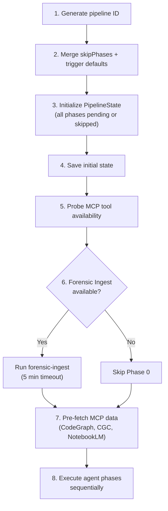

import { Card, Cards } from 'fumadocs-ui/components/card'
import { Callout } from 'fumadocs-ui/components/callout'
import { Tab, Tabs } from 'fumadocs-ui/components/tabs'
import { TypeTable } from 'fumadocs-ui/components/type-table'

The Panopticon 2.0 pipeline is configured through `PipelineConfig` at invocation time and environment variables for MCP service endpoints. This page covers every configuration option available.

## PipelineConfig

The primary configuration object passed to `orchestrator.execute()`:

```typescript
// apps/agent/src/lib/pipeline/types.ts
interface PipelineConfig {
  repoSlug: string;        // Repository slug being documented
  repoPath: string;        // Local filesystem path to the repo checkout
  triggerType: TriggerType; // Controls which phases run
  skipPhases?: PhaseName[]; // Additional phases to skip (merged with trigger defaults)
  dryRun?: boolean;         // Log actions but don't write files
  targetSlugs?: string[];   // Specific page slugs to scope work to
}
```

### repoSlug

The repository identifier used in MCP tool queries, pipeline state, logging, and generated page metadata. Examples: `"kijko-docs"`, `"supermemory"`, `"panopticon"`.

### repoPath

Absolute filesystem path to the repository checkout. Used by:
- Forensic Ingest (Phase 0) for running `ingest.py`
- Audit Agent for file-tree scanning fallback
- Verifier Agent for file path validation
- Monitor Agent for reading page files and computing staleness

### triggerType

Controls which phases are included or skipped by default. Six trigger types are supported:

```typescript
type TriggerType =
  | "full"          // Run all 7 phases
  | "incremental"   // Run all 7 phases (no default skips)
  | "single_page"   // Skip audit and monitor
  | "preview"       // Skip monitor and publish (no disk writes)
  | "drift_check"   // Only run audit + monitor
  | "manual";       // Run all 7 phases (same as full)
```

## Trigger Types in Detail

<Tabs items={["full / manual", "incremental", "single_page", "preview", "drift_check"]}>
  <Tab value="full / manual">
    **Runs**: All 7 phases (Audit, IA, Writer, Verifier, QA, Monitor, Publish)

    **Use case**: Initial wiki generation for a new repository, or complete regeneration after major codebase changes.

    **Skipped by default**: Nothing.
  </Tab>
  <Tab value="incremental">
    **Runs**: All 7 phases

    **Use case**: Regular update cycle. Same as `full` but semantically signals that existing wiki pages should be preserved and only gaps should be filled.

    **Skipped by default**: Nothing. The IA agent uses existing pages to avoid re-generating content that already exists.
  </Tab>
  <Tab value="single_page">
    **Runs**: IA, Writer, Verifier, QA, Publish

    **Skipped**: Audit, Monitor

    **Use case**: Generate or regenerate a specific page without running a full audit or drift check. Pair with `targetSlugs` to scope work.
  </Tab>
  <Tab value="preview">
    **Runs**: Audit, IA, Writer, Verifier, QA

    **Skipped**: Monitor, Publish

    **Use case**: Generate a preview of what the pipeline would produce without writing files to disk or updating the database. Useful for reviewing content quality before committing.
  </Tab>
  <Tab value="drift_check">
    **Runs**: Audit, Monitor

    **Skipped**: IA, Writer, Verifier, QA, Publish

    **Use case**: Quick check for documentation drift without generating new content. Returns a gap report and freshness scores. Fast -- typically completes in under a second.
  </Tab>
</Tabs>

### Default Skip Rules

The `defaultSkipPhases()` function in the orchestrator maps each trigger type to its default skip set:

```typescript
// apps/agent/src/lib/pipeline/orchestrator.ts
function defaultSkipPhases(triggerType: TriggerType): PhaseName[] {
  switch (triggerType) {
    case "drift_check":
      return ["ia", "writer", "verifier", "qa", "publish"];
    case "incremental":
      return [];
    case "preview":
      return ["monitor", "publish"];
    case "single_page":
      return ["audit", "monitor"];
    default:
      return [];
  }
}
```

### skipPhases (Explicit Override)

The `skipPhases` array in `PipelineConfig` is merged with the trigger-type defaults. This allows further customization:

```typescript
// Example: full pipeline but skip the monitor phase
const config: PipelineConfig = {
  repoSlug: "my-repo",
  repoPath: "/path/to/repo",
  triggerType: "full",
  skipPhases: ["monitor"],  // Merged with trigger defaults (none for "full")
};
```

The merge is a union:

```typescript
const skipSet = new Set([
  ...(config.skipPhases || []),
  ...defaultSkipPhases(config.triggerType),
]);
```

### dryRun

When `dryRun` is `true`, the pipeline logs its intended actions without writing files. This flag is passed through the config but must be checked by individual agents -- currently, the Publish agent is the primary consumer.

### targetSlugs

An array of specific page slugs to scope the pipeline to. Intended for `single_page` and `incremental` trigger types. When set, the IA and Writer agents should limit their work to only the specified pages.

## OrchestratorDeps

The `PipelineOrchestrator` constructor accepts a dependency injection object:

```typescript
// apps/agent/src/lib/pipeline/orchestrator.ts
interface OrchestratorDeps {
  /** The Mastra wiki-agent for LLM calls. */
  mastraAgent?: { generate: (prompt: string) => Promise<{ text: string }> };
  /** Callback to list existing wiki page slugs. */
  listExistingPages: () => string[];
  /** Optional state store override. */
  stateStore?: PipelineStateStore;
}
```

| Dependency | Required | Default | Purpose |
|---|---|---|---|
| `mastraAgent` | No | `undefined` | LLM agent for Writer content generation. Without it, Writer produces skeleton pages. |
| `listExistingPages` | Yes | -- | Callback returning current wiki page slugs. Used by Audit for gap analysis and QA for link validation. |
| `stateStore` | No | `InMemoryStateStore` | Pluggable persistence backend. See [State Persistence](/docs/panopticon-2.0/state-persistence). |

## Environment Variables

### MCP Service Endpoints

| Variable | Default | Used By |
|---|---|---|
| `CODEGRAPH_MCP_URL` | `http://localhost:3100` | `CodeGraphClient` -- semantic code search and symbol resolution |
| `CGC_MCP_URL` | `http://localhost:3101` | `CgcClient` -- dead code detection, complexity analysis |
| `NOTEBOOK_BASE_URL` | `http://localhost:11300` | `NotebookLmClient` -- HTTP fallback for notebook queries |
| `NOTEBOOK_API_KEY` | (none) | `NotebookLmClient` -- Bearer token for HTTP API auth |
| `NOTEBOOK_ID` | (none) | `NotebookLmClient` -- Default notebook ID for queries |
| `NOTEBOOKLM_MCP_BINARY` | `notebooklm-mcp` | `NotebookLmClient` -- Path to MCP binary for stdio transport |

### Tool Availability Probing

At pipeline startup, the orchestrator probes each MCP tool. This probing is independent of the environment variables -- it checks actual connectivity:

- **CodeGraph**: Checks `isAvailable` on the client (circuit breaker state)
- **CGC**: Checks `isAvailable` on the client (circuit breaker state)
- **NotebookLM**: Calls `health()` which tries MCP `tools/list` then HTTP `/docs`
- **Forensic Ingest**: Checks for `scripts/forensic-ingest/ingest.py` file, `python3` binary, and `repomix` binary

Results are stored in the `ToolAvailability` object and included in every `AgentContext`.

## Pipeline Initialization Sequence

When `orchestrator.execute(config)` is called, the following happens in order:



## Phase Names and Ordering

The seven phases always execute in this fixed order:

```typescript
// apps/agent/src/lib/pipeline/types.ts
const PHASE_NAMES = [
  "audit",    // Phase 1
  "ia",       // Phase 2
  "writer",   // Phase 3
  "verifier", // Phase 4
  "qa",       // Phase 5
  "monitor",  // Phase 6
  "publish",  // Phase 7
] as const;

type PhaseName = (typeof PHASE_NAMES)[number];

const PHASE_ORDER: Record<PhaseName, number> = {
  audit: 0, ia: 1, writer: 2, verifier: 3, qa: 4, monitor: 5, publish: 6,
};
```

## Page Type Classification

The pipeline tools module exposes a `classify-page-type` Mastra tool that classifies pages into one of 10 types:

```typescript
// 10 page types used across the pipeline
type PageType =
  | "landing_overview"
  | "quickstart_tutorial"
  | "concept_explainer"
  | "integration_guide"
  | "connector_guide"
  | "api_reference"
  | "cookbook_recipe"
  | "reference_spec"
  | "migration_guide"
  | "feature_guide";
```

The IA agent uses these types to determine section structure, word count targets, and sidebar placement.

## Snippet Verification Runtimes

The docs-pipeline automation layer at `apps/agent/src/lib/docs-pipeline.ts` includes a runtime registry for Docker-based snippet verification:

| Language | Runtime | Docker Image |
|---|---|---|
| `bash` / `sh` | bash / sh | `bash:5.2` |
| `curl` | curl | `curlimages/curl:8.12.1` |
| `ts` / `typescript` | tsx | `node:22-alpine` |
| `js` / `javascript` | node | `node:22-alpine` |
| `python` / `py` | python3 | `python:3.12-alpine` |
| `go` | go | `golang:1.24-alpine` |
| `java` | java | `eclipse-temurin:21-jre-alpine` |
| `json` | node | `node:22-alpine` |
| `mermaid` | diagram | `alpine:3.21` |

## Next Steps

<Cards>
  <Card title="Quickstart" href="/docs/panopticon-2.0/quickstart">
    Put this configuration into practice -- run the pipeline locally with step-by-step instructions.
  </Card>
  <Card title="State Persistence" href="/docs/panopticon-2.0/state-persistence">
    How pipeline state is stored and how to implement a custom PipelineStateStore.
  </Card>
  <Card title="API Reference" href="/docs/panopticon-2.0/api-reference">
    Complete type definitions for PipelineConfig, TriggerType, and all configuration interfaces.
  </Card>
</Cards>
