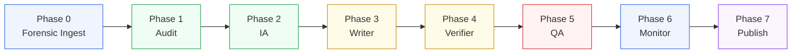

import { Card, Cards } from 'fumadocs-ui/components/card'
import { Callout } from 'fumadocs-ui/components/callout'

Panopticon 2.0 is the durable agent orchestration layer that powers the Kijko documentation pipeline. It coordinates seven specialized agents through a sequential pipeline with state persistence, graceful degradation, and resumable execution. Where [Panopticon](/docs/panopticon) provides infrastructure observability through metrics, traces, and alerts, Panopticon 2.0 extends that observability concept into the documentation process itself -- ensuring that wiki generation is as reliable and observable as the infrastructure it documents.

The pipeline lives inside the Kijko_Docs monorepo at `apps/agent/src/lib/pipeline/`. It is not a separate service or repository. The orchestrator, seven agent implementations, three MCP client wrappers, and the full type system total roughly 2,500 lines of TypeScript.

## At a Glance

<Cards>
  <Card title="Architecture" href="/docs/panopticon-2.0/architecture">
    7-phase sequential execution with Phase 0 forensic preprocessing, per-phase error boundaries, and context relay between agents.
  </Card>
  <Card title="The 7 Agents" href="/docs/panopticon-2.0/agents">
    Audit, IA, Writer, Verifier, QA, Monitor, and Publish -- each agent's role, inputs, outputs, and fallback behavior documented from source.
  </Card>
  <Card title="MCP Integration" href="/docs/panopticon-2.0/mcp-integration">
    CodeGraph, CGC, and NotebookLM clients with circuit breaker patterns, fallback strategies, and graceful degradation.
  </Card>
  <Card title="State Persistence" href="/docs/panopticon-2.0/state-persistence">
    Pipeline state model, resume-on-failure, phase lifecycle, and the PipelineStateStore interface for swapping persistence backends.
  </Card>
  <Card title="Configuration" href="/docs/panopticon-2.0/configuration">
    Trigger types, skip-phase rules, environment variables, dry-run mode, and target slug scoping.
  </Card>
  <Card title="Quickstart" href="/docs/panopticon-2.0/quickstart">
    Run the pipeline locally using the Mastra tool interface, with step-by-step setup and verification.
  </Card>
  <Card title="API Reference" href="/docs/panopticon-2.0/api-reference">
    Complete type definitions for PipelineConfig, AgentContext, AgentResult, all artifact types, and the Mastra tool schemas.
  </Card>
</Cards>

## How It Works

The pipeline follows a linear agent chain where each phase receives the accumulated context from all previous phases. The orchestrator pre-fetches MCP data once at startup, probes tool availability, and passes a shared `AgentContext` through each phase. If a phase fails, the pipeline persists its state and can be resumed from the failure point without re-running completed phases.



The pipeline supports five trigger types that control which phases execute. A `drift_check` only runs Audit and Monitor. A `preview` skips Monitor and Publish. A `single_page` skips Audit and Monitor. These optimizations keep incremental runs fast while full runs cover all seven phases.

## From Monitoring to Orchestration

The evolution from Panopticon to Panopticon 2.0 mirrors a common pattern in mature systems: once you have visibility into what is happening, the next step is automated response. Panopticon watches infrastructure. Panopticon 2.0 acts on documentation, using the same principles of structured data flows, state management, and failure isolation.

The key design decisions:

- **Sequential phases with error boundaries** -- each agent runs in its own try/catch, and failure persists state for resume rather than losing progress.
- **Graceful degradation** -- MCP tools (CodeGraph, CGC, NotebookLM) enhance output quality but are never required. Every agent has a fallback path.
- **Context accumulation** -- each phase can enrich the shared context via `nextContext`, so downstream agents benefit from upstream discoveries.
- **Forensic Ingest as Phase 0** -- codebase preprocessing (via repomix + dependency graphs) runs before the main agent chain, providing pre-analyzed structure to all agents.

## File Layout

```
apps/agent/src/lib/pipeline/
  index.ts              # Barrel exports
  orchestrator.ts       # PipelineOrchestrator class (589 lines)
  types.ts              # All types, interfaces, phase definitions (282 lines)
  agents/
    audit-agent.ts      # Phase 1: gap analysis (216 lines)
    ia-agent.ts         # Phase 2: information architecture (331 lines)
    writer-agent.ts     # Phase 3: MDX generation (268 lines)
    verifier-agent.ts   # Phase 4: code snippet validation (239 lines)
    qa-agent.ts         # Phase 5: quality assurance (300 lines)
    monitor-agent.ts    # Phase 6: drift detection (172 lines)
    publish-agent.ts    # Phase 7: file writes + DB persistence (261 lines)
  mcp-clients/
    codegraph-client.ts # Symbol search, call graphs (135 lines)
    cgc-client.ts       # Dead code, complexity, dependencies (121 lines)
    notebooklm-client.ts# Research queries, notebook management (509 lines)
```

## Next Steps

<Cards>
  <Card title="Architecture Deep Dive" href="/docs/panopticon-2.0/architecture">
    Detailed data flow diagrams, phase dependency analysis, and the context relay model.
  </Card>
  <Card title="Panopticon" href="/docs/panopticon">
    The infrastructure monitoring foundation that Panopticon 2.0 extends into documentation orchestration.
  </Card>
  <Card title="Baton Exchange" href="/docs/baton-exchange">
    The context relay protocol that governs handoffs between pipeline phases.
  </Card>
</Cards>
