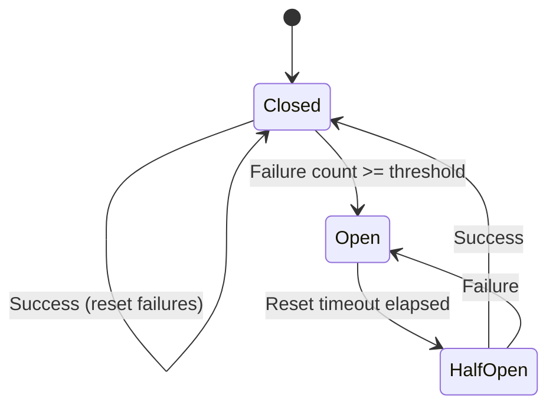
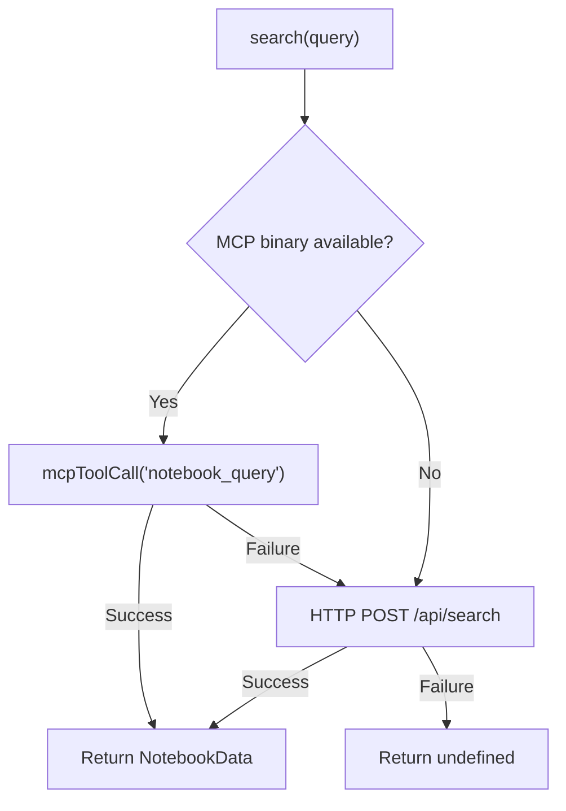

import { Card, Cards } from 'fumadocs-ui/components/card'
import { Callout } from 'fumadocs-ui/components/callout'
import { Tab, Tabs } from 'fumadocs-ui/components/tabs'
import { Accordion, Accordions } from 'fumadocs-ui/components/accordion'

The Panopticon 2.0 pipeline integrates with three MCP (Model Context Protocol) servers through dedicated client wrappers in `apps/agent/src/lib/pipeline/mcp-clients/`. Each client implements the circuit breaker pattern for graceful degradation: MCP tools enhance output quality but are never required. Every agent has a fallback path when its MCP data source is unavailable.

## Client Overview

| Client | File | Default URL | Purpose |
|---|---|---|---|
| `CodeGraphClient` | `codegraph-client.ts` | `http://localhost:3100` | Semantic code search, symbol resolution, call graphs |
| `CgcClient` | `cgc-client.ts` | `http://localhost:3101` | Dead code detection, complexity analysis, dependency graphs |
| `NotebookLmClient` | `notebooklm-client.ts` | `http://localhost:11300` | Documentation research, notebook management, knowledge queries |

## Circuit Breaker Pattern

All three clients implement the same circuit breaker logic. The breaker tracks consecutive failures and opens after a threshold, preventing the pipeline from wasting time on a service that is down.



### Implementation

The circuit breaker state is shared across all three clients with the same structure:

```typescript
// Shared pattern across codegraph-client.ts, cgc-client.ts, notebooklm-client.ts
interface CircuitBreakerState {
  failures: number;
  lastFailure: number;
  open: boolean;
}

const FAILURE_THRESHOLD = 3;
const RESET_TIMEOUT_MS = 60_000; // 120_000 for NotebookLM
```

| Parameter | CodeGraph | CGC | NotebookLM |
|---|---|---|---|
| Failure threshold | 3 | 3 | 3 |
| Reset timeout | 60 seconds | 60 seconds | 120 seconds |
| Request timeout | 15 seconds | 15 seconds | 60 seconds (120s for queries) |

NotebookLM has longer timeouts because it involves browser automation on the backend.

### State Transitions

```typescript
// apps/agent/src/lib/pipeline/mcp-clients/codegraph-client.ts
get isAvailable(): boolean {
  if (!this.breaker.open) return true;
  // Half-open check: allow retry after timeout
  if (Date.now() - this.breaker.lastFailure > RESET_TIMEOUT_MS) {
    return true;
  }
  return false;
}

private recordSuccess(): void {
  this.breaker = { failures: 0, lastFailure: 0, open: false };
}

private recordFailure(): void {
  this.breaker.failures += 1;
  this.breaker.lastFailure = Date.now();
  if (this.breaker.failures >= FAILURE_THRESHOLD) {
    this.breaker.open = true;
    console.warn(
      `[CodeGraphClient] Circuit breaker OPEN after ${FAILURE_THRESHOLD} failures. ` +
      `Will retry after ${RESET_TIMEOUT_MS / 1000}s.`
    );
  }
}
```

### Fallback-First Call Pattern

Every MCP call uses a fallback-first pattern. The `call()` method accepts a fallback value that is returned whenever the circuit breaker is open or the request fails:

```typescript
// apps/agent/src/lib/pipeline/mcp-clients/codegraph-client.ts
private async call<T>(endpoint: string, body: unknown, fallback: T): Promise<T> {
  if (!this.isAvailable) {
    return this.emptyResult(fallback, `Circuit breaker open, returning fallback`);
  }

  try {
    const response = await fetch(`${this.baseUrl}${endpoint}`, {
      method: "POST",
      headers: { "content-type": "application/json" },
      body: JSON.stringify(body),
      signal: AbortSignal.timeout(15_000),
    });

    if (!response.ok) {
      this.recordFailure();
      return this.emptyResult(fallback, `HTTP ${response.status}`);
    }

    const data = (await response.json()) as T;
    this.recordSuccess();
    return data;
  } catch (error) {
    this.recordFailure();
    return this.emptyResult(fallback, `Call failed: ${message}`);
  }
}
```

## CodeGraph Client

The CodeGraph client provides semantic code analysis through an HTTP API. The Audit agent uses it to build symbol inventories, and the Monitor agent uses it for code change detection.

### API Surface

```typescript
// apps/agent/src/lib/pipeline/mcp-clients/codegraph-client.ts
class CodeGraphClient {
  // Search for symbols matching a query string
  async searchSymbols(query: string, repo?: string): Promise<CodeGraphSymbol[]>

  // Get all callers/callees of a symbol
  async getCallers(symbol: string, repo?: string): Promise<Array<{ caller: string; callee: string }>>
  async getCallees(symbol: string, repo?: string): Promise<Array<{ caller: string; callee: string }>>

  // Impact analysis for a symbol or file change
  async getImpact(symbol: string, repo?: string): Promise<{ affectedFiles: string[]; affectedSymbols: string[] }>

  // Retrieve all exported symbols (used by Audit agent)
  async getAllSymbols(repo: string): Promise<CodeGraphSymbol[]>

  // Build full snapshot (symbols + call graph)
  async getFullGraph(repo: string): Promise<CodeGraphData>
}
```

### Fallback When Unavailable

When CodeGraph is unavailable, the Audit agent falls back to file-tree scanning with regex extraction. This produces a less complete symbol inventory (no call graph, no visibility analysis beyond export keywords) but is sufficient for basic gap detection.

## CGC Client (CodeGraphContext)

The CGC client provides code quality analysis: dead code detection, complexity scoring, and dependency graphs.

### API Surface

```typescript
// apps/agent/src/lib/pipeline/mcp-clients/cgc-client.ts
class CgcClient {
  // Complexity score for a specific file
  async getComplexity(file: string, repo?: string): Promise<Array<{ file: string; score: number }>>

  // Detect dead (unreachable) code
  async getDeadCode(repo: string): Promise<Array<{ symbol: string; file: string }>>

  // Dependency graph for a repo
  async getDependencyGraph(repo: string): Promise<Array<{ from: string; to: string }>>

  // Build full analysis snapshot
  async getFullAnalysis(repo: string): Promise<CgcData>
}
```

The `getFullAnalysis()` method issues three parallel requests (dead code, complexity, dependency graph) and merges them into a single `CgcData` object:

```typescript
// apps/agent/src/lib/pipeline/mcp-clients/cgc-client.ts
async getFullAnalysis(repo: string): Promise<CgcData> {
  const [deadCode, complexity, dependencies] = await Promise.all([
    this.getDeadCode(repo),
    this.call<Array<{ file: string; score: number }>>("/api/complexity-all", { repo }, []),
    this.getDependencyGraph(repo),
  ]);
  return { deadCode, complexity, dependencies };
}
```

### Fallback When Unavailable

When CGC is unavailable, the pipeline continues without dead code, complexity, or dependency data. No agent has a hard dependency on CGC data.

## NotebookLM Client

The NotebookLM client is the most complex of the three. It supports two transport mechanisms: MCP stdio (preferred) and a legacy HTTP API (fallback). It also handles notebook lifecycle (create, add sources, query).

### Dual Transport Strategy



The MCP transport spawns a fresh `notebooklm-mcp` process for each call via stdio JSON-RPC. Each process receives an `initialize` message followed by the actual tool call, then the process exits. This avoids managing long-lived connections but adds subprocess overhead per call:

```typescript
// apps/agent/src/lib/pipeline/mcp-clients/notebooklm-client.ts
private async mcpCall(
  method: string,
  params: Record<string, unknown> = {},
  timeoutMs = 60_000
): Promise<McpResponse | null> {
  const child = spawn(this.mcpBinary, [], {
    stdio: ["pipe", "pipe", "pipe"],
    timeout: timeoutMs,
  });

  // Send initialize + our call, then close stdin
  const initMsg = JSON.stringify({
    jsonrpc: "2.0",
    id: 1,
    method: "initialize",
    params: {
      protocolVersion: "2024-11-05",
      capabilities: {},
      clientInfo: { name: "kijko-wiki-agent", version: "1.0.0" },
    },
  });
  const callMsg = JSON.stringify({ jsonrpc: "2.0", id: 2, method, params });
  child.stdin!.write(initMsg + "\n" + callMsg + "\n");
  child.stdin!.end();
  // ... parse last JSON-RPC response with id: 2
}
```

### API Surface

```typescript
// apps/agent/src/lib/pipeline/mcp-clients/notebooklm-client.ts
class NotebookLmClient {
  // Research query (MCP stdio -> HTTP fallback)
  async search(query: string, notebookId?: string): Promise<NotebookData | undefined>

  // Notebook lifecycle via MCP
  async createNotebook(title: string): Promise<string | null>
  async addTextSource(notebookId: string, text: string, title: string): Promise<string | null>
  async query(notebookId: string, question: string, sourceIds?: string[]): Promise<string | null>
  async listNotebooks(): Promise<string | null>

  // Infographic generation (placeholder -- returns Mermaid fallback)
  async generateInfographic(type, sourceData, config?): Promise<InfographicResult>

  // Health check (MCP tools/list -> HTTP /docs)
  async health(): Promise<boolean>

  // Cleanup
  destroy(): void
}
```

### Infographic Fallback

The `generateInfographic()` method is a placeholder. When called, it returns a Mermaid diagram fallback rather than an actual infographic:

```typescript
// apps/agent/src/lib/pipeline/mcp-clients/notebooklm-client.ts
async generateInfographic(/* ... */): Promise<InfographicResult> {
  return {
    success: false,
    mermaidFallback: "graph TD\n  A[Source] --> B[Processing]\n  B --> C[Output]",
    error: "Infographic generation is a placeholder -- use Mermaid diagrams as fallback",
  };
}
```

## Tool Availability Probing

At pipeline startup, the orchestrator probes all MCP tools and forensic ingest availability:

```typescript
// apps/agent/src/lib/pipeline/orchestrator.ts
private async probeTools(repoPath?: string): Promise<ToolAvailability> {
  const [notebookHealth, forensicAvailable] = await Promise.allSettled([
    this.notebookClient.health(),
    repoPath ? this.probeForensicIngest(repoPath) : Promise.resolve(false),
  ]);

  return {
    codegraph: this.codegraphClient.isAvailable,
    cgc: this.cgcClient.isAvailable,
    notebooklm: notebookHealth.status === "fulfilled" ? notebookHealth.value : false,
    repomix: false, // Not yet implemented
    forensicIngest: forensicAvailable.status === "fulfilled" ? forensicAvailable.value : false,
  };
}
```

The resulting `ToolAvailability` flags are included in every `AgentContext`, so agents can check availability before attempting MCP calls:

```typescript
interface ToolAvailability {
  codegraph: boolean;
  cgc: boolean;
  notebooklm: boolean;
  repomix: boolean;
  forensicIngest: boolean;
}
```

## Graceful Degradation Summary

| Tool | Used By | When Unavailable |
|---|---|---|
| CodeGraph | Audit, Monitor | Audit falls back to file-tree regex scanning. Monitor skips code change factor. |
| CGC | (pre-fetched) | Pipeline continues without dead code / complexity data. No agent has a hard dependency. |
| NotebookLM | Writer (via context) | Writer uses skeleton templates instead of LLM-enriched content. |
| Forensic Ingest | All agents (via context) | Agents work without pre-analyzed code structure. Audit does its own file scan. |
| Mastra Agent | Writer | Writer builds skeleton pages with section headings and pending-content markers. |

<Callout type="info">
The pipeline is designed to produce useful output even when all MCP tools are unavailable. The output quality scales with tool availability -- full MCP coverage produces richer, more accurate documentation, but a bare pipeline with no MCP tools still generates a structurally complete wiki skeleton.
</Callout>

## Environment Variables

| Variable | Client | Default |
|---|---|---|
| `CODEGRAPH_MCP_URL` | CodeGraphClient | `http://localhost:3100` |
| `CGC_MCP_URL` | CgcClient | `http://localhost:3101` |
| `NOTEBOOK_BASE_URL` | NotebookLmClient | `http://localhost:11300` |
| `NOTEBOOK_API_KEY` | NotebookLmClient | (none) |
| `NOTEBOOK_ID` | NotebookLmClient | (none) |
| `NOTEBOOKLM_MCP_BINARY` | NotebookLmClient | `notebooklm-mcp` |

## Next Steps

<Cards>
  <Card title="Architecture" href="/docs/panopticon-2.0/architecture">
    How MCP data flows through the pipeline via the AgentContext relay pattern.
  </Card>
  <Card title="Configuration" href="/docs/panopticon-2.0/configuration">
    All environment variables, trigger types, and pipeline config options.
  </Card>
  <Card title="The 7 Agents" href="/docs/panopticon-2.0/agents">
    How each agent uses (or skips) MCP data in practice.
  </Card>
</Cards>
