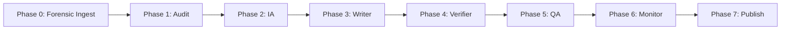

Panopticon 2.0 is the durable agent orchestration layer that powers the Kijko documentation pipeline. While [Panopticon](/docs/panopticon) provides infrastructure observability through metrics, traces, and alerts, Panopticon 2.0 extends that observability concept to the documentation process itself. It coordinates seven specialized agents through a sequential pipeline with state persistence, graceful degradation, and resumable execution -- ensuring that documentation generation is as reliable and observable as the infrastructure it documents.

## From Monitoring to Orchestration

The evolution from Panopticon to Panopticon 2.0 mirrors a common pattern in mature systems: once you have visibility into what is happening, the next step is automated response. Panopticon watches infrastructure. Panopticon 2.0 acts on documentation, using the same principles of structured data flows, state management, and failure isolation.

<Cards>
  <Card title="Pipeline Orchestrator">
    7-phase sequential execution with per-phase error boundaries, state persistence, and resume-on-failure capability.
  </Card>
  <Card title="MCP Tool Integration">
    CodeGraph, CGC, and NotebookLM clients with circuit breakers and graceful fallbacks when tools are unavailable.
  </Card>
  <Card title="Forensic Ingest">
    Phase 0 preprocessing that segments codebases into subsystem source files with dependency graphs for agent consumption.
  </Card>
  <Card title="Trigger Classification">
    Five trigger types (full, incremental, single_page, preview, drift_check) that control which phases execute for efficiency.
  </Card>
</Cards>

## Pipeline Architecture

The pipeline orchestrator at `apps/agent/src/lib/pipeline/orchestrator.ts` is the heart of Panopticon 2.0. It coordinates seven agents that execute sequentially, with each phase receiving context from the previous phase through the [Baton Exchange](/docs/baton-exchange) pattern.



Each phase is implemented as a class that implements the `PipelineAgent` interface:

```typescript
// apps/agent/src/lib/pipeline/types.ts
interface PipelineAgent {
  name: PhaseName;
  execute(context: AgentContext): Promise<AgentResult>;
}

// Phase names in execution order
const PHASE_NAMES: PhaseName[] = [
  "audit", "ia", "writer", "verifier", "qa", "monitor", "publish"
];
```

### Phase Details

<Tabs items={["Audit", "IA", "Writer", "Verifier", "QA", "Monitor", "Publish"]}>
  <Tab value="Audit">
    **File**: `apps/agent/src/lib/pipeline/agents/audit-agent.ts` (216 lines)

    Scans the repository for documentation gaps by comparing exported code symbols against existing wiki pages. When CodeGraph MCP is available, uses semantic symbol data. Falls back to file-tree scanning with regex pattern extraction (`EXPORT_PATTERNS`) when unavailable.

    **Outputs**: gap report (symbols without pages), coverage score, contradiction list, stale page detection.

    ```typescript
    // Fallback symbol extraction patterns
    const EXPORT_PATTERNS = [
      /export\s+(?:default\s+)?(?:function|class|interface|type|const|let|var|enum)\s+(\w+)/g,
      /^(?:class|def)\s+([A-Z]\w+|[a-z]\w+)\s*[\((:]/gm,
    ];
    ```

    The audit agent classifies each gap by importance (high/medium/low) and detects stale pages by checking if slug parts reference symbols that no longer exist in the codebase.
  </Tab>
  <Tab value="IA">
    **File**: `apps/agent/src/lib/pipeline/agents/ia-agent.ts` (331 lines)

    Generates the information architecture: page taxonomy, navigation structure, content outlines, and cross-link map. Uses the audit results to prioritize which pages need creation or updates.
  </Tab>
  <Tab value="Writer">
    **File**: `apps/agent/src/lib/pipeline/agents/writer-agent.ts` (268 lines)

    Produces MDX content for each planned page using the Mastra wiki-agent for LLM calls. Grounds output in code references from the audit phase. Respects the page type templates from the wiki generation prompt (Landing, Quickstart, Concept Explainer, Integration Guide, Feature Guide, etc.).
  </Tab>
  <Tab value="Verifier">
    **File**: `apps/agent/src/lib/pipeline/agents/verifier-agent.ts` (239 lines)

    Validates that generated content matches codebase reality. Checks file paths, function names, API signatures, and configuration keys referenced in the documentation against the actual repository state.
  </Tab>
  <Tab value="QA">
    **File**: `apps/agent/src/lib/pipeline/agents/qa-agent.ts` (300 lines)

    Runs comprehensive quality checks including:
    - Readability scoring (Flesch-Kincaid via `estimateReadabilityScore()`)
    - Broken link detection (internal and external)
    - Heading hierarchy validation
    - Snippet verification in Docker sandboxes (using the `SNIPPET_RUNTIME_REGISTRY`)
    - Duplicate content detection (Jaccard similarity via `similarityScore()`)
    - Style guide compliance
    - SEO issue detection (missing descriptions, title length)
  </Tab>
  <Tab value="Monitor">
    **File**: `apps/agent/src/lib/pipeline/agents/monitor-agent.ts` (172 lines)

    Assesses page freshness by comparing content hashes against file modification times. Tracks structural changes (new/removed files), behavioral changes (API surface modifications), and identifies pages needing snippet re-verification.
  </Tab>
  <Tab value="Publish">
    **File**: `apps/agent/src/lib/pipeline/agents/publish-agent.ts`

    Writes validated MDX content to `wiki-content/docs/`, updates `meta.json` navigation files, and generates sitemap entries.
  </Tab>
</Tabs>

## MCP Tool Integration

The orchestrator integrates with three MCP (Model Context Protocol) servers through dedicated client wrappers in `apps/agent/src/lib/pipeline/mcp-clients/`:

| Client | File | Purpose |
|---|---|---|
| `CodeGraphClient` | `codegraph-client.ts` (135 lines) | Semantic code search, symbol resolution, callers/callees analysis |
| `CgcClient` | `cgc-client.ts` (121 lines) | Dead code detection, complexity analysis, dependency graphs |
| `NotebookLmClient` | `notebooklm-client.ts` (164 lines) | Documentation research, knowledge synthesis, zero-hallucination validation |

Each client includes circuit breaker logic so that MCP unavailability degrades gracefully rather than failing the entire pipeline:

```typescript
// apps/agent/src/lib/pipeline/orchestrator.ts -- tool probing
const toolAvailability = await this.probeTools(config.repoPath);
console.log(`[Pipeline ${pipelineId}] Tool availability:`, toolAvailability);

// Agents check toolAvailability before using MCP data
if (context.codeGraphData && context.toolAvailability.codegraph) {
  codeSymbols = context.codeGraphData.symbols;
} else {
  // Fallback: file-tree scanning with regex extraction
  codeSymbols = this.scanFileTree(context.repoPath);
}
```

## State Persistence and Resume

Pipeline state is persisted after every phase transition, enabling resume-on-failure. The state model tracks each phase's status, timing, agent results, and errors:

```typescript
// apps/agent/src/lib/pipeline/types.ts
interface PipelineState {
  id: string;
  repoSlug: string;
  currentPhase: PhaseName | null;
  phases: PhaseState[];
  startedAt: string;
  completedAt?: string;
  status: "running" | "completed" | "failed" | "paused";
}

interface PhaseState {
  name: PhaseName;
  status: "pending" | "running" | "complete" | "failed" | "skipped";
  startedAt?: string;
  completedAt?: string;
  error?: string;
  agentResult?: AgentResult;
}
```

The `resume()` method finds the first failed phase, resets it to pending, and re-executes from that point with all previously accumulated context:

```typescript
// Resume skips completed phases and re-runs from the failure point
const completedPhases = existing.phases
  .filter((p) => p.status === "complete" || p.status === "skipped")
  .map((p) => p.name);

const resumeConfig: PipelineConfig = {
  ...config,
  skipPhases: [...(config.skipPhases || []), ...completedPhases],
};
```

## Forensic Ingest (Phase 0)

Before the main agent phases, the orchestrator runs forensic-ingest when available. This preprocessing step segments the codebase into subsystem source files with dependency data, stored at `/tmp/forensic-ingest/`:

- **`sources/*.md`** -- 37 markdown files containing code segments organized by subsystem (apps-agent, apps-web, server, client, misc-isolates)
- **`dependency_graph.json`** -- 414 nodes, 249 edges, 11 clusters mapping the codebase topology

The forensic-ingest data flows into the `AgentContext` as `ForensicIngestArtifacts`, providing agents with pre-analyzed code structure without requiring each agent to scan the full repository.

## Snippet Verification

The QA phase runs code snippet verification using Docker sandboxes. The `SNIPPET_RUNTIME_REGISTRY` in `apps/agent/src/lib/docs-pipeline.ts` maps languages to Docker images:

| Language | Runtime | Docker Image |
|---|---|---|
| bash/sh | bash | `bash:5.2` |
| curl | curl | `curlimages/curl:8.12.1` |
| ts/typescript | tsx | `node:22-alpine` |
| js/javascript | node | `node:22-alpine` |
| python/py | python3 | `python:3.12-alpine` |
| go | go | `golang:1.24-alpine` |
| java | java | `eclipse-temurin:21-jre-alpine` |
| mermaid | diagram | `alpine:3.21` |

Each snippet is executed in an isolated container, and the verification result includes sandbox mode, Docker availability check, request/response preview for HTTP snippets, and suggested fixes for failures.

## Monitoring Integration

The docs-pipeline automation at `apps/agent/src/lib/docs-pipeline.ts` generates monitoring artifacts that parallel Panopticon's observability model:

- **`MonitoringReport`** -- page freshness scores, content hashes, health risk classifications (healthy/watch/critical)
- **`LivingDocsReport`** -- changed files, affected pages, trigger manifests, freshness data
- **`DocsQualityReport`** -- broken links, heading issues, readability scores, snippet verification results, actionable failures with suggested fixes

These reports feed into the Living Docs CI workflow, creating a continuous documentation quality feedback loop.

## Next Steps

<Cards>
  <Card title="Panopticon" href="/docs/panopticon">
    The infrastructure monitoring foundation that Panopticon 2.0 extends into documentation orchestration.
  </Card>
  <Card title="Baton Exchange" href="/docs/baton-exchange">
    The context relay protocol that governs handoffs between pipeline phases.
  </Card>
  <Card title="Getting Started" href="/docs/getting-started">
    Run the pipeline locally using the CLI commands for rebuild, audit, and monitoring.
  </Card>
</Cards>
