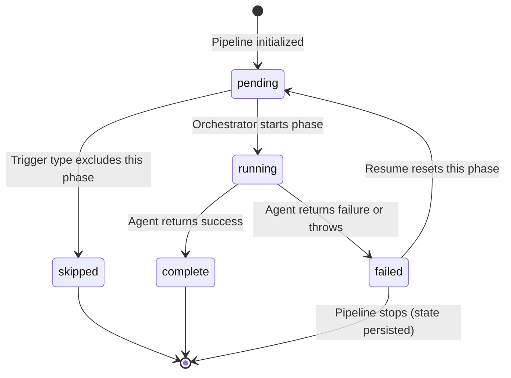
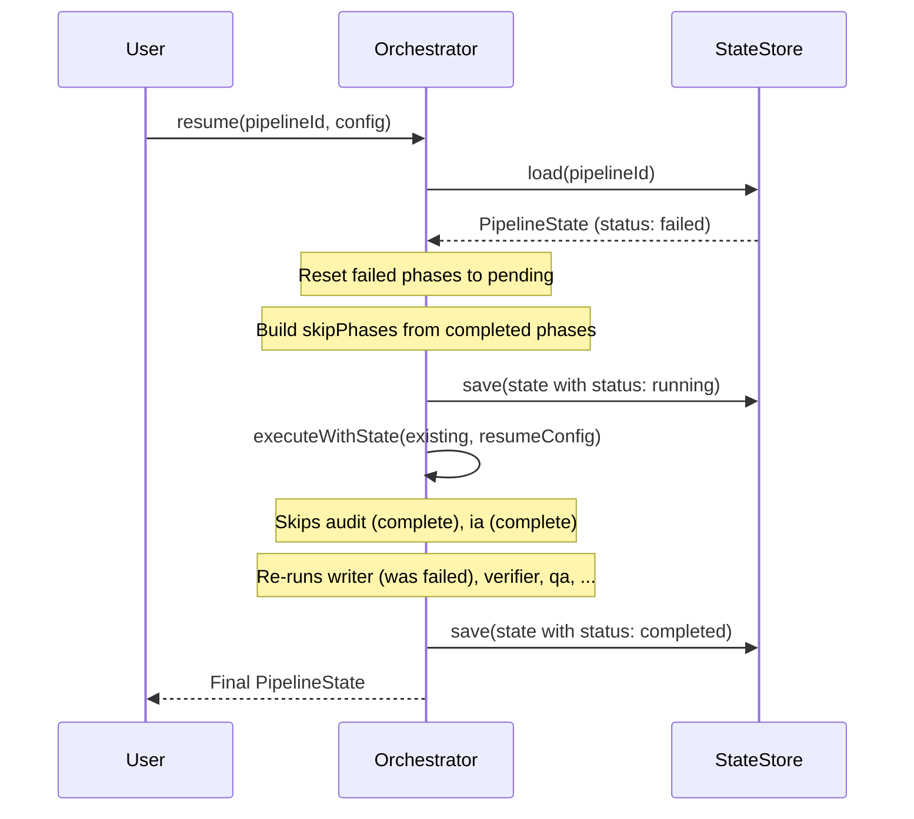

import { Card, Cards } from 'fumadocs-ui/components/card'
import { Callout } from 'fumadocs-ui/components/callout'
import { Tab, Tabs } from 'fumadocs-ui/components/tabs'
import { Step, Steps } from 'fumadocs-ui/components/steps'

Pipeline state persistence is the mechanism that enables resume-on-failure. After every phase transition -- start, complete, fail, or skip -- the orchestrator saves the full pipeline state to a `PipelineStateStore`. If the pipeline crashes, the persisted state can be loaded and execution resumed from the failure point.

## State Model

The pipeline state is a tree structure. At the top level, `PipelineState` tracks the overall run. Nested inside, each phase has its own `PhaseState` with status, timing, and agent results.

```typescript
// apps/agent/src/lib/pipeline/types.ts
interface PipelineState {
  id: string;                          // e.g. "pipeline-1711234567890-a1b2c3"
  repoSlug: string;                    // Repository being documented
  currentPhase: PhaseName | null;      // Currently executing phase (null when idle)
  phases: PhaseState[];                // One entry per phase, always 7 entries
  startedAt: string;                   // ISO 8601 timestamp
  completedAt?: string;                // Set when pipeline finishes
  status: "queued" | "running" | "completed" | "failed" | "paused";
}

interface PhaseState {
  name: PhaseName;                     // "audit" | "ia" | "writer" | ... | "publish"
  status: PhaseStatus;                 // "pending" | "running" | "complete" | "failed" | "skipped"
  agentResult?: AgentResult;           // Full agent output (artifacts, metrics, errors)
  error?: string;                      // Human-readable error if failed
  startedAt?: string;                  // ISO 8601 timestamp
  completedAt?: string;                // ISO 8601 timestamp
}
```

### Pipeline ID Generation

Each pipeline run gets a unique ID combining a timestamp and a random suffix:

```typescript
const pipelineId = `pipeline-${Date.now()}-${Math.random().toString(36).slice(2, 8)}`;
```

This produces IDs like `pipeline-1711234567890-a1b2c3` that are sortable by creation time and collision-resistant.

## Phase Lifecycle

Each phase transitions through a fixed set of states:



### State Persistence Points

The orchestrator saves state at five critical moments:

<Steps>
  <Step>
    **Pipeline initialization** -- All phases set to `"pending"` (or `"skipped"` for excluded phases). Pipeline status is `"running"`.
  </Step>
  <Step>
    **Phase start** -- Phase status changes to `"running"`, `startedAt` is set, `currentPhase` is updated.
  </Step>
  <Step>
    **Phase success** -- Phase status changes to `"complete"`, `agentResult` is stored, `completedAt` is set.
  </Step>
  <Step>
    **Phase failure** -- Phase status changes to `"failed"`, error message is stored, pipeline status changes to `"failed"`. State is saved **before** the error is re-thrown.
  </Step>
  <Step>
    **Pipeline completion** -- `currentPhase` set to `null`, pipeline status changes to `"completed"`, `completedAt` is set.
  </Step>
</Steps>

The critical detail in step 4: state is always persisted before the error is thrown. This ensures that even if the process crashes immediately after the throw, the failure state is recoverable.

```typescript
// apps/agent/src/lib/pipeline/orchestrator.ts
if (!result.success) {
  phaseState.error = result.errors.join("; ");
  state.status = "failed";
  this.stateStore.save(state);  // <-- persisted BEFORE throw
  throw new Error(`Phase ${phaseName} failed: ${result.errors.join("; ")}`);
}
```

## The PipelineStateStore Interface

State persistence is abstracted behind the `PipelineStateStore` interface, making it easy to swap backends:

```typescript
// apps/agent/src/lib/pipeline/orchestrator.ts
interface PipelineStateStore {
  save(state: PipelineState): void;
  load(id: string): PipelineState | null;
  list(): PipelineState[];
}
```

### InMemoryStateStore (Default)

The default implementation uses an in-memory `Map`. It uses `structuredClone()` on save and load to prevent aliasing bugs (where a reference to the saved state could be mutated externally):

```typescript
// apps/agent/src/lib/pipeline/orchestrator.ts
class InMemoryStateStore implements PipelineStateStore {
  private states = new Map<string, PipelineState>();

  save(state: PipelineState): void {
    this.states.set(state.id, structuredClone(state));
  }

  load(id: string): PipelineState | null {
    const state = this.states.get(id);
    return state ? structuredClone(state) : null;
  }

  list(): PipelineState[] {
    return [...this.states.values()].map((s) => structuredClone(s));
  }
}
```

<Callout type="warn">
The in-memory store does not survive process restarts. For production use, swap with a SQLite-backed implementation that uses the existing `AppDatabase`. The comment in the source explicitly notes this: "For production, swap with a SQLite-backed implementation that uses the existing AppDatabase."
</Callout>

### Custom State Store

To implement a persistent backend, implement the three-method interface:

```typescript
import type { PipelineStateStore, PipelineState } from "./pipeline";

class SqliteStateStore implements PipelineStateStore {
  constructor(private db: AppDatabase) {}

  save(state: PipelineState): void {
    this.db.run(
      `INSERT OR REPLACE INTO pipeline_runs (id, state_json) VALUES (?, ?)`,
      state.id, JSON.stringify(state)
    );
  }

  load(id: string): PipelineState | null {
    const row = this.db.get(`SELECT state_json FROM pipeline_runs WHERE id = ?`, id);
    return row ? JSON.parse(row.state_json) : null;
  }

  list(): PipelineState[] {
    return this.db.all(`SELECT state_json FROM pipeline_runs ORDER BY id DESC`)
      .map(row => JSON.parse(row.state_json));
  }
}
```

Pass the custom store when constructing the orchestrator:

```typescript
const orchestrator = new PipelineOrchestrator({
  listExistingPages: () => db.listPages().map(p => p.slug),
  stateStore: new SqliteStateStore(db),
});
```

## Resume-on-Failure

The `resume()` method finds the first failed phase, resets it to pending, and re-executes from that point. Completed and skipped phases are not re-run.

```typescript
// apps/agent/src/lib/pipeline/orchestrator.ts
async resume(pipelineId: string, config: PipelineConfig): Promise<PipelineState> {
  const existing = this.stateStore.load(pipelineId);
  if (!existing) {
    throw new Error(`Pipeline ${pipelineId} not found`);
  }

  if (existing.status !== "failed" && existing.status !== "paused") {
    throw new Error(
      `Pipeline ${pipelineId} is not in a resumable state (status: ${existing.status})`
    );
  }

  // Reset failed phases to pending
  for (const phase of existing.phases) {
    if (phase.status === "failed") {
      phase.status = "pending";
      phase.error = undefined;
      phase.agentResult = undefined;
      phase.startedAt = undefined;
      phase.completedAt = undefined;
    }
  }

  existing.status = "running";
  this.stateStore.save(existing);

  // Build config that skips already-completed phases
  const completedPhases = existing.phases
    .filter((p) => p.status === "complete" || p.status === "skipped")
    .map((p) => p.name);

  const resumeConfig: PipelineConfig = {
    ...config,
    skipPhases: [...(config.skipPhases || []), ...completedPhases],
  };

  return this.executeWithState(existing, resumeConfig);
}
```

### Resume Flow



### What Resume Preserves

When a pipeline resumes after failure:

- **Preserved**: Pipeline ID, `startedAt` timestamp, completed phase results (artifacts, metrics, timing), skipped phase markers.
- **Reset**: Failed phase status, error, agent result, timing. All phases after the failed one remain in their original state (pending or skipped).
- **Re-probed**: MCP tool availability is re-checked at resume time. A tool that was down during the original run may be available on retry.

<Callout type="info">
Resume does not re-inject accumulated context from completed phases. The `executeWithState()` method builds a fresh `AgentContext` for the resumed phases. However, since completed phases' results are still in `pipelineState.phases`, resumed agents can still read previous phase outputs through the standard context relay mechanism.
</Callout>

## Pipeline Status Queries

The orchestrator provides two query methods:

```typescript
// Get the current state of a specific pipeline
getStatus(pipelineId: string): PipelineState | null

// List all pipeline runs
listRuns(): PipelineState[]
```

Both return `structuredClone()` copies to prevent external mutation of stored state.

## Data Flow Through State

The pipeline state serves double duty: it tracks execution progress and carries data between agents. Agent results stored in `phaseState.agentResult.artifacts` become the input data for downstream agents:

```
Pipeline State
  phases[0] (audit)
    agentResult.artifacts = AuditArtifacts { gaps, coverageScore, ... }
      ^-- read by IA agent
  phases[1] (ia)
    agentResult.artifacts = IAArtifacts { pages, generationOrder, ... }
      ^-- read by Writer agent
  phases[2] (writer)
    agentResult.artifacts = WriterArtifacts { generatedPages, crossLinks, ... }
      ^-- read by Verifier, QA, Monitor, Publish agents
  phases[3] (verifier)
    agentResult.artifacts = VerifierArtifacts { snippets, passRate, ... }
      ^-- read by QA agent (cross-reference)
  phases[4] (qa)
    agentResult.artifacts = QAArtifacts { correctedPages, overallScore, ... }
      ^-- read by Publish agent
  phases[5] (monitor)
    agentResult.artifacts = MonitorArtifacts { driftReport, reauditTriggers, ... }
      ^-- feeds back to orchestrator for incremental re-runs
  phases[6] (publish)
    agentResult.artifacts = PublishArtifacts { writtenFiles, savedToDb, ... }
```

## Next Steps

<Cards>
  <Card title="Architecture" href="/docs/panopticon-2.0/architecture">
    The full execution model including Phase 0 forensic ingest and context relay.
  </Card>
  <Card title="API Reference" href="/docs/panopticon-2.0/api-reference">
    Complete type definitions for PipelineState, PhaseState, and all artifact types.
  </Card>
  <Card title="Configuration" href="/docs/panopticon-2.0/configuration">
    Trigger types and skip-phase rules that control pipeline behavior.
  </Card>
</Cards>
