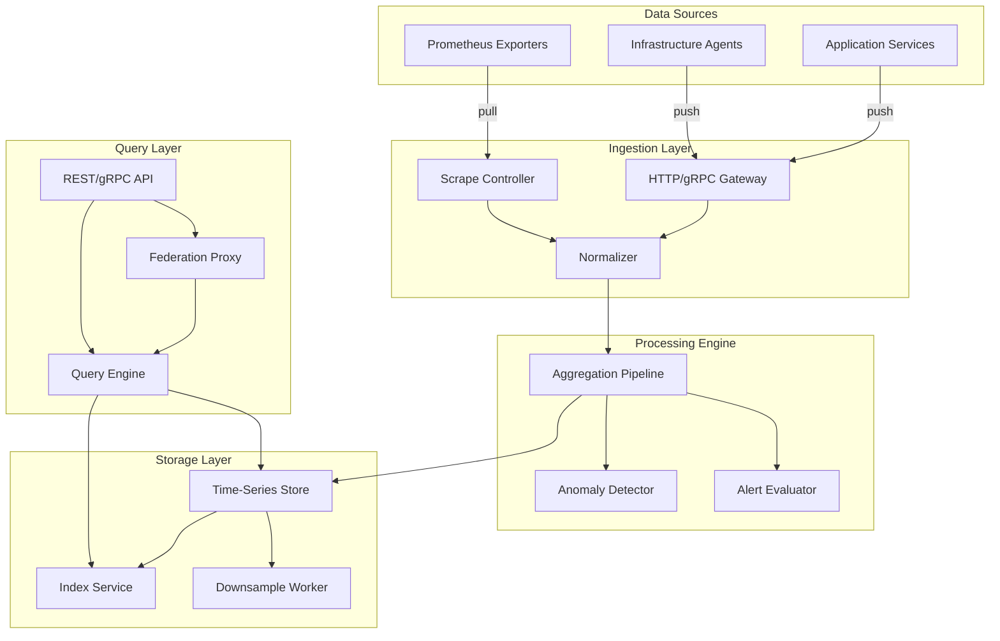

Understanding Panopticon's architecture is essential because every operational decision you make -- from choosing retention windows to designing alert rules -- depends on how data moves through the system. This page builds a mental model of the service topology, the data flow pipelines, and the integration boundaries that separate Panopticon from the services it monitors. If you know how the pieces fit together, you can reason about failure modes, capacity limits, and extension points without reading the implementation line by line.

## System Overview

Panopticon is composed of five core subsystems that communicate through well-defined interfaces. Each subsystem can be scaled independently, which means you can add ingestion capacity without touching the query layer, or upgrade the storage backend without modifying the alerting engine.



The diagram shows the primary data path from sources through ingestion, processing, and storage, with the query layer sitting alongside storage for read access. The key architectural insight is that the write path (ingestion through storage) and the read path (query layer) share only the storage subsystem, and even there they use separate access patterns to avoid contention.

## Ingestion Layer

The ingestion layer is the entry point for all telemetry data. It handles three distinct input modes and normalizes everything into a common internal representation before passing it downstream.

### HTTP/gRPC Gateway

The gateway accepts push-based telemetry from application services and infrastructure agents. It supports two wire formats: a JSON-over-HTTP format for ease of integration and a Protocol Buffer format over gRPC for high-throughput production use. Both formats carry the same semantic payload: a batch of samples, each with a metric name, a set of labels, a timestamp, and a numeric value.

```typescript
// Ingestion payload structure
interface MetricBatch \{
  samples: Array<\{
    metric: string;          // e.g., "http_request_duration_seconds"
    labels: Record<string, string>;  // e.g., \{ method: "GET", path: "/api/health" \}
    timestamp: number;       // Unix epoch milliseconds
    value: number;           // The measurement
  \}>;
  source: string;            // Identifier for the sending service
\}
```

The gateway performs basic validation -- rejecting malformed payloads, enforcing label cardinality limits -- and then forwards valid batches to the normalizer. Invalid payloads receive a structured error response with specific field-level diagnostics so the sender can fix the issue without guessing.

### Scrape Controller

For services that expose Prometheus-compatible metrics endpoints, the scrape controller runs a configurable polling loop. Each scrape target is defined in the configuration file with a target URL, a scrape interval, and optional label overrides. The controller maintains a per-target state machine that tracks scrape success, scrape duration, and backoff behavior for failing targets.

The scrape controller is particularly useful for third-party services that already expose Prometheus metrics. Instead of modifying those services to push to Panopticon, you configure a scrape target and the controller handles the rest.

### Normalizer

The normalizer is the convergence point where push-based and pull-based telemetry merge into a single stream. Its responsibilities are:

1. **Timestamp alignment**: Aligning sample timestamps to a configurable resolution boundary (default: 1 second) to reduce storage cardinality.
2. **Label enrichment**: Adding system-wide labels (cluster name, environment, region) to every sample so downstream queries can filter without per-service configuration.
3. **Deduplication**: Detecting and dropping duplicate samples that arrive within the same resolution window, which can happen when a service retries a failed push.
4. **Rate limiting**: Applying per-source rate limits to prevent a misbehaving service from overwhelming the processing pipeline. The default limit is 10,000 samples per second per source.

## Processing Engine

After normalization, data enters the processing engine, which runs three parallel pipelines on the incoming stream.

### Aggregation Pipeline

The aggregation pipeline computes windowed summaries over raw data. For each configured aggregation rule, it maintains a sliding window and emits computed values (sum, count, average, percentiles) at the window boundary. These aggregated metrics are stored alongside the raw data, giving query-time consumers the choice between granular and pre-computed results.

<Tabs items={["Raw Query", "Aggregated Query"]}>
  <Tab value="Raw Query">
    ```sql
    SELECT avg(value) FROM metrics
    WHERE metric = 'http_request_duration_seconds'
      AND labels.method = 'GET'
      AND timestamp BETWEEN now() - interval '1 hour' AND now()
    GROUP BY time(1m)
    ```
    Raw queries compute aggregations at query time. They are flexible but slower for large time ranges because every sample must be scanned.
  </Tab>
  <Tab value="Aggregated Query">
    ```sql
    SELECT value FROM aggregates
    WHERE metric = 'http_request_duration_seconds.p99'
      AND labels.method = 'GET'
      AND timestamp BETWEEN now() - interval '1 hour' AND now()
    ```
    Aggregated queries read pre-computed values. They are fast and predictable but limited to the aggregation rules you have configured.
  </Tab>
</Tabs>

The default aggregation windows are `[1m, 5m, 1h]` with functions `[avg, sum, count, min, max, p50, p95, p99]`. Adding the `1d` window is recommended for monthly reporting and SLO calculations.

### Anomaly Detector

The anomaly detector maintains a statistical baseline for each metric series and flags values that deviate significantly from the expected range. It uses a combination of exponential moving average (EMA) for trend estimation and modified z-score for outlier detection. When an anomaly is detected, it emits an event that the alert evaluator can use as a trigger condition.

The detector is deliberately conservative in its default configuration:

| Setting | Default | Purpose |
|---|---|---|
| `baseline_period` | 24h | Minimum data required before detection activates |
| `z_score_threshold` | 3.5 | Modified z-score threshold for flagging anomalies |
| `sensitivity` | medium | Preset: low (z=4.0), medium (z=3.5), high (z=3.0) |

These defaults minimize false positives at the cost of missing some subtle anomalies. Override them per metric in the [Configuration](/docs/panopticon/configuration) when you need higher sensitivity.

### Alert Evaluator

The alert evaluator runs alerting rules against the incoming data stream in near real-time. Unlike polling-based alert systems that evaluate rules on a timer, Panopticon's evaluator triggers on data arrival, which means alerts fire within seconds of a threshold breach rather than waiting for the next evaluation cycle.

Each alert rule specifies:
- A metric selector (name + label matchers)
- A condition (threshold, rate-of-change, anomaly flag)
- A duration requirement (how long the condition must hold before firing)
- A notification target (webhook, email, or integration channel)

<Callout type="warn">
Alert rules that match high-cardinality metrics can consume significant memory because the evaluator must maintain state for every distinct label combination. Use label matchers to scope your rules as narrowly as possible.
</Callout>

## Storage Layer

The storage layer persists time-series data with configurable retention and provides the index structures that make queries fast.

### Time-Series Store

The time-series store uses a columnar storage format optimized for append-heavy workloads with time-range queries. Data is organized into blocks by time range (default: 2h per block), with each block containing a sorted, compressed representation of all samples within that range. Blocks are immutable once written, which simplifies backup, replication, and garbage collection.

Retention is configured per metric tier:

<Tabs items={["Hot Tier", "Warm Tier", "Cold Tier"]}>
  <Tab value="Hot Tier">
    Recent data (default: 48 hours) stored on fast SSD with no downsampling. Approximately 1.5 bytes per sample compressed. Sub-millisecond query latency for single-series lookups. This is where real-time dashboards and recent alert evaluations read from.
  </Tab>
  <Tab value="Warm Tier">
    Medium-term data (default: 30 days) stored with 1-minute downsampling. Approximately 0.1 bytes per original sample after downsampling. Low single-digit millisecond queries for typical dashboard workloads. Suitable for trend analysis and capacity planning.
  </Tab>
  <Tab value="Cold Tier">
    Long-term data (default: 13 months) stored with 1-hour downsampling on cost-efficient storage. Approximately 0.01 bytes per original sample. Designed for annual SLO tracking, compliance-driven retention, and capacity reports.
  </Tab>
</Tabs>

### Index Service

The index service maintains an inverted index mapping label values to the time-series that contain them. This is what makes label-based queries fast: instead of scanning every series, the query engine looks up the matching series IDs in the index and reads only those series from storage.

The index supports prefix, exact, and regex matching on label values. It is rebuilt incrementally as new data arrives, so there is no background reindexing overhead for operational workloads.

## Query Layer

The query layer provides the read interface for dashboards, alerting integrations, and the Kijko agent surface.

### Query Engine

The query engine translates incoming queries into storage-level read operations. It supports a SQL-like query language with extensions for time-series operations (rate calculations, moving averages, histogram quantiles). Query planning includes automatic selection between raw and aggregated data based on the requested time range and resolution.

### Federation Proxy

For multi-cluster deployments, the federation proxy fans out a query to multiple Panopticon instances and merges the results. This is transparent to the caller -- the query API is the same regardless of whether data comes from a single instance or a federated cluster.

<Callout type="info">
Federation adds network latency proportional to the number of remote instances. For latency-sensitive dashboards, consider pre-aggregating cross-cluster metrics into a central instance instead of federating every query.
</Callout>

## Deployment Topology

In the Kijko workspace, Panopticon runs as a set of containers orchestrated by Docker Compose for local development and by Kubernetes for production. The minimum viable deployment is a single container that runs all subsystems in-process (`mode: standalone`). The recommended production deployment separates ingestion, processing, storage, and query into independent scaling groups (`mode: distributed`).

```yaml
# docker-compose.yml -- minimal local deployment
services:
  panopticon:
    image: kijko/panopticon:latest
    ports:
      - "9090:9090"   # Query API
      - "9091:9091"   # Ingestion API
    volumes:
      - ./config/panopticon.yaml:/etc/panopticon/config.yaml
      - panopticon-data:/var/lib/panopticon
    environment:
      - PANOPTICON_MODE=standalone
```

The production stack at `docs.kijko.nl` integrates Panopticon with the broader service topology: Nginx reverse proxy on port 8080, Keycloak authentication on the `kijko-docs` realm, the WikiApp container serving the Next.js frontend, and the agent container running the Hono API server on port 4111.

## Kijko Workspace Integration

Within the Kijko codebase, Panopticon's architecture is reflected in several key files:

- **`server/architecture.ts`** builds an architecture diagram from monitored repositories. Panopticon appears as a node generated by `buildRepoNodeId()` with edges scored by `scoreRelationshipReference()` using text pattern matching against README files, docker-compose configurations, and package.json contents.
- **`server/routes.ts`** registers the `/api/repos/:id/architecture` endpoint that returns the live dependency graph, with Panopticon as a permanent fixture via the seed data.
- **`apps/agent/src/lib/pipeline/orchestrator.ts`** uses a similar architectural pattern for the documentation pipeline -- sequential phases with independent subsystems, state persistence, and graceful degradation.

## Next Steps

<Cards>
  <Card title="Quickstart" href="/docs/panopticon/quickstart">
    Get Panopticon running locally with this deployment configuration.
  </Card>
  <Card title="API Reference" href="/docs/panopticon/api-reference">
    Explore the ingestion and query API endpoints in detail.
  </Card>
  <Card title="Configuration" href="/docs/panopticon/configuration">
    Customize retention, alerting, and scrape targets.
  </Card>
</Cards>
