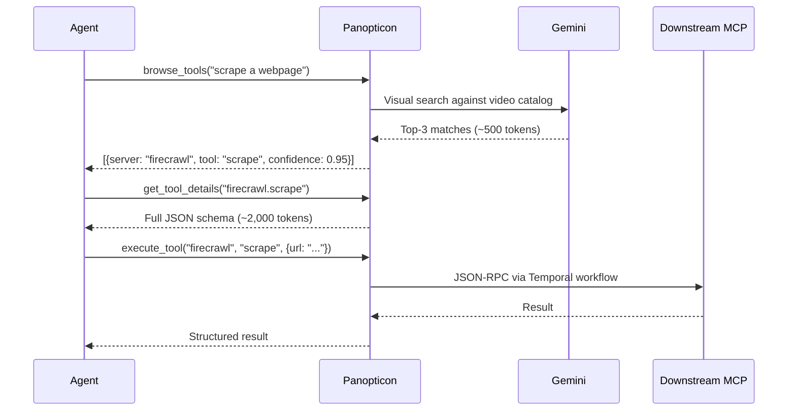
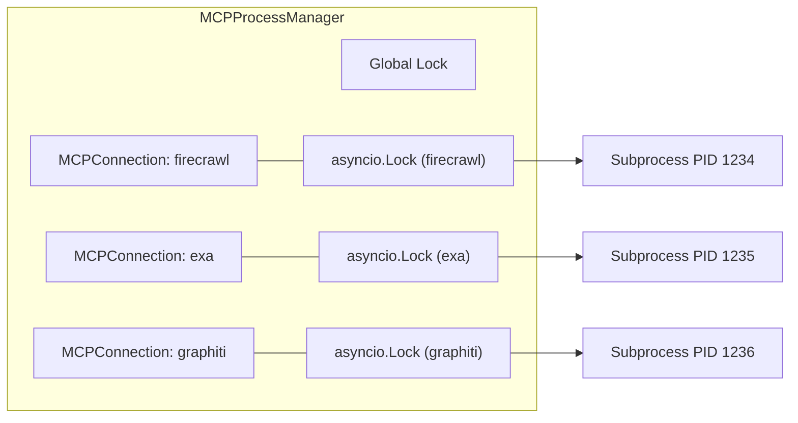
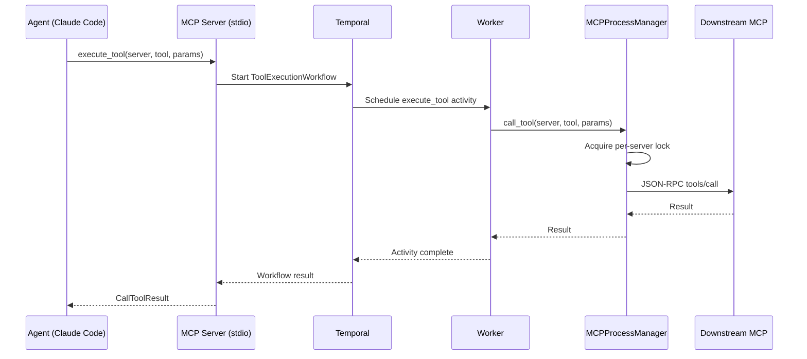

import { Card, Cards } from 'fumadocs-ui/components/card'
import { Callout } from 'fumadocs-ui/components/callout'
import { Tab, Tabs } from 'fumadocs-ui/components/tabs'
import { Accordion, Accordions } from 'fumadocs-ui/components/accordion'

Understanding Panopticon's architecture is essential because every operational decision -- from configuring MCP server connections to tuning the guardrail enforcement level -- depends on how tool calls flow through the system. This page builds a mental model of the six-layer architecture, the data flow pipelines, and the integration boundaries that connect Panopticon to downstream MCP servers and upstream AI agents.

## System Overview

Panopticon is a layered modular monolith. Each layer has a clear responsibility boundary, and all layers communicate through well-defined interfaces. The system is designed so that the write path (tool execution) and the read path (tool discovery) operate on separate subsystems with independent resource budgets.

```mermaid
flowchart TB
    subgraph Interface["Interface Layer"]
        CLI["CLI (Click)"]
        MCP["MCP Server (stdio)"]
        REST["REST API (Flask:8043)"]
    end

    subgraph Discovery["Discovery Layer"]
        HV["HyperVisa Video Renderer"]
        GVS["Gemini Visual Search"]
        SR["Schema Registry"]
    end

    subgraph Orchestration["Orchestration Layer"]
        TW["9 Temporal Workflows"]
        TA["12 Activities"]
        NS["Nexus Service"]
    end

    subgraph Process["Process Management"]
        PM["MCPProcessManager"]
        MC["MCPConnection (per server)"]
        SL["Per-Server asyncio.Lock"]
    end

    subgraph Intelligence["Intelligence Layer"]
        TC["Trace Capture"]
        RL["RL Training (Agent Lightning)"]
        EM["Episodic Memory"]
        HM["Hive Mind"]
    end

    subgraph Agents["Agent Integration"]
        OR["Oracle (governance)"]
        SM["Smith (guardrails)"]
        TR["Trinity (optimizer)"]
    end

    CLI --> Discovery
    MCP --> Discovery
    REST --> Discovery
    CLI --> Orchestration
    MCP --> Orchestration
    REST --> Orchestration

    Discovery --> SR
    Discovery --> HV
    HV --> GVS

    Orchestration --> Process
    Orchestration --> Intelligence

    Process --> MC
    MC --> SL

    Intelligence --> EM
    Intelligence --> HM
    Intelligence --> RL

    Agents --> Orchestration
```



## Layer 1: Interface

The interface layer provides three entry points into Panopticon. All three converge on the same internal modules, so the behavior is identical regardless of how you invoke a tool call.

### CLI (`panopticon/cli.py`)

The CLI is built with Click and exposes 10 commands. It is the primary interface for operators and local development. Each command maps to either a discovery operation or a Temporal workflow invocation.

```python
# Core CLI commands (panopticon/cli.py)
@click.group()
@click.version_option(version="0.1.0", prog_name="panopticon")
def main():
    """Panopticon -- Durable MCP infrastructure with video-encoded tool discovery."""
    pass

# Discovery commands
@main.command()
def discover(rebuild):      # Build HyperVisa video catalog
@main.command()
def browse(query):           # Visual search for tools
@main.command()
def details(tool_name):      # Full JSON schema for a tool

# Execution commands
@main.command("exec")
def exec_tool(tool_name, params):  # Raw execution via Temporal
@main.command()
def ask(intent):             # Smart execution via Gemini

# Infrastructure commands
@main.command()
def health():                # System health check
@main.command()
def worker():                # Start Temporal worker
@main.command()
def serve():                 # Start MCP server (stdio)
@main.command()
def api(port):               # Start REST API server
@main.command()
def register(name, command): # Register a new MCP server
```

### MCP Server (`panopticon/mcp/server.py`)

The MCP server runs on stdio transport (JSON-RPC) and exposes 7 tools that Claude Code and other MCP clients can call directly. All logging goes to stderr to keep stdout clean for the JSON-RPC protocol.

| Tool | Description | Token Cost |
|------|-------------|-----------|
| `health_check` | System status + Temporal + key pool summary | ~200 |
| `browse_tools` | Visual catalog search via Gemini | ~500 |
| `get_tool_details` | Full JSON schema for a specific tool | ~2,000 |
| `execute_tool` | Raw mode: direct tool call via Temporal | varies |
| `smart_execute` | Natural language to tool to result | varies |
| `execute_parallel` | Batch execution with dependency graph | varies |
| `key_pool_health` | Per-key RPM, cooldown, failure counts | ~300 |

### REST API (`panopticon/api.py`)

Flask API on port 8043 serving telemetry data to the dashboard. Mirrors HyperVisa's proven pattern.

| Endpoint | Method | Description |
|----------|--------|-------------|
| `/api/panopticon/health` | GET | System health + Temporal status |
| `/api/panopticon/servers` | GET | Registered MCP servers + status |
| `/api/panopticon/catalog` | GET | Video catalog metadata |
| `/api/panopticon/tools` | GET | All discovered tools |
| `/api/panopticon/agents` | GET | Oracle/Smith/Trinity status |
| `/api/panopticon/traces` | GET | Execution traces (paginated) |
| `/api/panopticon/traces/stats` | GET | Aggregated trace statistics |
| `/api/panopticon/training` | GET | Training metrics + state |
| `/api/panopticon/hive` | GET | Hive mind stats + promotions |
| `/api/panopticon/memory` | GET | Episodic memory patterns |
| `/api/panopticon/guardrails` | GET | Current guardrail policy |
| `/api/panopticon/temporal` | GET | Temporal workflow status |

## Layer 2: Discovery

The discovery layer is Panopticon's core innovation. It solves the "schema bloat" problem -- dumping all MCP tool schemas into an agent's context window wastes ~50,000+ tokens and degrades response quality.

### Three-Tier Progressive Disclosure



### HyperVisa Video Renderer (`panopticon/mcp/discovery.py`)

Tool schemas are formatted as structured text with Chromacode semantic markers (blue for definitions, red for required params, green for defaults) and rendered to 1fps MP4 video using HyperVisa's renderer (Tamzen fonts, 1920x1080). The video is uploaded to the Gemini File API.

```python
# Catalog build pipeline (panopticon/mcp/discovery.py)
async def build_catalog(force=False):
    schemas = fetch_all_schemas(force=force)      # Step 1: Fetch from all MCP servers
    text = _format_schemas_for_video(schemas)      # Step 2: Format with Chromacode
    video_path, frames = render_text_to_video(     # Step 3: Render 1fps MP4
        text, str(CONFIG_DIR / "catalog.mp4")
    )
    pool = get_pool()                              # Step 4: Upload with key failover
    file_ref = pool.with_failover(_upload)
    save_catalog(catalog)                          # Step 5: Persist metadata
```

### Schema Registry (`panopticon/mcp/registry.py`)

The registry is the source of truth for what tools are available. It fetches schemas from downstream MCP servers by starting each server process, sending a JSON-RPC `tools/list` request, and caching the results at `~/.panopticon/schema_cache.json`.

## Layer 3: Orchestration

The orchestration layer uses Temporal for durable workflow execution. Every tool call, catalog refresh, and memory consolidation runs as a Temporal workflow with automatic retry and crash recovery.

### Workflows (`panopticon/temporal/workflows.py`)

| Workflow | Purpose | Duration |
|----------|---------|----------|
| `MCPServiceLifecycle` | Spawn, heartbeat, auto-restart MCP servers | Long-running |
| `ToolExecutionWorkflow` | Execute single tool call with retry on crash | 2-120s |
| `CatalogRefreshWorkflow` | Render schemas to video, upload to Gemini | 30-300s |
| `AgentTaskWorkflow` | Multi-step execution with compensating rollback | varies |
| `MemoryConsolidationWorkflow` | Archive traces to disk + Graphiti | 10-60s |
| `BrowseToolsWorkflow` | Gemini visual search via activity | 5-60s |
| `CatalogRefreshFromRegistryWorkflow` | Self-contained catalog rebuild | 30-300s |
| `HealthCheckWorkflow` | Full system health check | 5-30s |
| `NotebookLMCookieRefreshWorkflow` | Cookie refresh every 25 minutes | Long-running |

### Activities (`panopticon/temporal/activities.py`)

Activities are the actual work units. They handle I/O, subprocess management, and external service calls. Key activities:

- `spawn_mcp_server` / `restart_mcp_server` -- Subprocess lifecycle
- `execute_tool` -- Routes through MCPProcessManager
- `render_catalog` / `upload_to_gemini` -- HyperVisa pipeline
- `archive_traces` -- Memory consolidation
- `refresh_notebooklm_cookies` -- Headless Chrome token extraction
- `execute_claude_chunk` -- Claude subprocess execution with checkpointing

### Nexus Service (`panopticon/temporal/nexus_service.py`)

The Nexus service exposes 4 operations for cross-namespace invocation:

```python
@nexusrpc.service
class PanopticonService:
    execute_tool: nexusrpc.Operation[ExecuteToolInput, ExecuteToolOutput]
    browse_tools: nexusrpc.Operation[BrowseToolsInput, BrowseToolsOutput]
    refresh_catalog: nexusrpc.Operation[RefreshCatalogInput, RefreshCatalogOutput]
    health_check: nexusrpc.Operation[HealthCheckInput, HealthCheckOutput]
```

Each operation delegates to a durable Temporal workflow, providing the same crash-safety guarantees for cross-namespace callers.

### Retry Policy

```python
# Standard retry for external services
STANDARD_RETRY = RetryPolicy(
    initial_interval=timedelta(seconds=1),
    backoff_coefficient=2.0,
    maximum_interval=timedelta(seconds=30),
    maximum_attempts=5,
)

# Fast retry for health checks
HEALTH_RETRY = RetryPolicy(
    initial_interval=timedelta(milliseconds=500),
    maximum_attempts=3,
)
```

## Layer 4: Process Management

The MCPProcessManager (`panopticon/mcp/proxy.py`) is the single owner of all downstream MCP server subprocesses. This is the ONLY code path that creates, tracks, and destroys MCP server processes.



### Design Decisions

- **Worker-level singleton** -- Instantiated once before `Worker.run()` to ensure a single source of truth for all subprocess PIDs.
- **Per-server asyncio.Lock** -- MCP stdio transport is NOT concurrent-safe. Interleaved JSON-RPC requests corrupt the stream. The per-server lock serializes all calls to each server.
- **Error classification** -- Transport errors (broken pipe, EOF, connection reset) trigger a server restart. Application errors return immediately without restart.
- **Proper process cleanup** -- Uses `.terminate()` with timeout, then `.kill()`, then `os.kill(SIGKILL)` as last resort. No `pkill -f`.

## Layer 5: Intelligence

The intelligence layer captures execution data and uses it to improve future tool selections.

### Trace Capture (`panopticon/learning/trace.py`)

Every tool call generates a trace record:

```python
trace = {
    "timestamp": "2026-03-29T10:15:00Z",
    "tool_name": "firecrawl.scrape",
    "params": {"url": "https://example.com"},  # Sanitized
    "result_summary": "200 OK, 1234 bytes",
    "duration_ms": 2340.5,
    "success": True,
    "agent_context": "smith-session-abc",
    "reward": 1.2,  # Computed by reward function
}
```

### Reward Function

The reward function aligns with Trinity's reward matrix:

| Component | Value | Condition |
|-----------|-------|-----------|
| Base (success) | +1.0 | Tool call succeeded |
| Base (failure) | -0.5 | Tool call failed |
| Speed bonus | +0.2 | Duration < 1 second |
| Speed bonus | +0.1 | Duration < 5 seconds |
| Retry penalty | -0.3 | Call required retry |

### Hive Mind (`panopticon/memory/hive.py`)

When a tool-query pattern succeeds 3+ times (the promotion threshold), it gets promoted to the shared Graphiti group (`panopticon-hive`). Other Panopticon instances query this shared memory for proven tool selection patterns.

```
Agent A: firecrawl.scrape for "web content" -- success #1
Agent B: firecrawl.scrape for "web content" -- success #2
Agent C: firecrawl.scrape for "web content" -- success #3
  --> PROMOTED to hive mind: "firecrawl.scrape proven for web content queries"
Agent D: browse_tools("web content") --> hive mind suggests firecrawl.scrape
```

## Layer 6: Agent Integration

Panopticon integrates with three agents in the Kijko Pantheon:

<Tabs items={["Oracle", "Smith", "Trinity"]}>
  <Tab value="Oracle">
    **Role**: Type 2 governance -- coherence, taste, architectural judgment.

    Oracle runs as a systemd service (`oracle-agent.service`) monitoring Zulip. When Panopticon needs architectural guidance, it posts a consultation query to the `Dev-Swarm` stream, `panopticon-consult` topic. Oracle responds with judgment calls about tool selection strategy.

    ```python
    # panopticon/agents/oracle_consult.py
    def consult_oracle(query: str, context: dict = None) -> Optional[str]:
        """Post a consultation query to Oracle via Zulip."""
    ```
  </Tab>
  <Tab value="Smith">
    **Role**: Sidecar sentinel -- guardrails, context engineering, QA.

    Smith does not run as a standalone service. It operates as hooks in `~/.claude/settings.json`. The `panopticon/agents/steering.py` module adapts Smith's enforcement matrix for Panopticon-routed tool calls:

    | Level | Behavior |
    |-------|----------|
    | HIGH | Block dangerous tools, validate all params, scan results for secrets |
    | MEDIUM | Block dangerous, scan on flag |
    | LOW | Log only |
    | MINIMAL | Pass-through |

    Always-blocked tools: `rm_rf`, `drop_database`, `format_disk`.
  </Tab>
  <Tab value="Trinity">
    **Role**: Optimizer -- APO pipeline, reward signals, deployment.

    Trinity runs as a daemon (`trinity-agent.service`). It consumes execution traces, runs the Agent Lightning training pipeline, and produces optimized prompts. Panopticon reads Trinity's optimization hints from `~/.cortex/trinity/`.
  </Tab>
</Tabs>

## Gemini Key Pool (`panopticon/keys.py`)

All Gemini operations share a singleton `GeminiPool` with automatic key rotation and failover:

- **Round-robin rotation** across multiple API keys
- **Per-key RPM tracking** with 60-second window reset
- **Cooldown on rate-limited keys** (default 60s)
- **Permanent disable** for invalid/revoked keys
- **Mixed key types**: regular Google AI Studio + Vertex AI Express
- **Thread-safe** via `threading.Lock`

```python
# Automatic failover: try next key on rate limit
result = pool.with_failover(lambda client: client.models.generate_content(
    model=DEFAULT_MODEL,
    contents=[file_ref, prompt],
))
```

## Data Flow: End-to-End Tool Execution



If the downstream MCP server crashes at step 6, the MCPProcessManager detects the transport error, restarts the server, and retries. If the Temporal worker crashes at any step, Temporal replays the workflow from the last completed activity.

## Next Steps

<Cards>
  <Card title="Core Concepts" href="/docs/panopticon/concepts">
    Understand progressive disclosure, durable execution, and the hive mind in depth.
  </Card>
  <Card title="API Reference" href="/docs/panopticon/api-reference">
    Complete endpoint documentation for REST, MCP, CLI, and Nexus interfaces.
  </Card>
  <Card title="Deployment" href="/docs/panopticon/deployment">
    Set up the Temporal infrastructure, register the Nexus endpoint, and deploy to production.
  </Card>
</Cards>
